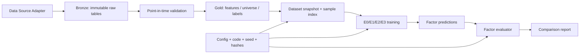

# FacDiggerNN：机器学习量化因子挖掘工具实施设计

> 设计基线：`PatchTST迁移学习实现设计文档_AI版.md` v1.0
> 项目现状：仓库为空，从零搭建
> 首版目标：研究工具，不包含实盘下单、组合资金管理和撮合
> 默认市场：美国股票日频（US equities），可通过适配器替换为其他市场

## 1. 最终要交付什么

FacDiggerNN 首版应是一个可复现的“因子工厂”，而不只是一个模型训练脚本。输入点时行情、股票池和市场状态，系统自动生成数据快照、训练模型、输出每日逐股因子值，并完成横截面有效性评价和简化成本检验。

首版完成后的标准工作流：

```text
原始点时数据
  -> 数据审计与标准化
  -> 7通道时序特征
  -> 512日窗口与5日标签
  -> E0/E1/E2/E3训练
  -> 每日逐股因子分数
  -> IC/RankIC/ICIR/分层收益/换手/稳定性报告
  -> 对“架构、外域迁移、金融域预训练”分别下结论
```

首版不做：分钟级数据、自动因子表达式搜索、多因子组合优化、订单执行、实盘服务、复杂风险模型。它们都应建立在首版研究闭环验证有效之后。

## 2. 对参考文档的分析结论

### 2.1 应直接继承的设计

1. 决策时点为 t 日收盘后，最早 t+1 日开盘执行。
2. 模型输入为 `[B, 512, 7]`，输出为每个股票—日期的单个 Alpha 分数。
3. 标签为 `log(C[t+5] / O[t+1]) - benchmark_return[t+1:t+5]`。
4. 只迁移 PatchTST 编码器，不迁移电力预测头。
5. 金融域 masked-patch 预训练只能使用训练期特征。
6. E0—E3 必须使用相同数据快照、切分和评价器。
7. 权重加载按参数量审计；低于 80% 立即失败。
8. 首要指标是逐日横截面 Rank IC、ICIR 和 Q5-Q1，而不是训练 loss。

### 2.2 需要补强的地方

参考文档定义了模型模块，但一个可用的“因子挖掘工具”还缺少以下工程层：

- 数据供应商适配与不可变数据快照；
- 历史股票池、退市证券、交易暂停、证券类型、主上市地和上市天数等点时状态；
- 特征注册、版本和血缘；
- 标签重叠导致的 purge/embargo；
- 横截面日期分组采样器；
- 因子值的中性化前后对照；
- 预测覆盖、容量、成本和换手检验；
- 统一 CLI、运行清单和失败门禁；
- E0 基线的严格定义，避免拿弱基线衬托深度模型。

### 2.3 必须先验证的兼容性风险

IBM checkpoint 的历史配置使用旧字段和旧架构名，例如 `PatchTSTForMaskPretraining`、`encoder_layers`、`encoder_attention_heads`、`stride`；当前 Transformers 文档使用 `PatchTSTForPretraining`、`num_hidden_layers`、`num_attention_heads`、`patch_stride`。因此不得假设当前最新版 Transformers 能无损直接加载。

源 checkpoint 的实际配置还显示：6 层 encoder、`d_model=128`、16 heads、`patch_length=12`、`stride=12`、`pre_norm=false`、`norm=BatchNorm`、dropout 0.3、`scaling=mean`。这与参考文档里的部分示意配置和当前库默认值不同。E2/E3 的首轮目标模型必须以源配置为准；任何降层、改 normalization 或改内部 scaling 的实验都另编号，不能仍称为纯迁移对照。尤其需要防止“外部 robust scaling + 模型内部 scaling”形成未记录的双重标准化。

M0 必须完成一个独立兼容性探针：

1. 固定 checkpoint revision；建议从 `1212736a0decf12b5cea5a605302421e110a3614` 开始验证；
2. 试验一组可工作的 Transformers 版本；
3. 保存源/目标配置、state dict 键和形状差异；
4. 验证单 batch forward/backward；
5. 锁定依赖后再开发训练代码；
6. 所有版本差异只允许出现在 `HuggingFacePatchTSTAdapter` 中。

## 3. 产品边界和核心用例

### 3.1 核心用例

```bash
# 1. 导入并审计原始数据
facdigger data ingest --config configs/data/us_equities_daily.yaml
facdigger data validate --snapshot <snapshot_id>

# 2. 构建点时特征、股票池、标签和样本索引
facdigger dataset build --config configs/datasets/daily_v1.yaml

# 3. 训练对照实验
facdigger train --experiment e0_lightgbm --dataset <dataset_id>
facdigger train --experiment e1_random --dataset <dataset_id>
facdigger pretrain --experiment e3_domain_adapt --dataset <dataset_id>
facdigger train --experiment e2_transfer --dataset <dataset_id>
facdigger train --experiment e3_domain_adapt --dataset <dataset_id>

# 4. 统一推理和评价
facdigger predict --run <run_id> --split test
facdigger evaluate --run <run_id>
facdigger compare --runs <e0_id>,<e1_id>,<e2_id>,<e3_id>
```

### 3.2 研究对象

系统中的一个因子定义为：

```text
factor_id = model_spec + feature_set + label_spec + universe_spec + training_protocol
factor_value(security_id, asof_date) = model score available after close(asof_date)
```

同一模型换了股票池、标签、训练区间或特征集，应视为不同因子版本，禁止复用同一个 `factor_id`。

## 4. 总体架构



### 4.1 分层职责

| 层 | 职责 | 主要产物 |
|---|---|---|
| 数据接入 | 对接供应商，保留原始字段和采集信息 | Bronze Parquet |
| 点时语义 | 交易日、复权、股票池、可交易状态 | PIT tables |
| 特征与标签 | 只用历史数据计算特征，构造未来标签 | Gold Parquet |
| 数据集 | 时间切分、purge、窗口索引、缩放器 | dataset manifest |
| 模型 | 基线、PatchTST、迁移和域适配 | checkpoints |
| 因子评价 | IC、分层、换手、成本、稳定性 | metrics/report |
| 实验治理 | 配置、hash、Git、环境、随机状态 | run manifest |

## 5. 技术选型

首版优先本地、轻量和可审计：

| 领域 | 选择 | 原因 |
|---|---|---|
| Python | 3.11 | 生态成熟，兼顾 Windows |
| 表处理 | Polars + PyArrow | Parquet 友好，降低 pandas 内存压力 |
| 查询/审计 | DuckDB | 直接查询 Parquet，无需部署数据库 |
| 深度学习 | PyTorch + Transformers | PatchTST 现成实现和权重生态 |
| 树模型 | LightGBM | 强 tabular 横截面基线 |
| 配置/校验 | YAML + Pydantic | 配置可读且有强校验 |
| CLI | Typer | 把研究流程固化为稳定命令 |
| 测试 | pytest + hypothesis | 单元测试和时点性质测试 |
| 报告 | JSON/Parquet + HTML | 机器可读和人工审阅兼顾 |

首版不引入在线数据库、消息队列、Kubernetes 或远程实验平台。运行清单和 artifact 目录已足够；需要多人协作时再接 MLflow。

## 6. 推荐目录

```text
FacDiggerNN/
├── pyproject.toml
├── README.md
├── configs/
│   ├── data/
│   ├── datasets/
│   ├── models/
│   └── experiments/
├── src/facdigger/
│   ├── cli.py
│   ├── config.py
│   ├── data/
│   │   ├── adapters/base.py
│   │   ├── ingest.py
│   │   ├── calendar.py
│   │   ├── adjustments.py
│   │   ├── universe.py
│   │   ├── validation.py
│   │   └── snapshots.py
│   ├── features/
│   │   ├── registry.py
│   │   ├── price_volume.py
│   │   ├── transforms.py
│   │   └── pipeline.py
│   ├── labels/
│   │   ├── forward_return.py
│   │   └── benchmark.py
│   ├── datasets/
│   │   ├── splits.py
│   │   ├── index.py
│   │   ├── window.py
│   │   ├── sampler.py
│   │   └── scaling.py
│   ├── models/
│   │   ├── baselines.py
│   │   ├── patchtst_adapter.py
│   │   ├── transfer.py
│   │   └── alpha_head.py
│   ├── training/
│   │   ├── pretrain.py
│   │   ├── finetune.py
│   │   ├── losses.py
│   │   └── checkpoint.py
│   ├── evaluation/
│   │   ├── ic.py
│   │   ├── quantiles.py
│   │   ├── turnover.py
│   │   ├── neutralization.py
│   │   ├── stability.py
│   │   └── report.py
│   └── experiments/
│       ├── manifest.py
│       └── runner.py
├── tests/
│   ├── unit/
│   ├── integration/
│   └── leakage/
├── data/                 # 默认 gitignore
│   ├── bronze/
│   ├── gold/
│   └── snapshots/
└── artifacts/            # 默认 gitignore，保留小型示例清单
```

## 7. 数据设计

### 7.1 数据源适配器

首版不要在核心逻辑中绑定某家数据源。适配器统一输出：

```python
class MarketDataAdapter(Protocol):
    def load_calendar(self, start, end) -> Table: ...
    def load_bars(self, security_ids, start, end) -> Table: ...
    def load_adjustments(self, security_ids, start, end) -> Table: ...
    def load_security_master(self) -> Table: ...
    def load_trade_status(self, security_ids, start, end) -> Table: ...
    def load_benchmark(self, start, end) -> Table: ...
```

MVP 最安全的入口是“用户提供的标准 Parquet 适配器”。后续再增加具体供应商连接器，不让数据授权和 API 稳定性阻塞模型闭环。

#### EODHD 首个供应商实现

EODHD 连接器位于 `data/providers/eodhd`，通过通用 `MarketDataProvider` 协议接入。它的职责止于把 API 响应映射为标准 Parquet；数据快照、特征、标签和训练层仍只读取 `StandardParquetAdapter`。

实现约束：

- token 只从 `EODHD_API_TOKEN` 环境变量读取，不进入 YAML、缓存键、异常 URL 或 manifest；无账户 token 时可以显式允许官方 `demo`。
- 所有成功响应进入内容寻址的本地 JSON 缓存；另用 UTC 日预算文件在发起请求前计数，保护免费版的每日调用额度。
- EODHD 原始 OHLC 不复权，`adjusted_close` 同时包含拆股和分红调整。标准表保留原始 OHLC，并记录 `adj_factor=adjusted_close/close` 和调整口径。
- `security_id` 优先由 ISIN 生成；缺少元数据时只能退化为 provider ticker，必须写入 `identity_quality` 和采集告警，不能宣称跨 ticker 变更稳定。
- EOD 日线不能还原历史停牌状态、历史行业或点时流通市值。首版只把存在有效 bar 的 session 标记为“推断可交易”，其余字段保持缺失并附质量标记。
- 供应商的“已退市”标志不能替代退市收益或终值。没有可靠 terminal value 时不得生成标准 `delistings` 表；纳入退市证券历史行情与退市标签处理是两个独立能力。
- 免费版约一年的历史只有约 252 个交易日，不足以形成 512 日上下文。免费配置只用于采集和短窗口管线冒烟；最终研究需要升级历史覆盖或导入合规的长期历史快照。

### 7.2 最低数据表契约

`bars_daily`：

| 字段 | 类型 | 说明 |
|---|---|---|
| security_id | string | 跨 ticker 变更保持稳定的证券标识 |
| symbol | string | 当日 ticker，用于展示和供应商映射 |
| trade_date | date | 交易日 |
| open/high/low/close | float64 | 明确前复权/后复权/不复权口径 |
| volume/dollar_volume | float64 | 股数成交量与美元成交额；0 与缺失需区分 |
| adj_factor | float64 | 调整因子及其可知时间 |
| source_revision | string | 数据供应商版本或导出批次 |
| ingested_at | timestamp | 进入系统时间 |

`universe_daily`：

| 字段 | 说明 |
|---|---|
| security_id, trade_date | 联合主键；`security_id` 必须跨 ticker 变更保持稳定 |
| symbol | 当日 ticker，仅作展示和数据连接，不作为长期证券主键 |
| listed_days | 上市交易日数 |
| exchange | 当日主上市交易所 |
| security_type | common stock、ETF、ADR、preferred、warrant 等 |
| is_primary_listing | 是否为主要上市证券 |
| is_listed/is_delisted/is_halted | 当日点时状态；历史退市证券必须保留 |
| industry_code | 当日可知行业分类 |
| float_market_cap | 当日可知流通市值 |
| close | 当日收盘价，用于价格过滤 |
| adv20_usd | 过去 20 日平均美元成交额，用于流动性过滤 |
| eligible | 由配置规则生成的最终研究股票池 |

默认美股股票池建议定义为：NYSE、Nasdaq 和 NYSE American 的主要上市普通股；排除 OTC、ETF、ADR、优先股、权证及其他非普通股证券。价格、流动性和最短上市历史门槛必须配置化并按当日信息计算。首轮可采用 `close >= 5 USD`、`ADV20 >= 1,000,000 USD` 作为研究起点，但这只是容量过滤假设，不是固定业务规则。

证券主表必须保留 ticker、公司名、交易所和证券类型的生效区间。ticker 会复用或变更，训练、标签和预测表内部一律以稳定 `security_id` 连接。

交易日以证券对应主交易所的 session calendar 为准，日线的 `trade_date` 表示该交易 session，而不是供应商文件的 UTC 日期。`eligible[t]` 只能使用 t 日收盘前后已经可知的信息；如果股票在 t+1 开盘时临时停牌，评价器按预先固定的“取消该笔交易或延迟到首次可交易开盘”规则处理，不能反过来用 t+1 状态删除 t 日信号。

### 7.3 不可变快照

每次构建数据集创建：

```text
dataset_id = sha256(
  input_file_hashes
  + adapter_version
  + universe_config
  + feature_definitions
  + label_definition
  + split_definition
)
```

已发布快照不可原地更新。原始数据修订后生成新的 `dataset_id`，历史 run 继续指向旧快照。

### 7.4 7 通道特征

严格定义如下，所有滚动计算按 `security_id` 分组且只向后看：

```text
r_close[t]      = log(adj_close[t] / adj_close[t-1])
r_gap[t]        = log(adj_open[t] / adj_close[t-1])
r_intraday[t]   = log(adj_close[t] / adj_open[t])
range[t]        = log(adj_high[t] / adj_low[t])
dlog_volume[t]  = log1p(volume[t]) - log1p(volume[t-1])
vol20[t]        = std(r_close[t-19:t], ddof=0)
dollar_volume_z20[t] = robust_z(close * volume over t-19:t)
```

美股供应商通常不直接提供统一口径的换手率。若没有可靠的 point-in-time shares outstanding，默认使用 `dollar_volume_z20`，其中 dollar volume 为 `close * volume`；变更后生成新的 `feature_set_id`，不可只改列名。

特征处理顺序：

1. 先处理拆股、反向拆股、现金/股票分红、并购和 ticker 变更；公司行动必须带 ex-date 与数据可知时间；
2. 计算原始时序特征；
3. 将无穷值转缺失，保留 observed mask；
4. winsor 参数只在 train 拟合；
5. scaling 参数只在 train 拟合；
6. 缺失值填 0，同时 mask 为 0；
7. 将拟合参数随 dataset snapshot 保存。

不建议对每个 512 日窗口独立 z-score 作为唯一方案，因为它会抹去长期波动状态。首版同时保留两种可对照配置：`train_global_robust` 和 `window_instance_norm`，但 E1—E3 必须使用同一种。

### 7.5 标签和执行语义

```text
asof_date = t
signal_available = close(t) 后
entry = open(t+1)
exit = close(t+5)
raw_return = log(adj_close[t+5] / adj_open[t+1])
label = raw_return - benchmark_return(t+1, t+5)
```

基准收益可选：CRSP 风格全市场收益、Russell 3000、S&P 500、行业收益或当日可交易股票池等权收益。MVP 使用“当日 eligible 股票池等权收益”更贴近纯横截面排序，并以 Russell 3000 或可获得的宽基总回报指数做敏感性对照。基准成分和收益都必须具备 point-in-time 语义。

对于在 `t+1` 至 `t+5` 之间退市的股票，标签必须纳入供应商提供的 delisting return、现金收购价或可验证的最终回收价值。若数据源不提供退市收益，不得把这些样本静默删除；需要单独标记、报告缺失比例，并把由此产生的幸存者偏差列为数据限制。

### 7.6 时间切分与 purge

5 日标签跨越 split 边界时会泄漏未来区间信息。切分规则不是仅比较 `asof_date`，而是：

```text
train: label_end <= train_end
valid: asof_date > train_end + embargo 且 label_end <= valid_end
test:  asof_date > valid_end + embargo 且 label_end <= test_end
```

默认 `embargo = 5` 个交易日。金融域自监督预训练只读取 train 特征日期，不能因为“没有标签”而读到 valid/test。

## 8. 数据集和采样

### 8.1 不物化全部 3D 窗口

全股票池的 `[N, 512, 7]` 数组会放大存储。推荐保存列式特征表和 `sample_index.parquet`，Dataset 按 `(security_id, row_start, row_end)` 切片；完成性能验证后再决定是否生成 memory map 缓存。

`sample_index` 至少包含：

```text
sample_id, security_id, symbol, asof_date, feature_start, feature_end,
label_start, label_end, split, target, eligible, dataset_id
```

构建时硬断言：

```text
feature_end == asof_date
feature_start <= feature_end
max(feature_time) <= asof_date < min(label_time)
label_end <= split_end
window_length == 512
```

### 8.2 两种采样器

- `SequenceSampler`：随机抽股票—日期，供 masked pretraining 和 Huber 预热使用；
- `DateGroupedSampler`：先抽日期，再抽该日股票，供横截面 Rank IC loss 使用。

横截面 loss 的 batch 中必须有足够股票。若某日有效样本少于 `min_cross_section=64`，该日不进入 rank loss，但可以进入 Huber loss。

## 9. 模型实现

### 9.1 E0 基线

至少包含两个基线：

1. `LastValueMLP`：7 通道的多窗口统计量（5/20/60/120/252 日）进入两层 MLP；
2. `LightGBMRankerOrRegressor`：使用同一组统计特征和同一标签/切分。

E0 必须共享同一 evaluator。若 LightGBM 已经优于 PatchTST，应诚实停止扩大深度模型，而不是继续搜索到测试集过拟合。

### 9.2 PatchTST 主体

首轮保持与源 checkpoint 的结构兼容：

```text
context_length=512
num_input_channels=7
patch_length=12
patch_stride=12
d_model=128
num_attention_heads=16
encoder_depth=6
pre_norm=false
norm_type=batchnorm
dropout=0.3
model_internal_scaling=mean
```

不要把配置字段直接写死为当前库名称。适配器先把 checkpoint 的旧字段规范化为项目内部 `CanonicalPatchTSTConfig`，再映射到锁定版本的 Transformers 配置。

缩放策略必须由一个配置明确表达两层行为：`feature_scaler` 表示数据管线缩放，`model_internal_scaling` 表示 PatchTST 内部缩放。E1—E3 必须完全一致。首轮兼容性实验优先保留源模型的 `model_internal_scaling=mean`；若比较关闭内部 scaling，应作为单独消融实验，而不是悄悄修改默认值。

### 9.3 编码器输出适配

`EncoderOutputAdapter` 只接受以下规范输出：

```text
hidden: float32/float16 [B, C, P, D]
channel_mask: bool [B, C]
patch_mask: bool [B, C, P]
```

如果第三方库返回 `[B*C, P, D]` 或其他布局，在适配层转换并做 shape assertion。Alpha 头不感知 Transformers 内部输出类型。

### 9.4 Alpha Head

MVP 采用低风险实现：

```text
patch mean pooling
 -> 每通道 LayerNorm
 -> flatten(C * D)
 -> Linear(C*D, 128)
 -> GELU + Dropout(0.2)
 -> Linear(128, 1)
```

后续只有在 E3 闭环稳定后，才比较 channel attention。首轮避免同时改变 backbone、pooling 和 loss，确保归因清晰。

### 9.5 权重迁移

`load_matching_encoder_weights()` 输出 JSON：

```json
{
  "source_model": "ibm-research/patchtst-etth1-pretrain",
  "source_revision": "1212736a0decf12b5cea5a605302421e110a3614",
  "loaded_numel": 0,
  "source_encoder_numel": 0,
  "loaded_numel_ratio": 0.0,
  "loaded_keys": [],
  "missing_keys": [],
  "unexpected_keys": [],
  "shape_mismatches": [],
  "allowed_mismatches": []
}
```

门禁：

- 比率分母只统计源 encoder，不含预训练重建头；
- `loaded_numel_ratio >= 0.80`；
- 所有 mismatch 必须匹配显式 allowlist；
- E2/E3 的第一个 batch 前后保存参数指纹，证明加载并参与了预期训练；
- 不允许 `strict=False` 后只打印 warning。

### 9.6 金融域预训练

```text
数据：仅 train split 的 512x7 窗口
mask：random patch mask，mask_ratio=0.40
loss：只在被 mask 且 observed 的位置计算 MSE/Huber reconstruction
epoch：先 10，最多 20
lr：1e-4，warmup 5%，cosine decay
precision：CUDA 时 FP16 AMP；CPU/MPS 冒烟用 FP32
```

checkpoint 选择分两层：重建 loss 用于训练早停；在固定的小型下游验证协议中比较 Rank IC，用于选择进入正式微调的预训练 checkpoint。测试期不得参与选择。

### 9.7 监督微调和 loss

阶段：

| 阶段 | Encoder | Head | 建议 |
|---|---|---|---|
| FT-0 | 全冻结 | 训练 | 3—5 epoch，lr 1e-3 |
| FT-1 | 解冻最后 1 block | 训练 | 10—20 epoch，encoder 1e-5 / head 3e-4 |
| FT-2 | 全解冻 | 训练 | 仅验证集持续改善时启用，encoder 5e-6 |

MVP loss：

```text
L = Huber(y_hat, y)
```

闭环稳定后的第二实验：

```text
L = 0.5 * Huber + 0.5 * (1 - differentiable_corr_by_date)
```

不建议一开始直接优化 Spearman 排名：排序不可微近似更复杂，也更依赖日期分组 batch，容易把数据/训练问题混在一起。

## 10. 实验矩阵

| ID | 初始化 | 金融域预训练 | 监督微调 | 目的 |
|---|---|---|---|---|
| E0a | 无 | 无 | LightGBM | 强 tabular 基线 |
| E0b | 无 | 无 | MLP | 神经网络低复杂度基线 |
| E1 | 随机 PatchTST | 无 | 相同协议 | 架构贡献 |
| E2 | ETTh1 encoder | 无 | 相同协议 | 跨域初始化贡献 |
| E3 | ETTh1 encoder | 有 | 相同协议 | 金融域适配增量 |
| E4 | 随机 PatchTST | 有 | 相同协议 | ETTh1 是否优于纯金融自监督 |

第一轮只跑 E0—E3。E4 在 E3 确认能运行后补充。所有实验固定：dataset、split、seed 集合、head、微调阶段、early stopping 和 evaluator。

正式结论至少使用 3 个 seed。开发期可用单 seed，测试期结论不可只报最好 seed；报告均值、标准差和逐 seed 明细。

## 11. Walk-forward 协议

固定块切分用于开发，扩展窗口 walk-forward 用于最终判断：

```text
fold k:
  train = 起始日 ... T_k
  embargo = 5 trading days
  valid = 后续约 6 个月
  embargo = 5 trading days
  test = 再后续约 12 个月
```

每个 fold 重新拟合 scaler、winsor 阈值、模型和中性化参数。禁止用前一 fold 的 test 指标决定同一份 test 上的超参；超参协议在进入 walk-forward 前冻结。

## 12. 因子评价

### 12.1 预测表契约

`predictions.parquet`：

```text
security_id, symbol, asof_date, score_raw, score_neutralized,
target, split, model_id, checkpoint_hash, dataset_id,
eligible, industry_code, log_float_market_cap
```

联合主键 `(model_id, security_id, asof_date)` 唯一。任何 NaN、重复键或覆盖率低于配置门槛都阻断报告。

### 12.2 指标定义

逐日计算后再做时间聚合：

```text
IC_d       = Pearson(score, target) within date d
RankIC_d   = Spearman(score, target) within date d
ICIR       = mean(IC_d) / std(IC_d) * sqrt(annualization)
Q5-Q1_d    = mean(target | top quintile) - mean(target | bottom quintile)
turnover_d = 0.5 * sum(abs(w_d - w_{d-1}))
```

标签为 5 日持有期且每日滚动，年化和显著性不能假设日度独立。报告应同时给出：

- 原始日频指标；
- 每 5 个交易日抽样的非重叠指标；
- Newey-West/HAC t 值（lag 至少 4，作为统计对照）；
- 分年、行业、市值分组稳定性；
- 原始分数与行业/市值中性化后分数对照；
- 0/10/20/50 bps 单边成本情景下的 Q5-Q1 或组合收益。

### 12.3 中性化

每个交易日做横截面回归：

```text
score_raw ~ industry_dummies + log(float_market_cap)
score_neutralized = residual
```

行业和市值必须是 asof_date 当时可知值。报告并列展示 raw 与 neutralized，不用中性化隐藏模型原始风险暴露。

### 12.4 选模规则

验证期按以下顺序决策：

1. 平均 Rank IC；
2. Rank ICIR 和正 Rank IC 比例；
3. Q5-Q1 单调性；
4. 中性化后是否仍有效；
5. 换手和成本后收益；
6. 分年/行业/市值稳定性；
7. 同等效果下选择更简单的模型。

测试集只允许在模型和协议冻结后运行一次。最终 holdout 在所有研究结论冻结后再解封。

## 13. 运行清单和可恢复性

每次 run 的目录：

```text
artifacts/<run_id>/
├── resolved_config.yaml
├── manifest.json
├── environment.txt
├── data_audit.json
├── weight_load_report.json
├── checkpoints/
│   ├── last.pt
│   └── best.pt
├── predictions.parquet
├── metrics.json
└── report.html
```

`manifest.json` 至少记录：

```text
run_id, created_at, command, git_commit, git_dirty,
python/platform/cuda/torch/transformers versions,
dataset_id, source checkpoint + revision,
resolved config hash, random seeds,
checkpoint hashes, feature/label/universe versions
```

checkpoint 除模型外还保存 optimizer、scheduler、GradScaler、global_step、best metric、RNG 状态和 sampler 状态。恢复测试必须证明 step、LR 和采样序列连续。

## 14. 测试策略和质量门禁

### 14.1 单元测试

- 7 个特征对手工小样本计算正确；
- 调整因子变化不产生伪收益；
- 标签准确对应 t+1 open 到 t+5 close；
- missing 值填 0 且 mask 为 0；
- `[B,512,7] -> [B]` shape；
- IC、分组、换手与中性化有确定例子；
- manifest/hash 对相同输入稳定。

### 14.2 泄漏测试

- 修改 t+1 以后行情不改变 t 的任何特征；
- scaler 删除 valid/test 后拟合结果不变；
- 预训练数据最大日期不超过 train feature boundary；
- 每条样本满足 `feature_end <= asof_date < label_start`；
- 跨 split 的重叠标签样本被 purge；
- 当日 universe 不包含当时尚未上市或不可交易股票。
- ticker 变更前后的记录仍连接到同一 `security_id`，且 ticker 复用不会合并不同证券；
- 历史退市证券不会从旧日期的 universe 消失，跨退市窗口的标签按固定规则处理；
- 供应商 UTC 时间戳能稳定映射到正确的美国交易 session。

### 14.3 集成测试

- 2 只股票 × 530 天的 synthetic 数据完成 ingest → train → predict → evaluate；
- tiny batch 可过拟合；
- E2 加载报告比例合格或明确失败；
- checkpoint 中断后恢复与连续训练在容差内一致；
- Windows `num_workers=0` 可完成全流程。

### 14.4 阻断门禁

以下任一失败都不得生成“有效因子”报告：

- 点时或 split 断言失败；
- 迁移加载率低于 80%；
- 预测键重复、NaN 或覆盖不足；
- run 缺少 dataset/config/checkpoint hash；
- test 在协议冻结前被读取；
- E1—E3 未使用同一 evaluator 或数据快照。

## 15. 分阶段实施过程

### M0：工程与兼容性探针（1—2 天）

任务：

- 初始化 `pyproject.toml`、包、CLI、pytest、lint；
- 创建运行目录和 manifest；
- 固定 IBM checkpoint revision；
- 确定可加载的 Transformers 版本并锁依赖；
- 完成 PatchTST 单 batch forward/backward 和保存/恢复；
- 记录旧/新配置字段映射和权重键审计。

退出条件：本机目标设备可执行 shape test、训练一步、保存和恢复；加载审计可机器读取。

### M1：点时数据闭环（3—5 天）

任务：

- 实现标准 Parquet adapter；
- 美国交易 session、稳定证券标识、历史退市证券、行情、公司行动和股票池契约；
- 7 通道特征；
- 标签、时间切分、purge/embargo；
- 数据审计、dataset hash、sample index；
- leakage/property tests。

退出条件：synthetic 和一份真实小样本均通过审计，生成不可变 dataset snapshot。

### M2：评价器和 E0（2—4 天）

任务：

- predictions schema；
- IC/RankIC/ICIR、Q5-Q1、换手、覆盖率；
- 行业/市值中性化和稳定性；
- LightGBM/MLP 基线；
- compare report。

退出条件：无需 PatchTST 即可完成 train → predict → report，手工指标样例全部通过。

### M3：E1 随机 PatchTST（2—4 天）

任务：

- window Dataset 与 SequenceSampler；
- PatchTST + AlphaHead；
- FP16、梯度累积、早停、断点恢复；
- tiny overfit 和 100 股票短训练。

退出条件：E1 在同一数据集完整跑通，资源使用和预测完整性达标。

### M4：E2 迁移学习（2—3 天）

任务：

- canonical config 和 Hugging Face adapter；
- 按名称+形状迁移、allowlist、numel 门禁；
- FT-0/FT-1 渐进解冻；
- 参数指纹和训练审计。

退出条件：加载率合格，E2 可与 E1 公平对比；若不合格则输出技术结论并阻断 E2，而不是静默回退。

### M5：E3 金融域适配（3—5 天）

任务：

- random patch masking；
- train-only 自监督数据集；
- reconstruction loss 和 checkpoint 选择；
- 复用 E2 微调协议。

退出条件：E3 完整输出；能分辨 E1→E2 和 E2→E3 的增量。

### M6：Walk-forward 和研究冻结（4—7 天）

任务：

- 3+ folds 扩展窗口；
- 3 seeds；
- 非重叠/HAC 统计；
- 中性化、成本和分组稳定性；
- 解封最终 holdout；
- 写出 go/no-go 结论。

退出条件：回答“PatchTST 架构是否有效、ETTh1 是否有用、金融域预训练是否有增量、成本后是否仍有研究价值”。

## 16. 优先级和工作量控制

### P0：不完成就不能相信结果

- 点时数据、历史股票池、复权语义；
- split + purge/embargo；
- dataset/run hash；
- 统一 evaluator；
- E0/E1；
- 权重加载审计；
- 预测完整性。

### P1：决定研究结论质量

- E2/E3；
- walk-forward；
- 中性化、成本、换手；
- 多 seed；
- HAC/非重叠统计。

### P2：闭环后再做

- differentiable rank loss；
- channel attention；
- 更多价量/基本面特征；
- 自动超参搜索；
- 因子组合和风险模型；
- Web UI。

## 17. 首版验收标准

工程验收：

- 一条 CLI 可从标准 Parquet 生成 dataset snapshot；
- 一条 CLI 可运行 E0/E1/E2/E3；
- Windows + RTX 2070 Super 可在配置降级后完成训练；
- 所有 run 都可恢复、可追踪、可复现；
- 泄漏、shape、加载、恢复、预测完整性门禁通过。

研究验收：

- E0—E3 在完全相同测试样本上比较；
- 同时报 Rank IC、ICIR、Q5-Q1、换手、成本后结果和覆盖率；
- 给出 raw/neutralized、分年/行业/市值结果；
- 最终结论区分架构收益、ETTh1 迁移收益和金融域适配收益；
- 允许结论为“PatchTST 或迁移无增益”，不得只展示最好实验。

建议的研究成功条件，而非硬编码产品门禁：E3 相比 E1 在多数 walk-forward fold 和多数 seed 上同时改善 Rank IC 与 ICIR，中性化后仍为正，且成本情景下 Q5-Q1 没有被换手完全吞噬。

## 18. 立即开始时的任务顺序

第一周不要直接训练全市场模型。按以下顺序开工：

1. 完成 M0，先证明 checkpoint 和当前库版本真的兼容；
2. 用 synthetic 数据把时点、标签、purge 和评价器测试写全；
3. 接入约 100 只股票的小型真实数据快照；
4. 先跑 E0，再做 E1 tiny overfit 和短训练；
5. E1 全链路可靠后才进入 E2/E3；
6. 设计冻结前不读取最终 holdout；
7. 小规模闭环稳定后再扩大股票池和年份。

这样最早在 M2 就能得到一个可用的传统机器学习因子研究工具；PatchTST 是其上的可替换模型插件，而不是整个系统的单点依赖。

## 19. 参考实现依据

- PatchTST 论文：https://arxiv.org/abs/2211.14730
- Hugging Face PatchTST 文档：https://huggingface.co/docs/transformers/model_doc/patchtst
- IBM ETTh1 checkpoint：https://huggingface.co/ibm-research/patchtst-etth1-pretrain
- IBM checkpoint 配置：https://huggingface.co/ibm-research/patchtst-etth1-pretrain/blob/main/config.json
- PatchTST 官方仓库：https://github.com/yuqinie98/PatchTST
