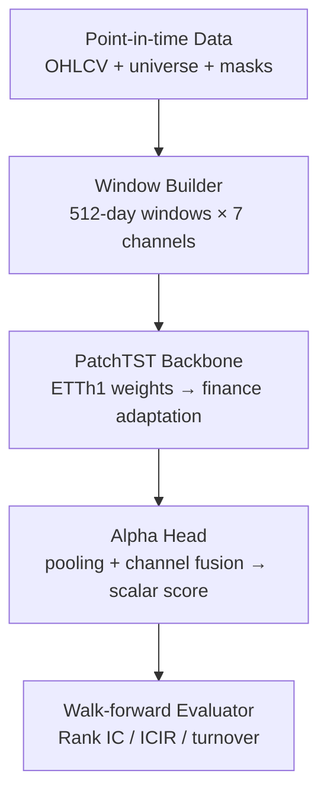

# PatchTST迁移学习实现设计文档

**IMPLEMENTATION DESIGN**

**PatchTST 迁移学习<br>
实现设计文档**

Windows + RTX 2070 Super｜日频金融时间编码器与横截面 Alpha 原型

**文档状态：**已实现工程基线 v2.0

**目标读者：**个人开发者 / 机器学习量化研究

**默认任务：**美股过去512个交易日 → 未来5日超额收益分数

**硬件边界：**Windows 11，RTX 2070 Super 8GB，单GPU

**日期：**2026-07-23

> **结论：** 该项目可在 RTX 2070 Super 8GB 上完成。首版不训练通用基础模型，而是复用公开 PatchTST 编码器，进行金融域继续预训练与轻量微调；核心风险来自数据时点、权重兼容和样本外验证，而不是算力。

# AI读取与实现约定

本文件既是人类设计文档，也是面向代码生成模型的实现规格。AI在生成或修改代码时必须遵守以下规则：

1. 将顶部YAML front matter视为全局约束，正文中的示例不得覆盖这些约束。
2. 不得把 outer validation 或 test 用于特征缩放器拟合、masked-patch预训练、早停、checkpoint 或训练阶段选择；监督训练只允许在正式 Train 内切出 inner selection。
3. 不得静默忽略权重加载失败；必须输出按参数数量计算的编码器加载比例以及所有不匹配键。
4. 所有样本必须满足 `max(feature_time) <= asof_date < min(label_time)`。
5. 所有实验必须由配置、数据版本、Git commit、随机种子和运行清单共同标识。
6. E0—E3、walk-forward、checkpoint回放和独立评价闭环已经实现；仍不扩展到订单执行、资金管理或实盘交易。

# 执行摘要

本设计将公开的 PatchTST ETTh1 自监督权重作为初始化来源，把模型迁移到日频股票序列。系统按“点时数据 → 窗口样本 → PatchTST 编码 → Alpha 头 → 时间滚动评估”组织，先证明迁移学习是否优于随机初始化，再决定是否扩大股票池和模型规模。

推荐路线不是直接拿电力预测头预测股票，而是只迁移形状兼容的编码器参数；随后在金融训练期内执行 masked-patch 域适配，最后用未来5日超额收益微调。这样能把“跨领域迁移”与“金融域预训练”的贡献拆开评估。

## 当前实现状态

本设计已经落地为 `FacDiggerNN`。当前完成 M0—M8 工程闭环：PatchTST 兼容性探针、标准 Parquet 数据契约、E0—E3、walk-forward 冻结、checkpoint 独立回放、最新信号和独立评价。默认数据源为 EODHD，供应商格式只存在于 provider 层；特征、标签、训练和评价继续依赖供应商中立的数据契约。

当前正式实验前的数据策略为：

- 同时发现 Nasdaq、NYSE 和 NYSE American 的 active 与 delisted 普通股，不用“今天仍上市”反推历史股票池。
- 根据每个历史 session 当时可知的 20 日平均成交额，动态选择最多 1000 只满足价格、上市天数和流动性门槛的证券。
- 为证券上市区间恢复完整市场 session 网格；缺少个股 bar 的 session 标记为推断停牌，标签期限按全市场 session 推进。
- EODHD 当前套餐没有可靠退市终值/原因。工程阶段允许使用明确标注的交易所惩罚插值，并在数据表、manifest 和训练 provenance 中保留方法与参数；这类数据保持 `source_research_ready=false`。
- EOD 日线无法提供点时行业和流通市值，因此工程配置暂时关闭 source-readiness 与中性化为正的硬门禁。正式研究配置必须重新开启门禁并补齐真实点时暴露。
- E0—E3 只在正式 Train 内切分 inner selection，且 purge 与 inner selection 起点标签重叠的拟合样本。Outer validation 仅用于统一样本外评价，test 仍需显式解封。

| **决策项** | **首版选择**                         | **理由**                                       |
|------------|--------------------------------------|------------------------------------------------|
| 模型       | PatchTST Encoder + 自定义 Alpha Head | 避免被原96小时预测头与7个电力通道绑定          |
| 输入       | 512日 × 7个平稳化特征                | 最大化与公开权重的结构兼容，同时适合日频长窗口 |
| 输出       | 每只股票每个交易日一个标量分数       | 可直接计算每日 IC、Rank IC 和分层收益          |
| 训练       | FP16 AMP；单卡；梯度累积             | 适配2070S 8GB，不引入多GPU复杂度               |
| 验证       | 按时间切分 + walk-forward            | 阻止未来市场状态进入训练过程                   |

## 文档结构

- 1—3：范围、约束与总体架构
- 4—6：数据、迁移策略与训练设计
- 7—9：工程结构、实验矩阵与评估
- 10—12：测试、里程碑、风险与验收
- 附录：环境安装、配置样例、伪代码与参考材料

# 1. 范围与假设

## 1.1 目标

交付一个可复现的 PatchTST 迁移学习训练模块：输入单只股票截至日期 t 可见的历史特征，输出该股票未来5个交易日的预期超额收益分数。模块服务于因子研究，不承担订单、撮合、资金管理和实盘执行。

- 验证公开 ETTh1 预训练权重能否为金融任务提供有效初始化。
- 验证金融域 masked-patch 继续预训练能否进一步提升样本外 Rank IC。
- 形成可在 Windows 单机上稳定运行、可恢复、可审计的训练流程。
- 保存逐日逐股预测，供后续因子分层和风险归因使用。

## 1.2 默认假设与可配置项

| **项目** | **默认假设**                         | **配置入口**            |
|----------|--------------------------------------|-------------------------|
| 市场     | 美股日频；Nasdaq/NYSE/NYSE American  | provider / universe     |
| 决策时点 | t日收盘后生成分数，最早t+1开盘交易   | label.execution_lag=1   |
| 历史窗口 | 512个交易日                          | model.context_length    |
| 预测周期 | 未来5个交易日                        | label.horizon=5         |
| 横截面   | 每日动态高流动性普通股，最多1000只   | universe.max_symbols    |
| 公开权重 | ibm-research/patchtst-etth1-pretrain | model.source_checkpoint |

> **范围边界：** 首版只解决模型训练与因子有效性验证。若之后接入 QuantConnect、NautilusTrader 或 IBKR，应把模型输出作为上游 signal，不在本模块中混入交易框架生命周期。

# 2. 技术基线与硬件约束

## 2.1 公开材料基线

PatchTST 的两个关键设计是 patching 与 channel independence。公开 ETTh1 权重使用7个电力通道，模型卡给出的任务是输入512小时、预测未来96小时。迁移时不保留该预测语义；仅把编码器作为时间模式初始化。

| **组件**            | **可复用**     | **处理方式**                                        |
|---------------------|----------------|-----------------------------------------------------|
| Patch embedding     | 条件复用       | patch长度一致时直接加载；否则重建并列入不匹配清单   |
| Transformer Encoder | 优先复用       | 这是迁移学习的核心，要求记录成功加载参数比例        |
| 位置编码            | 条件复用       | patch数量变化时插值或重新初始化；首版优先保持512/12 |
| Mask重建头          | 不用于最终任务 | 仅在金融域继续预训练阶段使用                        |
| 96步预测头          | 不复用         | 替换为输出单个Alpha分数的自定义头                   |

## 2.2 RTX 2070 Super 约束策略

| **约束**           | **设计响应**                                                                 |
|--------------------|------------------------------------------------------------------------------|
| 8GB显存            | 小模型、FP16自动混合精度、梯度累积、按需减小batch；不采用多尺度大模型        |
| Turing架构         | 使用FP16；不把BF16设为默认；首次运行前用torch.cuda.is_available()做冒烟测试  |
| Windows DataLoader | 入口必须加 `if __name__ == '__main__':`；num_workers从0开始再升到2—4    |
| 单机训练           | checkpoint包含模型、优化器、scheduler、scaler、epoch和随机状态，支持中断恢复 |
| 实验吞吐           | 先固定模型结构，只搜索学习率、冻结策略、域适配与loss，避免网格爆炸           |

# 3. 总体架构



## 3.1 组件职责

| **组件**         | **输入**        | **输出**    | **关键职责**                            |
|------------------|-----------------|-------------|-----------------------------------------|
| Data Catalog     | 原始行情/股票池 | 点时表      | 统一交易日、公司行动、缺失和可交易状态  |
| Feature Pipeline | 点时表          | 特征Parquet | 平稳化、滚动统计、仅向后窗口            |
| Window Dataset   | 特征表          | \[B,L,C\]   | 构造512日样本、mask与标签               |
| Transfer Adapter | 公开checkpoint  | backbone    | 按形状加载并审计missing/unexpected keys |
| Trainer          | 样本+模型       | checkpoint  | AMP、梯度累积、早停、恢复               |
| Evaluator        | 逐股预测        | 指标与报告  | Rank IC、ICIR、分层、换手和稳定性       |

# 4. 数据与标签设计

## 4.1 点时数据原则

- 每个样本只允许读取决策时点 t 及以前的数据；滚动统计必须显式 shift 或以闭区间结束于 t。
- 股票池应保存每个交易日的可交易成员，不能以今天仍上市的股票反推历史股票池。
- 价格、成交量与复权因子的口径固定；训练数据版本写入 manifest。
- 自监督预训练也不得看到验证期和测试期，因为未来分布本身就是信息。
- EODHD 连接器必须同时纳入 active 与 delisted 候选，再按历史当日流动性决定 eligibility；当前 metadata 不能用于历史流动性排序。
- 原始 OHLC 保持不变，`adj_factor = adjusted_close / close`。EODHD 的 adjusted close 同时包含拆股和分红影响，该限制必须进入来源告警。
- 日线无法直接区分停牌与缺数。实现以完整市场 session 网格承载缺口，使用 `trade_status_quality` 明确标注推断，不把缺失 bar 当作正常交易。

## 4.2 首版7通道特征

| **通道**     | **定义（示意）**                      | **目的**     |
|--------------|---------------------------------------|--------------|
| r_close      | log(C_t / C\_{t-1})                   | 日收益       |
| r_gap        | log(O_t / C\_{t-1})                   | 隔夜跳空     |
| r_intraday   | log(C_t / O_t)                        | 日内方向     |
| range        | log(H_t / L_t)                        | 日内振幅     |
| dlog_volume  | log(V_t+1)-log(V\_{t-1}+1)            | 量能变化     |
| vol20        | std(r_close, 20)                      | 短期波动状态 |
| dollar_volume_z20 | 成交额20日滚动z-score           | 相对活跃度   |

所有通道在单个历史窗口内做稳健标准化或使用仅基于训练期拟合的缩放器。不得用全样本均值和方差。极端值处理参数也只从训练期估计。

## 4.3 标签

默认标签是从下一交易日开盘到第5个交易日收盘的未来收益，再减去同期基准或当日股票池均值：

```text
y(i,t) = log(C(i,t+5) / O(i,t+1)) - benchmark_return(t+1:t+5)
score_time = close(t)
earliest_execution = open(t+1)
```

使用5日标签会造成相邻日期标签重叠。训练可以保留重叠样本，但统计显著性和最终检验应增加非重叠周频抽样或使用适当的自相关稳健估计；文档首版以样本外 Rank IC 序列稳定性为主。

标签的 `t+1` 和 `t+5` 必须按全市场交易日历计算，不能对每只证券的实际 bar 直接 shift，否则停牌会把期限错误推迟。跨退市窗口优先使用可验证的 terminal value 或 delisting return。当前 EODHD 套餐缺少该字段，工程配置采用显式保守插值：Nasdaq `-55%`、NYSE/NYSE American `-30%`、未知交易所 `-50%`；每行写入 `is_imputed=true` 和 `imputation_method`。这些参数是假设，不是观测事实，正式研究需做敏感性分析并最终替换真实退市收益。

## 4.4 时间切分

| **区间**      | **用途**                              | **禁止事项**                        |
|---------------|---------------------------------------|-------------------------------------|
| Train         | 金融域预训练、监督拟合及 inner selection | inner selection 前必须 purge 标签重叠 |
| Validation    | 冻结配置下的统一 outer 样本外评价       | 不得早停、选 checkpoint 或更新参数    |
| Test          | 显式解封后的一次性样本外比较             | 不得用于继续调参                       |
| Final Holdout | 最终报告；可选但强烈推荐              | 在所有设计冻结前保持不可见          |

> **实现切分：** 按连续时间块切分，不使用随机划分。每个 walk-forward fold 重新构建内容寻址快照和训练期 scaler；Train 尾部默认10%作为 inner selection。Outer validation 和 test 的训练、checkpoint 选择访问行数必须在 manifest 中审计为0。

# 5. 迁移学习方案

## 5.1 四组必做对照

| **实验** | **初始化/训练**                         | **要回答的问题**                  |
|----------|-----------------------------------------|-----------------------------------|
| E0       | LightGBM或MLP基线                       | 深度模型是否真的必要？            |
| E1       | PatchTST随机初始化，直接监督训练        | PatchTST架构本身的贡献是多少？    |
| E2       | ETTh1编码器 → 直接金融微调              | 跨领域预训练是否有帮助？          |
| E3       | ETTh1编码器 → 金融域masked预训练 → 微调 | 域适配是否带来额外提升？          |
| E4（暂缓） | 金融域随机初始化预训练 → 微调         | ETTh1初始化是否优于纯金融自监督？ |

## 5.2 权重加载规则

1.  加载公开预训练模型，并通过通用 base_model 接口取得编码器，避免硬编码内部属性名。
2.  创建金融目标模型；首版保持 context_length=512、patch_length/stride与源配置一致。
3.  仅复制名称与形状同时匹配的参数；预测头、重建头及明确不兼容的位置参数进入allowlist。
4.  打印并保存 loaded_numel / source_backbone_numel、missing_keys、unexpected_keys和shape_mismatch。
5.  若编码器成功加载比例低于80%，训练立即失败，不允许静默回退为随机初始化。

```python
source = PatchTSTForPretraining.from_pretrained(SOURCE_ID)
source_backbone = source.base_model
target_backbone = PatchTSTModel(target_config)
report = load_matching_weights(target_backbone, source_backbone.state_dict())
assert report.loaded_backbone_numel_ratio >= 0.80
model = FinancialAlphaModel(target_backbone, AlphaHead(...))
```

> **兼容性原则：** 公开checkpoint的类名可能随 Transformers 版本变化。项目应在 requirements-lock.txt 中锁定通过冒烟测试的版本，并用一条兼容适配器集中处理类名与state_dict前缀，业务训练代码不直接依赖内部模块路径。

## 5.3 金融域继续预训练

仅使用Train时间段，无需收益标签。每个样本随机遮挡约40%的patch，让模型重建被遮挡的平稳化特征。Train 内部按日期切出尾部10%作为重建 checkpoint 选择段，不读取 outer validation 或 test。

- mask_ratio：默认0.40；比较0.25/0.40，不做大范围搜索。
- 学习率：建议1e-4起步；使用warmup + cosine或linear decay。
- 早停：只监控 Train 内部的重建 inner-selection loss；下游 outer validation 只用于冻结协议下的最终比较。
- 保存：best_pretrain、last_pretrain及完整运行manifest。

## 5.4 Alpha微调

AlphaHead 对编码器输出做patch维平均池化，再做通道融合，最后由两层MLP输出单个分数。首版先用Huber回归保证训练稳定；第二阶段再增加按日期分组的Rank IC损失。

```pseudocode
encoder output: H in [B, C, N_patch, D] (adapter also accepts [B, N_patch, D])
patch_pool = mean(H, dim=patch)
channel_fusion = flatten_or_attention(patch_pool)
alpha = Linear(GELU(LayerNorm(channel_fusion))) -> [B, 1]
```

| **阶段** | **冻结策略**                               | **建议学习率**            |
|----------|--------------------------------------------|---------------------------|
| FT-0     | 冻结全部Encoder，仅训练AlphaHead 3—5 epoch | head: 1e-3                |
| FT-1     | 解冻最后1个Encoder block                   | encoder: 1e-5；head: 3e-4 |
| FT-2     | 若验证改善，再解冻全部Encoder              | encoder: 5e-6至1e-5       |

# 6. 单机训练设计

## 6.1 推荐起始配置

| **参数**      | **预训练**       | **微调**                         |
|---------------|------------------|----------------------------------|
| precision     | FP16 AMP         | FP16 AMP                         |
| batch_size    | 16；OOM降为8     | 32；日期分组时8日期×16股票或更小 |
| grad_accum    | 4                | 2—4                              |
| epochs        | 10起步，最多20   | FT-0 5 + FT-1 10—20              |
| gradient_clip | 1.0              | 1.0                              |
| num_workers   | 0冒烟；稳定后2—4 | 同左                             |
| checkpoint    | 每epoch + best   | 每epoch + best Rank IC           |

## 6.2 OOM降级顺序

1.  减小 batch_size，同时增加 gradient_accumulation 保持有效batch。
2.  关闭 output_attentions / output_hidden_states，避免保留不需要的激活。
3.  启用 gradient checkpointing（若当前Transformers实现支持且验证无误）。
4.  把 d_model 从128降到64，或Encoder层数从3降到2；这属于模型变更，必须单独编号实验。
5.  最后才缩短 context_length；这会改变位置参数兼容性和研究问题。

## 6.3 训练可恢复性

每个checkpoint至少包含：model、optimizer、scheduler、GradScaler、epoch/global_step、best_metric、随机数状态、数据版本hash、配置快照和Git commit。恢复训练后必须验证global_step连续、学习率未重置、验证指标可复现。

# 7. 工程结构与接口

```text
FacDiggerNN/
├── configs/
│   ├── data/                 # EODHD explicit/pilot/historical-liquid
│   ├── datasets/             # provider-neutral snapshot builds
│   ├── experiments/          # E0—E3
│   └── research/             # M6 walk-forward protocol
├── src/facdigger/
│   ├── data/providers/eodhd/ # provider config/client/mapping/universe only
│   ├── data/                 # standard contracts and immutable snapshots
│   ├── features/             # price-volume features and train-only scaling
│   ├── labels/               # market-calendar forward return + delisting
│   ├── models/               # E0 and PatchTST adapters/backbones
│   ├── training/             # E0—E3 runners and checkpoint engines
│   ├── evaluation/           # metrics, neutralization and reports
│   ├── research/             # folds, statistics, freeze and preflight
│   └── inference/            # checkpoint replay, factors and latest signal
├── tests/
├── data/                     # ignored local provider data/cache/snapshots
└── artifacts/                # ignored generated runs and reports
```

## 7.1 核心数据契约

| **对象**      | **形状/字段**                      | **约束**                       |
|---------------|------------------------------------|--------------------------------|
| past_values   | float32 \[B,512,7\]                | 最后一个时间点为t；不得包含t+1 |
| observed_mask | bool \[B,512,7\]                   | 1=有效；缺失值填0但mask为0     |
| target        | float32 \[B\]                      | t+1开盘至t+5收盘的超额收益     |
| sample_meta   | symbol, asof_date, label_end       | 用于泄漏断言和预测落盘         |
| prediction    | symbol, asof_date, score, model_id | 每日每股唯一；可追踪checkpoint |

## 7.2 配置样例

```yaml
seed: 42
data:
  context_length: 512
  channels:
    - r_close
    - r_gap
    - r_intraday
    - range
    - dlog_volume
    - vol20
    - dollar_volume_z20
  split:
    train_end: YYYY-MM-DD
    valid_end: YYYY-MM-DD
    test_end: YYYY-MM-DD
model:
  source_checkpoint: ibm-research/patchtst-etth1-pretrain
  patch_length: source_config
  patch_stride: source_config
  alpha_head:
    hidden_dim: 128
    dropout: 0.2
pretrain:
  enabled: true
  mask_ratio: 0.40
  learning_rate: 1.0e-4
finetune:
  horizon: 5
  loss: huber
  selection_fraction: 0.10
  encoder_learning_rate: 1.0e-5
  head_learning_rate: 3.0e-4
  precision: fp16
```

# 8. 训练流程

1.  环境冒烟：确认设备、模型下载、单batch forward/backward和checkpoint恢复。
2.  EODHD probe：核对 active/delisted 候选规模和单只历史格式，不隐式启动全量采集。
3.  数据采集与审计：生成标准 bars、universe、actions、delistings 和 source manifest。
4.  快照构建：从标准表生成内容寻址的 features、labels、sample metadata/index。
5.  运行E0/E1：完成传统基线与随机初始化 PatchTST。
6.  运行E2：加载ETTh1编码器，保存权重加载报告后渐进解冻。
7.  运行E3：仅在 Train 上继续预训练，再以同一 inner-selection 微调协议训练。
8.  M6 walk-forward：先 preflight，再运行 validation 矩阵并冻结配置和报告哈希。
9.  独立回放与评价：从 checkpoint 重建模型；test/final holdout 仅在冻结后显式解封。

# 9. 评估与模型选择

## 9.1 主要指标

| **层级** | **指标**                                | **用途**                             |
|----------|-----------------------------------------|--------------------------------------|
| 训练     | masked reconstruction loss / Huber loss | 诊断优化是否正常，不作为最终结论     |
| 预测     | MAE、MSE、方向准确率                    | 辅助观察；金融收益尺度下不可单独决策 |
| 因子     | Daily IC、Rank IC、ICIR、正IC占比       | 主要模型选择指标                     |
| 分层     | Q5-Q1收益、单调性、覆盖率               | 验证分数是否具有经济排序意义         |
| 稳定性   | 分年/行业/市值分组IC                    | 识别单一时期或风险暴露驱动           |
| 可交易性 | 换手率、简单成本后spread                | 排除只靠高换手的假Alpha              |

## 9.2 首版模型选择规则

单次训练的 checkpoint 和早停只使用 Train 内的 inner selection。Outer validation 用于冻结协议下比较 E0—E3、seed 和 walk-forward fold，不反馈到同一 run 的参数更新；若据此改变研究设计，必须形成新版本并重新冻结。推荐主指标为 validation 平均 Rank IC，辅以 Rank ICIR、正IC占比和成本后分层收益。测试期只在设计冻结后运行一次。

> **最小成功定义：** E3 相比 E1 在测试期的 Rank IC 和 ICIR 同时改善，且提升不是由单一年份、单一行业或极少数股票造成；换手率没有出现不可接受的恶化。

# 10. 测试与质量门禁

| **测试**             | **断言**                                         | **失败处理**           |
|----------------------|--------------------------------------------------|------------------------|
| Shape test           | 模型接收\[B,512,7\]并输出\[B\]                   | 阻止训练               |
| Look-ahead test      | max(feature_time) ≤ asof_date \< min(label_time) | 阻止数据发布           |
| Split test           | symbol-date不跨split；缩放器只fit Train          | 阻止训练               |
| Weight-load test     | 编码器numel加载比例≥80%；不匹配项均在allowlist   | 阻止迁移实验           |
| Tiny overfit         | 小批量loss能显著下降                             | 检查模型、标签和优化器 |
| Resume test          | 恢复后step/LR/scaler连续                         | 修复checkpoint协议     |
| Determinism          | 同seed核心指标在容差内一致                       | 记录非确定算子         |
| Prediction integrity | 每日每股唯一、无NaN、覆盖率达标                  | 阻止评估               |

# 11. 里程碑与工作量

| **阶段** | **当前产物**                                      | **状态** |
|----------|---------------------------------------------------|----------|
| M0       | 环境锁定、PatchTST兼容性和权重探针                | 已完成   |
| M1       | 标准Parquet、点时校验、不可变数据快照             | 已完成   |
| M2       | E0基线与统一评价                                  | 已完成   |
| M3       | E1随机PatchTST、训练恢复                           | 已完成   |
| M4       | E2 ETTh1迁移、加载与参数指纹审计                  | 已完成   |
| M5       | E3金融域masked-patch预训练                        | 已完成   |
| M6       | Walk-forward、统计推断、研究冻结与preflight       | 已完成   |
| M7       | Checkpoint独立回放与因子导出                      | 已完成   |
| M8       | 最新信号和预测文件独立评价                        | 已完成   |
| 正式实验 | 历史动态股票池全量采集、真实退市终值、点时风险暴露 | 待完成   |

个人开发建议以“每阶段可独立验收”为原则推进。第一轮不做大规模超参搜索；完整跑通E0—E3后，才扩展股票池、特征和横截面loss。

# 12. 风险与缓解

| **风险**        | **表现**                         | **缓解**                                                 |
|-----------------|----------------------------------|----------------------------------------------------------|
| 负迁移          | E2差于E1                         | 允许结论为‘ETTh1无帮助’；重点观察E3，暂缓的E4不影响工程闭环 |
| 静默未加载      | 日志显示训练正常但实际随机初始化 | numel比例门禁、state_dict审计、参数指纹测试              |
| 未来泄漏        | 测试指标异常优秀                 | 样本元数据断言、时间切分、训练期fit所有变换              |
| 显存不足        | CUDA OOM                         | 按既定降级顺序处理并记录有效batch                        |
| 过拟合          | 验证IC快速反转                   | 更小模型、dropout、早停、渐进解冻、减少搜索次数          |
| 风险暴露伪Alpha | 收益集中在小盘/行业              | 工程模式保留空结果并关闭硬门禁；正式实验补齐点时行业/流通市值后重新开启 |
| 退市插值偏差    | 插值政策改变结果                 | 报告插值比例与敏感性；正式研究替换真实delisting return   |
| Windows不稳定   | DataLoader卡住或驱动错误         | workers从0起步；锁版本；长训练前做30分钟压力测试         |

# 验收标准

- macOS/CPU 工程闭环通过；正式训练前在 RTX 2070 Super 上补跑 CUDA/FP16 冒烟与 E1—E3。
- 每次迁移训练都生成可机器读取的权重加载报告，且编码器加载比例达到门槛。
- 时间泄漏、split、shape、checkpoint恢复和预测完整性测试全部通过。
- 同一 outer validation 上输出E0—E3的Rank IC、ICIR、分层收益、换手与分组稳定性；冻结后才解封test。
- 最终结论明确区分：架构收益、ETTh1迁移收益、金融域预训练收益。
- 任何实验均可由config + manifest + commit + data hash复现。
- 正式结论要求 `source_research_ready=true`，并要求点时行业/流通市值中性化后仍满足决策门禁。

# 附录A｜Windows环境实施建议

建议使用 Miniconda/Miniforge 创建独立环境。PyTorch应从官方安装选择器获取与当前驱动兼容的Windows CUDA wheel；不在设计文档中固定未来可能过期的CUDA小版本。安装后立即锁定requirements-lock.txt。

```powershell
conda create -n facdigger python=3.11 -y
conda activate facdigger
# 按 PyTorch 官方 selector 安装 Windows + Pip + CUDA 版本
pip install transformers datasets accelerate pandas pyarrow scikit-learn scipy pyyaml tensorboard
python -c "import torch; print(torch.__version__, torch.cuda.is_available(), torch.cuda.get_device_name(0))"
pip freeze > requirements-lock.txt
```

## Windows专项检查

- 更新NVIDIA驱动；PyTorch wheel自带所需CUDA运行库时，通常无需另装完整CUDA Toolkit。
- 训练脚本入口使用 `if __name__ == '__main__':`:，避免多进程递归启动。
- 数据与checkpoint路径使用 pathlib，不手写反斜杠拼接。
- 显存监控使用 nvidia-smi；训练时记录峰值 allocated/reserved memory。
- 若长时间训练不稳定，先把num_workers设为0并关闭第三方overlay/超频。

# 附录B｜首轮实验顺序

| **顺序** | **实验**                  | **停止条件**               |
|----------|---------------------------|----------------------------|
| 1        | 单股票/小批量tiny overfit | 无法过拟合则不进入正式训练 |
| 2        | 100只股票、短训练E1       | 确认数据、loss和评估闭环   |
| 3        | 同数据E2                  | 确认加载报告与渐进解冻     |
| 4        | 同数据E3                  | 确认masked域适配的增量     |
| 5        | 扩大到完整训练股票池      | 只有小规模闭环稳定后执行   |
| 6        | walk-forward与分组稳定性  | 设计冻结后执行最终报告     |

# 附录C｜参考材料

[\[S1\] PatchTST 原论文：A Time Series Is Worth 64 Words](https://arxiv.org/abs/2211.14730)

[\[S2\] PatchTST 官方开源实现](https://github.com/yuqinie98/PatchTST)

[\[S3\] Hugging Face PatchTST 文档](https://huggingface.co/docs/transformers/model_doc/patchtst)

[\[S4\] IBM Research ETTh1 预训练权重](https://huggingface.co/ibm-research/patchtst-etth1-pretrain)

[\[S5\] IBM Granite PatchTST 模型卡](https://huggingface.co/ibm-granite/granite-timeseries-patchtst)

[\[S6\] PyTorch Windows 安装选择器](https://pytorch.org/get-started/locally/)

> **实施提醒：** 在开始全量训练前，先完成E1小规模闭环和E2权重加载审计。对该项目而言，“确实加载了哪些权重”比“训练日志看起来正常”更重要。
