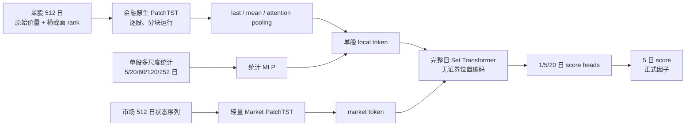

# Transformer 因子质量优化设计

> **状态：工程实现完成，真实 RTX 实验待运行。** 输入/标签、模型、监督 embedding replay、
> 金融预训练、Train 内 linear probe、100-update 资源准入、训练快照回放和 9 阶段精简 runner
> 已落地并通过小型测试。面向生产的 target-free snapshot、ModelRelease 和 FactorBatch 暂不扩展，
> 等本轮模型通过配对门禁后再接入。现行 E0—E3 继续作为历史基线。

## 1. 决策摘要

下一轮不再围绕现有 ETTh1 兼容结构做局部调参，而采用以下四项高影响改造：

1. **金融原生时间编码器**：取消 ETTh1 架构约束，改用 LayerNorm、pre-norm、重叠 patch、
   通道专属 embedding、通道 attention、显式多尺度池化，并关闭 PatchTST 内部二次 scaling。
2. **向模型提供相对状态和市场状态**：在原始价量序列之外加入同日横截面 rank 序列、市场
   状态序列和确定性的多尺度统计分支，使模型不必从七个原始通道中重新发明所有金融归纳偏置。
3. **增加完整日横截面 Transformer**：先逐股编码时间序列，再在同一交易日的股票 embedding
   上执行无位置编码的 Set Transformer，使模型直接学习股票之间的相对关系，而不仅是在 loss
   末端比较彼此独立的分数。
4. **重做金融预训练与监督优化**：从金融数据随机初始化预训练，以连续遮蔽和未来片段预测代替
   单纯随机重建；监督阶段使用 1/5/20 日多任务排序、完整解冻、warmup 和按 optimizer step
   调度。

最终候选模型暂称 `finance_patch_transformer`。这是实验名称，不引入新的外部格式版本，也不
改变 FactorBatch 契约。主因子仍是 5 日 horizon 的单个 Transformer score；LightGBM 分数、
seed 集成和模型组合不计入本轮模型质量增益。

为把 RTX 2070S 的完整实验控制在 1—2 周，主实验只保留两个完全同构的模型：

| ID | 初始化 | 其余数据、结构和监督训练 |
|---|---|---|
| `scratch` | 随机初始化 | 与 pretrained 完全相同 |
| `finance_pretrained` | 金融原生预训练 encoder | 与 scratch 完全相同 |

每个模型运行三个 walk-forward folds、固定 seed 42，共 6 个监督 cell；每个 fold 的金融预训练
只执行一次并供该 fold 的 pretrained cell 使用。时间控制只来自删除中间模型分支、超参数网格
和额外 seeds，不减少任一 cell 的股票池、日期、窗口、样本或 epoch 预算。

## 2. 为什么需要重做训练设计

最新完整 validation 结果位于：

```text
/Users/young/Documents/FacDiggerNN/artifacts3/r/
  m6fb32-20260813T134100Z-42d5f262/validation/research.json
```

其核心结果为：

| 模型 | 平均 Rank IC | 主要结论 |
|---|---:|---|
| E0 LightGBM | 0.01886 | 显式多尺度特征仍是强基线 |
| E1 随机 PatchTST | 0.01960 | 时间模型有弱正增量，但 seed/阶段稳定性不足 |
| E2 ETTh1 迁移 | 0.01732 | 相对 E1 为负，出现负迁移 |
| E3 ETTh1 + 金融重建 | 0.02048 | 自身显著，但相对 E1 仅 +0.00088，`p=0.414` |

现有结果支持以下诊断：

- 完整日横截面排序 objective 已经修复，当前主要矛盾不再是 loss 被切成小块；
- 高流动性样本观测覆盖很高，退市插值影响的行比例很低，原始数据损坏不是主因；
- E0 的主要增益来自 60/120/252 日均值、标准差和极值，说明长历史存在信号，但当前
  PatchTST 的等权 patch 均值没有有效提取；
- 当前 PatchTST 对每个通道独立编码，所有股票也独立编码，Transformer 实际没有看到
  “价量联动”和“同日股票相对关系”；
- ETTh1 小时级电力域与美股日频横截面排序差异过大，而 E2/E3 又只解冻最后一层，金融适配
  不充分；
- E1 早期梯度频繁触发裁剪，score 方差膨胀，五个 epoch 和无 warmup 的 `3e-4` 全模型学习率
  不足以形成稳定收敛路径。

因此，本轮不把中性化、退市、组合成本或外部发布规范作为训练改造重点。它们影响结果解释和
组合使用，但不能解释当前 Transformer 表示能力和迁移增益不足。

## 3. 目标、边界和成功定义

### 3.1 主目标

提高**不依赖 LightGBM、不依赖跨模型集成的 Transformer 5 日因子**在 walk-forward
validation 上的：

- 日均 Rank IC；
- 跨年份和跨 fold 的方向稳定性；
- 固定 seed 下三个 walk-forward fold 的一致性；
- 排名头尾区分能力。

### 3.2 暂不作为本轮优化目标

- 通过 E0 + Transformer 组合尽快生成更强生产因子；
- 用 seed 预测集成掩盖单模型训练方差；
- 行业/市值中性化和真实退市收益；
- 将 20 bps 组合收益直接并入训练 loss；
- 保持与 ETTh1 checkpoint 的结构兼容；
- 在原始 512 日 token 上做 1000 股票之间的全量联合 attention。

最后一项不是放弃横截面建模。新模型会先把每只股票压缩成一个 embedding，再在约 1000 个
embedding 上做完整日 attention，计算和显存都可控。

### 3.3 资源边界

- 训练机器：RTX 2070 Super，8 GB VRAM，16 GB RAM；
- 推理机器：macOS 本机；
- 股票池：每天最多 1000 只；
- context：继续使用 512 个交易日；
- GPU physical microbatch 可降至 8 或 16，但完整日 objective 不得退化；
- 所有正式参数在资源基准后冻结，不能一边看完整 validation 一边无限调参。
- 主矩阵固定一个 seed 42；第二、第三 seed 和组件消融延后，不计入 1—2 周预算。

## 4. 目标模型总览



模型分成明确的五个职责：

1. `LocalTemporalEncoder`：只负责单只股票的时间序列；
2. `MultiScaleStatisticsEncoder`：提供稳定的金融多尺度归纳偏置；
3. `MarketContextEncoder`：每个日期只计算一次市场状态；
4. `CrossSectionalEncoder`：对当日股票集合做 permutation-equivariant attention；
5. `MultiHorizonRankHead`：输出 1/5/20 日横截面分数，5 日头用于发布。

模型接口必须显式拆成：

```text
encode_local(...) -> local_embeddings
encode_market(...) -> market_token
score_date(local_embeddings, market_token, ...) -> horizon_scores
```

这既是逻辑边界，也是显存受限重放训练的必要条件。

## 5. 输入表示改造

### 5.1 保留的单股原始序列

继续保留现有七通道，以便和 E1 结果对照：

```text
r_close
r_gap
r_intraday
range
dlog_volume
vol20
dollar_volume_z20
```

`r_close = r_gap + r_intraday` 存在数值冗余，但这里仍保留总收益通道：总收益的横截面排序并
不能由 gap rank 和 intraday rank 线性恢复，且显式总收益能减少模型在弱监督下学习简单加法的
负担。后续可单独做移除 `r_close` 的低成本消融，不与主改造绑定。

### 5.2 新增同日横截面 rank 序列

对七个单股通道，按每个 `trade_date` 的当日 eligible 股票做 average-tie percentile rank，
映射到 `[-1, 1]`：

```text
rank_r_close
rank_r_gap
rank_r_intraday
rank_range
rank_dlog_volume
rank_vol20
rank_dollar_volume_z20
```

这七个序列与原始序列共同进入 LocalTemporalEncoder。原始值表达绝对状态，rank 表达同日相对
状态。rank 只使用当日已经完整取得的横截面，不使用目标或未来价格。

### 5.3 新增市场状态序列

每个交易日从当日 eligible 横截面计算：

| 字段 | 定义 |
|---|---|
| `market_return_median` | `r_close` 横截面中位数 |
| `market_breadth` | `r_close > 0` 的有效股票比例，映射到 `[-1,1]` |
| `market_return_dispersion` | `r_close` 横截面 MAD，经训练期 scaler 处理 |
| `market_range_median` | `range` 横截面中位数 |
| `market_volume_activity` | `dollar_volume_z20` 横截面中位数 |
| `market_vol20` | `market_return_median` 的 20 日滚动波动率 |

这些字段形成一条 `[512, 6]` 市场序列。同一 as-of date 只编码一次，不把相同市场序列复制
1000 次进入本地编码器。

连续原始值和市场值沿用 train-global robust scaler；横截面 rank 已固定在 `[-1,1]`，不再做
第二次尺度拟合。缺失值仍以零作为张量占位并由 observed mask 排除。多尺度统计基于完成上述
处理后的输入计算，PatchTST 内部 `scaling=false`，从而只有一条权威尺度变换路径。

### 5.4 显式多尺度统计分支

对七个原始单股通道，在模型前向中按 observed mask 计算：

```text
windows = [5, 20, 60, 120, 252]
statistics = [mean, std, min, max, observed_ratio]
latest = 每通道最后一个有效值
```

总计 `7 × 5 × 5 + 7 = 182` 个确定性值，经 LayerNorm 和两层 MLP 投影为 64 维。该分支：

- 不调用 LightGBM，也不读取 E0 score；
- 不替代 PatchTST，而是向预测头提供 E0 已证明有效的多尺度归纳偏置；
- 直接从当前 window 和 observed mask 计算，训练与推理共用一条实现；
- 不单独持久化一份可漂移的 tabular 特征表。

### 5.5 多 horizon 标签

在现有 5 日主标签之外增加：

| Horizon | 原始收益区间 | 用途 |
|---:|---|---|
| 1 | 下一交易日开盘到下一交易日收盘 | 短期信息和反转辅助任务 |
| 5 | 下一交易日开盘到第五个未来交易日收盘 | 主任务和发布 score |
| 20 | 下一交易日开盘到第二十个未来交易日收盘 | 中期状态辅助任务 |

每个 horizon 都减去当日 eligible 股票等权 benchmark，并在完整日内转换成 `[-1,1]` target
rank。样本切分按最长 20 日标签边界处理。推理和 FactorBatch 只输出 5 日 head。

## 6. 金融原生时间编码器

### 6.1 默认结构

| 参数 | 新默认值 | 设计原因 |
|---|---:|---|
| context length | 512 | 保留长期信息 |
| local channels | 14 | 七个原始值 + 七个横截面 rank |
| patch length / stride | 16 / 8 | 50% 重叠，约 63 个 token，兼顾短期边界与 8 GB 显存 |
| d_model | 64 | 独立日期信息量有限，降低过拟合和显存 |
| heads | 8 | 每头 8 维，支持多种时间关系 |
| layers | 4 | 比现有 6 层更适合有效样本量 |
| FFN | 256 | 4 倍扩张 |
| norm | LayerNorm | 消除任意股票 microbatch 对 BN 统计的影响 |
| pre-norm | true | 改善深层和相关性 loss 的梯度稳定性 |
| internal scaling | false | 保留 train-global scaling 后的横截面振幅信息 |
| shared embedding | false | 不同金融通道使用不同 patch projection |
| channel attention | true | 每层同时建模时间关系和价量通道关系 |
| dropout | 0.1 | 降低现有 0.3 带来的弱信号损失 |

`patch_length=8, stride=4` 只作为资源基准通过后的预注册替代候选；它的时间 attention 计算量
约为 16/8 方案的四倍，不能未经基准直接进入完整矩阵。

### 6.2 时间池化

现有模型对所有 patch 等权平均。新模型对每个通道并行保留：

- 最后一个有效 patch；
- 所有有效 patch 的 masked mean；
- 一个带可学习 query 和单调 recency bias 的 attention pooling。

三者拼接、投影后形成 local temporal vector。attention pooling 不替代 last/mean，因此即使其
早期训练不稳定，模型仍保留最近状态和全历史汇总的直接路径。

### 6.3 市场编码器

市场序列使用较小的 PatchTST：

```text
channels=6, patch_length=16, stride=8,
d_model=32, heads=4, layers=2, ffn_dim=128,
LayerNorm, pre_norm, channel_attention=true, scaling=false
```

池化后的市场表示投影为 128 维 `market_token`。它只按日期计算一次，不能在每只股票的
microbatch 中重复计算。

## 7. 完整日横截面 Transformer

### 7.1 输入与结构

LocalTemporalEncoder 的输出和 64 维多尺度统计 embedding 融合为每只股票 128 维
`local_token`。同一天的 token 组成：

```text
[market_token, stock_1, stock_2, ..., stock_N]
```

随后进入两层 Set Transformer：

```text
d_model=128
heads=4
layers=2
ffn_dim=256
dropout=0.1
pre_norm=true
```

关键约束：

- 不加入 security 顺序位置编码；改变股票输入顺序必须只改变输出的对应顺序；
- 不使用固定 ticker embedding，避免模型把历史股票身份当作主要信号；
- `market_token` 是唯一特殊 token；
- 动态横截面通过 padding mask 处理；正式路径一般每次只输入一个完整日期，无需跨日期 pad；
- 输出使用 local residual：`score = local_score + gate × contextual_score`，gate 从较小值初始化，
  防止横截面模块在训练初期破坏已有本地信号。

### 7.2 为什么 RTX 2070S 可行

模型不会对 `1000 × 512` 原始 token 做跨股票 attention。跨股票模块只接收约 1001 个
128 维 token。两层、四头 attention 的主要权重矩阵规模约为每层四百万个 FP16 元素；显存
远小于同时保留 1000 只股票的时间编码计算图。

时间编码仍按 physical microbatch 运行。LayerNorm 使 batch 从 16 降到 8 时只影响吞吐，不
改变单个样本的归一化统计，解决了现有 BatchNorm 微批依赖问题。

## 8. 显存受限的精确训练算法

横截面 attention 使每只股票的 score 依赖当日其他股票，不能继续独立 microbatch 打分。
训练采用完整链式梯度的 embedding replay：

1. 对一个完整日期，保存每个 local microbatch 以及 market encoder 的 RNG 状态；
2. 第一遍不建图，分块计算全部 `local_token`，并计算一次 `market_token`；只保留约
   `N × 128` 的 FP32 local embedding 和一个 128 维 market embedding；
3. 将 local/market embedding 都作为 `requires_grad=true` 的 leaf tensor 进入
   CrossSectionalEncoder；
4. 对完整日 1/5/20 日 score 一次性计算 loss 并反向，得到横截面模块参数梯度以及
   `d(loss)/d(local_token)`；
5. 恢复 RNG，重新计算 local token 和 market token，并使用各自保存的 embedding gradient
   反向到 LocalTemporalEncoder、统计融合层和 MarketContextEncoder；
6. 累积配置数量的完整日期后裁剪梯度并执行一次 optimizer step。

该算法是标准链式法则的精确重放，不 detach 最终训练信号，也不近似横截面 attention。与现有
两遍完整日 score 重放相比，只是把重放边界从标量 score 前移到 128 维 local embedding。

必须新增以下等价性测试：

- 小横截面单图训练与 embedding replay 的 loss、参数梯度一致；
- 改变 physical microbatch 大小后，FP32/no-dropout 梯度一致；
- 打乱股票输入顺序后，score 按相同置换变化；
- RNG 重放开启 dropout 后，两遍 local embedding 一致；
- 不完整日期、重复 security 或 horizon label 错位必须显式失败。

## 9. 监督目标与优化日程

### 9.1 多任务完整日排序 loss

对每个 horizon：

```text
L_h = 1 - corr(score_h, target_rank_h)
```

总 loss：

```text
L_rank = 0.20 × L_1 + 0.60 × L_5 + 0.20 × L_20
L_scale = Σ_h weight_h × log(std(score_h) + epsilon)^2
L_total = L_rank + 0.01 × L_scale
```

`L_scale` 只用于识别相关性 loss 原本不确定的 score 尺度，目标标准差为 1；它不要求预测收益
数值，也不改变横截面排序目标。实现时使用完整日 score 的 autograd，不再手写多 horizon
解析梯度。

需要单独保留两个消融：

- 仅 5 日 `L_5`；
- 1/5/20 日多任务但 `L_scale=0`。

如果 scale regularizer 没有降低梯度裁剪率或 seed 方差，应删除，而不是为了设计完整而保留。

### 9.2 从头训练

| 项目 | 默认值 |
|---|---:|
| optimizer | AdamW，betas=(0.9, 0.95) |
| local temporal LR | 1e-4 |
| market/cross-section/head LR | 3e-4 |
| weight decay | 1e-2；bias 和 norm 不衰减 |
| warmup | 总 optimizer steps 的 5% |
| schedule | 按 optimizer step cosine，最低为初始 LR 的 10% |
| dates per optimizer step | 4 |
| max/min epochs | 10 / 6 |
| patience | 3 |
| max gradient norm | 1.0 |
| precision | CUDA FP16，统计量和 loss 使用 FP32 |

warmup 和 cosine 必须按真正成功的 optimizer update 计数，不能按 epoch 近似。AMP overflow
跳过的 step 不推进 scheduler。

### 9.3 checkpoint 选择

Train 内 selection 从尾部 10% 提高到 15%，再按日期切成三个连续子区间。只用 5 日主 head
计算：

```text
selection_score = overall_mean_rank_ic
                  - 0.25 × std(three_subperiod_mean_rank_ic)
```

这样仍奖励平均 Rank IC，同时降低只适配 selection 某一小段市场状态的 checkpoint 被选中
概率。报告必须同时保留原始 overall mean 和三个分段值，不能只输出复合分数。

## 10. 金融原生预训练

### 10.1 不再以 ETTh1 为默认起点

新预训练从随机初始化的金融原生 encoder 开始。现有 E2/E3 继续作为历史对照，但不再约束
patch、norm、embedding、channel attention 或解冻策略。

### 10.2 预训练样本

新增 target-free pretraining index：

- 只使用对应 fold 的 official Train 日期；
- 不要求样本具有 1/5/20 日监督标签；
- 从 snapshot 中所有具备完整 512 日边界的证券生成；
- future-summary target 的结束日期也必须位于 official Train 内；
- 使用全部有效 endpoint 和证券，不做日期 stride、证券上限或随机行下采样；
- 按日期和证券两级均衡采样；
- market sequence 每个 endpoint 只存一个索引，不复制原始数组。

若当前 snapshot 没有覆盖比监督样本更广的证券，先复用同一训练期 features，不能声称已使用
“全市场无标签语料”。是否扩展 bronze 候选是后续数据实验，不阻塞模型代码。

### 10.3 预训练目标

预训练 local/market encoder 使用两个互补任务：

1. **连续 patch 遮蔽重建**，权重 0.4：mask 30% patch，span 长度 1—4；一半 span 在全部
   通道共享，迫使模型使用时间上下文，另一半按通道独立，迫使 channel attention 使用价量
   关系。只在真实 observed 元素计算 Huber loss。
2. **未来 5 日摘要预测**，权重 0.6：从 as-of date 后五个 session 预测原始价量通道的
   标准化 sum/mean/std 摘要。该任务仍由行情自身生成，不读取最终 FactorBatch，但比恢复已知
   历史更接近预测型表示。

重建和未来预测先按通道有效元素标准化，再加权，防止高方差通道支配 loss。

### 10.4 预训练 checkpoint 选择

不能再只按 reconstruction loss 选择。每个预训练 epoch 后：

1. 冻结 encoder；
2. 在固定的 Train 内 probe-fit 日期上训练轻量线性 5 日 rank head；
3. 在固定 probe-selection 日期上计算完整日 Rank IC；
4. 以 probe Rank IC 为主选择 encoder，预训练 loss 只作为训练健康指标。

probe 使用固定日期子集和固定 seed，成本应在资源基准中单独记录。若 probe 开销超过一个
预训练 epoch 的 20%，暂停并重新核算完整时间预算，不能减少 probe 频率或退回“只看重建
loss”来换取速度。

预训练使用完整数据运行最多 3 个 epoch、最少 2 个 epoch、patience=1。这里不通过抽样节省
时间；预算来自每个 fold 只训练一次 encoder，而不是为每个监督 seed 重复预训练。

### 10.5 监督微调

金融预训练模型进入监督阶段后：

- 从第一步开始解冻全部 local/market encoder；
- 不再执行两 epoch head-only；
- encoder LR 与 scratch 同为 `1e-4`，统计、cross-section 和 heads 同为 `3e-4`；
- warmup、完整日 loss、physical batch 和 checkpoint 选择与从头训练完全相同；
- max/min epochs 与 scratch 相同，均为 10/6，patience 为 3。

这里刻意不使用只对 pretrained 生效的 layer-wise decay 或更小 LR，否则配对结果会同时混入
初始化和监督优化协议两种差异，无法回答本轮唯一核心问题。

## 11. 精简后的主实验

### 11.1 唯一核心对照

主问题缩减为一个：

```text
同一金融原生 Transformer 在完全相同的数据和监督训练下，
金融预训练是否优于随机初始化？
```

主矩阵：

```text
3 folds × 1 seed × 2 initialization methods = 6 supervised cells
+ 3 fold-specific financial pretraining runs
```

执行顺序按 fold 进行：

1. 构建该 fold 的完整 snapshot；
2. 运行一次完整金融预训练并冻结最佳 encoder；
3. 运行 `scratch/seed-42`；
4. 运行 `finance_pretrained/seed-42`；
5. 完成该 fold 配对评价后进入下一 fold。

现有 E1/E2/E3 结果只作为历史背景，不重跑、不进入主矩阵统计。scratch 与 pretrained 必须复用
同一新架构，除了初始化 checkpoint 外配置完全一致；不允许 pretrained 使用更小 LR、更少
epoch 或不同 selection 规则。

### 11.2 1—2 周运行预算

旧 FP32 实验中，现有 E1 的 5 epoch 单 cell 约为 6—12.5 小时，36-cell 矩阵从
2026-08-13 运行到 2026-08-23。新协议以 10 epoch、FP16、固定的金融原生模型容量、按 4 个日期累积更新，
但增加 channel/cross-section attention。正式估时不能只按参数量猜测，工程实现完成后必须在
真实 RTX 2070S 上运行 100 个 optimizer update 基准并计算：

```text
projected_total =
    Σ(3 fold pretraining time)
  + Σ(3 fold scratch supervised time)
  + Σ(3 fold pretrained supervised time)
  + 10% checkpoint/evaluation/resume overhead
```

目标上限为 14 天；低于 7 天不构成问题。若预测超过 14 天，按以下顺序优化执行效率：

1. 确认 FP16、预取、持久 DataLoader worker 和 pinned memory 已生效；
2. 确认监督路径每日期只计算一次 market embedding、预训练每个 market endpoint 只遍历一次；
3. 调整 physical microbatch 到吞吐最高且不 OOM 的值；
4. 启用可验证等价的编译/融合算子，并重新运行同一基准。

不得通过缩小股票池、缩短 512 日 context、丢弃训练日期、对监督或预训练行下采样、减少
10 epoch 上限来满足时间预算。若执行优化后仍超过 14 天，应暂停完整矩阵并报告真实基准，不能
静默牺牲单模型质量。

## 12. 因子质量验收标准

本轮只有一个 seed，不做 seed 集成。primary metric 是三个 fold 上 pretrained 与 scratch 的
同日期配对结果。

金融预训练相对 scratch 应同时满足：

1. 三个 fold 的 paired mean Rank IC delta 至少 `+0.001`；
2. 至少 2/3 fold 的 delta 为正；
3. scratch 与 pretrained 的最差 fold 绝对 Rank IC 都为正；
4. pretrained 不得靠明显更高 score 波动或梯度失稳取得单期提升；
5. 两组训练后半段梯度裁剪 step 比例低于 10%，score std 不持续单调膨胀。

scratch 本身还应与历史 E1 的 `0.01960` 平均 Rank IC 作描述性比较，但因架构、输入和训练预算
均已改变，不把它当作严格配对门禁。同时报告 Q5−Q1、换手、20 bps 净值、分年 IC、预测相关性
和 attention/embedding 诊断。

<!--
时间充裕后的完整实验设计（当前不执行）：

T0 当前 E1；T1 金融原生 PatchTST 与新优化器；T2 加横截面 rank、市场 encoder 和多尺度统计；
T3 加完整日 Set Transformer；T4 比较单任务、多任务及 scale regularizer；T5 加金融原生预训练。
筛选阶段在三个 folds 上使用 seed 42，组件必须至少两个 folds 为正才继续；确认阶段对最佳 scratch
和 pretrained 扩展到 3 folds × 3 seeds。可额外比较 patch 16/8 与 8/4，并重新运行完全同 snapshot
的 T0。该完整消融不计入本轮 1—2 周预算，代码只需通过配置保留关闭组件的能力，不预先运行。
-->

## 13. 训练健康与表示诊断

当前每个 epoch 已记录：

- 每个参数组的实际 LR；
- optimizer updates、AMP skipped steps；
- pre-clip gradient norm 的均值、P95、最大值和 clip 比例；
- 每个 horizon 的 train rank loss、score std 和主 5 日 selection Rank IC；
- 三个 selection 子区间的 Rank IC；
- local/market embedding replay 最大误差、context gate；
- 每日完整横截面数、physical microbatch 数和全量样本计数；
- 预训练 local/market reconstruction、future-summary loss、真实 mask ratio 和 probe Rank IC；
- 每 epoch/全 run 耗时及持续追加的 `progress.jsonl`。

local embedding 有效秩、local/contextual residual 相关性、market attention 和 attention entropy
属于注释保留的完整诊断实验。PyTorch 标准 `TransformerEncoder` 不暴露稳定的逐层 attention
权重；本轮不为尚未使用的诊断复制一套 encoder 实现。

如果模型表现不佳，这些字段应能区分：输入无信息、表示塌缩、横截面模块未使用、梯度失稳、
pretraining 无迁移和 checkpoint 选错，而不是再次只看到一个最终 IC。

## 14. RTX 2070S 资源门禁

完整训练前先执行 100 个 optimizer update 的单 cell 基准，并用第 11.2 节公式估算全部九个长
运行阶段：

```bash
facdigger train finance-benchmark \
  --supervised-config configs/experiments/finance_patch_transformer_scratch.yaml \
  --pretraining-config configs/experiments/finance_patch_pretrain.yaml \
  --dataset data/snapshots/<largest_fold_dataset_id> \
  --updates 100 \
  --output artifacts/benchmarks/finance-transformer-rtx2070s.json
```

| 检查 | 目标 |
|---|---|
| CUDA 峰值显存 | `< 7.2 GB`，为驱动和碎片保留余量 |
| 宿主峰值 RAM | `< 13 GB` |
| physical microbatch | 优先 16；OOM 时降至 8 |
| 完整日最大横截面 | 至少覆盖 1000 股票 |
| replay 等价性 | FP32 小样本梯度测试通过 |
| 吞吐 | 记录每完整日秒数，再推算一个 fold 和完整矩阵时间 |

基准对最大 fold 的时长保守地乘以全部 3 次预训练和 6 个监督 cell，并增加 10% overhead；
probe 时间单独标记，首个实际预训练 epoch 若发现 probe 超出 overhead，必须修正估时。若超过
14 天，允许的调整顺序仅限等价执行优化：

1. physical microbatch 16 → 8 或向上试探，只改变显存/吞吐；
2. 在 RAM 门禁内增加 DataLoader workers 和 persistent workers；
3. 验证 pinned memory、FP16 和数据搬运 non-blocking；
4. 使用有数值等价测试的编译或融合优化。

本轮不允许修改 patch、`d_model`、层数、股票池、日期、上下文、样本或 epoch 预算来通过时间
门禁。等价优化后仍超时则暂停并报告，而不是降低单模型质量。

该报告不是操作建议而是 runner 的强制输入。`transformer-run` 在创建研究 run 前要求：实际
测量不少于 100 个 optimizer update，CUDA/FP16 为真，峰值显存和宿主 RAM 分别不超过
7.2/13 GiB，投影不超过 14 天；随后将报告中的 scratch/pretraining 配置哈希和 dataset ID
与当前配置及最大 fold snapshot 比对。任一条件不满足都 fail closed，不能启动九阶段矩阵。

## 15. 已实现的代码边界

后续实现应沿用现有领域目录，不建立通用 helpers：

```text
src/facdigger/features/
  cross_sectional.py          # 当日 rank 和市场状态

src/facdigger/labels/
  forward_return.py           # 扩展为 1/5/20 日标签

src/facdigger/datasets/
  index.py                    # 监督、推理及 target-free pretrain index
  window.py                   # local/market window 和共享 store
  sampler.py                  # 完整日与 date/security 均衡采样

src/facdigger/models/
  finance_patch_transformer.py # local、market、statistics、set encoder 和 heads
  finance_pretrain.py          # span mask、future-summary heads

src/facdigger/training/
  finance_transformer_config.py
  finance_transformer_engine.py # embedding replay、多任务 loss、step scheduler
  finance_pretrain_config.py
  finance_pretrain_engine.py
  finance_benchmark.py

src/facdigger/research/
  transformer_config.py
  transformer_runner.py

configs/experiments/
  finance_patch_transformer_scratch.yaml
  finance_patch_transformer_pretrained.example.yaml
  finance_patch_pretrain.yaml

configs/research/
  finance_transformer_streamlined.yaml
```

现有 `training/ranking.py` 的 target rank、日度审计和评价逻辑继续复用。新完整日引擎只替换
“如何获得全日 score 并把梯度传回时间编码器”，不能复制出第二套 Rank IC 定义。

训练 snapshot 的 `facdigger predict` 已增加 full-date scoring adapter：先分块产生 local
embedding，再对目标日期执行一次 Set Transformer，并交给现有 prediction evaluator。生产侧
仍保持 E3-only；新模型确认有效后再扩展无标签 inference snapshot、ModelRelease 和
FactorBatch，避免提前形成两套生产路径。

## 16. 实施状态

### 阶段 1：输入与标签（已完成）

- 横截面 rank、市场状态和 1/5/20 标签；
- 多尺度统计的共享训练/推理实现；
- snapshot 和 window 测试；
- 不改现有 E1—E3 行为。

### 阶段 2：金融原生模型（已完成）

- LocalTemporalEncoder、MarketContextEncoder、pooling、统计融合；
- CrossSectionalEncoder 和 permutation 测试；
- 单图 forward/backward 测试。

### 阶段 3：监督训练引擎（已完成）

- embedding replay；
- 多 horizon loss 和 scale regularizer；
- parameter groups、warmup/cosine、完整 resume；
- 小样本单图梯度等价测试和 RTX 资源基准命令。

### 阶段 4：金融预训练（已完成）

- target-free index 和均衡采样；
- span mask、future-summary objective；
- 固定 linear probe 选择；
- 全量解冻并与 scratch 共用监督优化协议。

### 阶段 5：研究与训练快照回放（已完成）

- scratch/finance_pretrained 两组配置和精简 runner 注册；
- full-date checkpoint replay；
- 训练 snapshot checkpoint 回放；
- 更新实验设计、开发文档和复盘。

生产 target-free 每日/全历史推理和 ModelRelease 接入明确推迟到配对实验 `go` 以后，不属于
本轮开始训练的前置条件。

各阶段已经分别完成相关单元和小型集成测试；只有 RTX 资源门禁通过，才开始真实完整训练。

当前工程阶段已经完成；实际执行入口为：

```bash
facdigger research transformer-plan \
  --config configs/research/finance_transformer_streamlined.yaml
facdigger research transformer-run \
  --config configs/research/finance_transformer_streamlined.yaml
```

runner 只注册 9 个长阶段，按 fold 依次完成 pretrain、scratch、finance-pretrained，并在
`matrix.json` 保存恢复状态。它不会调用旧 M6 runner 或注释中的 T0—T5/3-seed 完整实验。

## 17. 风险与停止条件

| 风险 | 如何识别 | 处理 |
|---|---|---|
| 横截面 attention 只复制输入 rank | contextual residual 与 local score 近乎完全相关 | 本轮记录诊断，留待完整消融验证 |
| Set Transformer 过拟合股票集合 | selection 上升但后续 folds 转负 | 当前矩阵不改；在后续完整消融中预注册降层/维度并保留 local residual |
| 多任务产生负迁移 | 辅助 head 梯度长期与 5 日 head 冲突 | 当前矩阵不临时改配置，留待完整消融验证 |
| scale regularizer 干扰排序 | clip 率未降且 IC 下降 | 当前矩阵记录为失败原因，后续预注册移除消融 |
| 预训练仍只学平滑重建 | probe IC 不升、reconstruction 持续下降 | 本轮按门禁判为无增益，后续再预注册 future objective 变体 |
| 训练时间不可接受 | 资源基准推算超过 14 天 | 先优化 FP16、worker、pinned memory 和 microbatch 吞吐；仍超时则暂停，不缩数据或单模型预算 |
| 市场状态重复或无增益 | market attention 长期退化为零或常数 | 本轮记录诊断，留待完整消融验证 |

本轮不根据中途结果修改冻结配置。组件级贡献要等注释保留的完整消融恢复后再判断；本文描述的
是当前最理想的可实现候选，不意味所有组件在后续证据为负时必须永久保留。

## 18. 最终预期

这次改造的关键不在于把现有 PatchTST 再训练更久，而是让 Transformer 真正获得它此前没有的
三种能力：

1. 在时间轴上识别最近事件与长期状态，而不是把 42 个 patch 等权平均；
2. 在同一股票内部联合理解价格、成交量、波动率和相对排名；
3. 在完整交易日内直接比较股票 embedding，并根据市场状态形成条件化排序。

如果 scratch 与 finance_pretrained 都无法稳定超过历史 E1，说明即使加入金融原生时间表示、
市场上下文和横截面关系，当前纯 EOD 价量信息仍没有形成更强的可泛化 alpha。届时再启用注释中
保留的完整组件消融，区分问题来自结构还是某个辅助目标；在此之前不应继续增加基本面、新闻或
更高频数据来掩盖训练设计问题。
