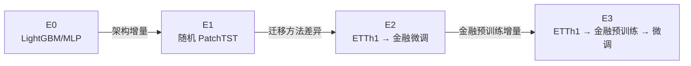
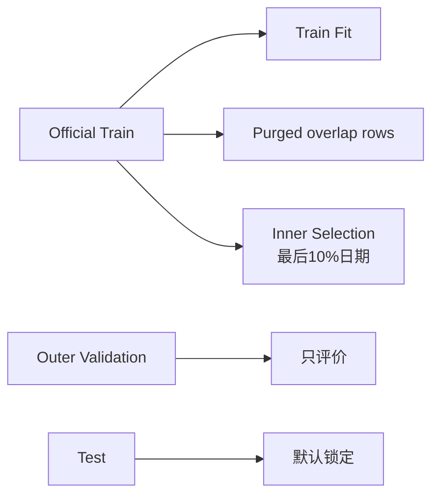

# FacDiggerNN 中文实验设计文档

> **现行实验协议说明**。面向第一次接触本项目的研究者和实验执行者，说明研究问题、
> 对照组、数据与样本协议、评价指标、统计方法、决策门禁、执行顺序和结果解释方式。实际
> 执行仍以代码、严格配置和测试为准。

如果尚不了解目录、数据表、命令或配置系统，请先从[文档中心](README.md)进入并阅读
[开发文档](开发文档.md)。

当前待运行的主实验已切换为提高 Transformer 单模型因子质量的精简配对协议，见
[Transformer 因子质量优化设计](Transformer因子质量优化设计.md)。输入、标签、金融原生
模型、完整日训练、金融预训练、资源基准和 9 阶段 runner 已落地；下文 E0—E3/M6 继续作为
历史基线与时间充裕时的完整实验，不会由新 runner 自动启动。

精简主实验只回答一个问题：同一金融原生 Transformer 在完全相同的数据、结构和监督训练下，
Train-only 金融预训练是否优于随机初始化。固定矩阵是：

```text
3 folds × seed 42 × {scratch, finance_pretrained} = 6 supervised cells
+ 每个 fold 一次金融预训练 = 3 pretraining runs
= 9 个长阶段
```

时间只通过删除旧模型分支、超参数网格和重复 seeds 节省；不得缩小任一 cell 的股票池、日期、
512 日上下文、样本行或 10 epoch 上限。正式运行前必须在 RTX 2070S 上执行 100-update 基准，
CUDA/FP16 未生效、峰值显存/进程 RAM 超过 7.2/13 GiB，或保守总耗时预测超过 14 天时暂停
矩阵。runner 会核对报告的配置哈希和最大 fold dataset ID，不能复用较小任务的报告。

## 1. 实验要回答什么

项目不是为了证明“深度学习一定优于传统模型”，而是把不同增量拆成可以被反驳的研究问题。

### 1.1 四个核心问题

| 编号 | 研究问题 | 对应比较 |
|---|---|---|
| Q1 | PatchTST 架构是否优于传统 tabular 基线？ | E1 − E0 |
| Q2 | 完整 ETTh1 迁移方法是否优于随机 PatchTST 方法？ | E2 − E1 |
| Q3 | 金融域 masked-patch 预训练是否继续改善迁移模型？ | E3 − E2 |
| Q4 | 最终 E3 是否在成本、稳定性和风险暴露控制后仍可用？ | E3 本身及 E3 − E1 |

允许的研究结论包括“没有提升”或“负迁移”。实验设计的目标是区分贡献来源，不是强行得到正结果。

### 1.2 实验因果链


```mermaid
flowchart LR
    E0["E0\nLightGBM/MLP"] -->|架构增量| E1["E1\n随机 PatchTST"]
    E1 -->|迁移方法差异| E2["E2\nETTh1 → 金融微调"]
    E2 -->|金融预训练增量| E3["E3\nETTh1 → 金融预训练 → 微调"]
```

比较有效的前提是：

- 使用相同数据快照；
- 使用相同 train/validation/test 样本键；
- 使用相同七通道、512 日上下文和标签；
- 使用相同 seeds、folds、成本情景和评价器；
- 除研究变量外尽量保持 PatchTST 结构和微调协议一致。

当前 E1 在全量训练 backbone，E2/E3 却使用 FT-0/FT-1 阶段冻结/解冻。所以
E2−E1 是 method-level 对照，同时包含初始权重和优化日程的差异，不能宣称为
“只改变初始化”的纯因果估计。如需回答更纯的预训练初始效应，需另行预注册一个
与 E2 完全匹配 FT-0/FT-1 的随机初始消融，不得在查看 holdout 后临时补做。

## 2. 当前实验准备状态

### 2.1 已经具备

- E0—E3 训练、恢复和独立回放；
- 不可变数据快照；
- Train-only scaler；
- Train 内 inner selection 和标签重叠 purge；
- outer validation/test 训练访问审计；
- ETTh1 权重加载比例、shape 和指纹审计；
- 统一 IC、Rank IC、Q5−Q1、换手和成本评价；
- 行业/市值中性化实现；
- 3 folds × 3 seeds × 4 models 的 M6 编排；
- Newey–West/HAC 和非重叠样本统计；
- validation freeze 与显式 final holdout 解封；
- 来源 readiness 和中性化决策门禁。
- 新 snapshot schema v4：14 路个股序列、6 路市场序列、1/5/20 日标签和 target-free
  Train 预训练索引；
- 金融原生 local/market PatchTST、多尺度统计、完整日 permutation-equivariant Set
  Transformer 和多期限排序 head；
- 显存受限的精确 embedding replay、连续 patch 遮蔽 + 未来五日摘要预训练、固定 Train 内
  linear probe、resume/progress 日志；
- `finance-benchmark` 的 CUDA/内存/14 天强制资源准入和 `research transformer-run` 九阶段
  可恢复编排；准入报告绑定最大 fold dataset ID 与实际训练配置哈希。

### 2.2 尚不具备正式研究条件

| 缺口 | 当前处理 | 正式实验要求 |
|---|---|---|
| 真实数据不随 Git 分发 | 历史 bronze 曾在项目机器上完成并通过质量门禁 | 每台实验机迁移或重建，并复核 manifest/哈希 |
| 真实退市终值/原因缺失 | 使用显式交易所惩罚插值 | 优先替换真实 delisting return；至少做敏感性分析 |
| 点时行业缺失 | 中性化为空 | 接入可审计的历史行业 |
| 点时流通市值缺失 | 中性化为空 | 接入 point-in-time float market cap |
| 新协议的完整 GPU 运行未验收 | CPU 小型闭环和旧协议 GPU 证据已通过 | 在目标 RTX 2070 Super / 16 GB 上先跑 100-update 门禁，再跑 9 阶段矩阵 |

因此当前 `m6_eodhd_engineering.yaml` 是工程模式，不是正式研究配置。本轮为完整日
objective v2 注册的 `research_id` 是 `m6_eodhd_engineering_full_date_v2`。它的 final
holdout 仍然锁定；新代码、新 checkpoint schema 或新训练预算都不构成解锁理由。

## 3. 固定研究任务

### 3.1 样本定义

一个样本由 `(security_id, asof_date)` 唯一确定：

```text
输入：截至 asof_date 收盘可见的 512 个市场 session × 7 个特征
输出：一个标量 score
标签：下一 session 开盘至第五个未来 session 收盘的超额收益
```

### 3.2 标签

对股票 `i` 和日期 `t`：

```text
raw_return(i,t) =
    log(adjusted_close(i,t+5) / adjusted_open(i,t+1))

benchmark_return(t) =
    mean(raw_return(j,t) for 当日 eligible 股票 j)

target(i,t) =
    raw_return(i,t) - benchmark_return(t)
```

重要细节：

- `t+1` 和 `t+5` 是市场交易日历的位置；
- 不能按每只股票自己的实际交易记录 shift；
- 如果个股停牌，缺失开盘或收盘会使相应标签不可计算；
- 跨退市窗口使用 terminal value/delisting return；
- 相邻日期的五日标签重叠，因此普通独立同分布标准误不适用。

### 3.3 七通道

| 通道 | 信息类型 | 主要作用 |
|---|---|---|
| `r_close` | 日收益 | 收盘趋势和反转 |
| `r_gap` | 隔夜收益 | 盘后信息和开盘跳空 |
| `r_intraday` | 日内收益 | 开盘至收盘方向 |
| `range` | 日内振幅 | 波动和不确定性 |
| `dlog_volume` | 成交量变化 | 量能冲击 |
| `vol20` | 20 日波动 | 市场状态 |
| `dollar_volume_z20` | 相对成交活跃度 | 流动性/关注度变化 |

通道顺序固定。特征先在训练期拟合的稳健 scaler 上处理，再进入所有模型。

## 4. 股票池设计

### 4.1 目标股票池

默认目标：

- Nasdaq、NYSE、NYSE American；
- 普通股；
- 最低收盘价 5 美元；
- 最低 trailing ADV20 为 100 万美元；
- 至少 252 个上市 session；
- 当日仍上市、未退市、未推断停牌；
- 每个 session 按 ADV20 降序选择最多 1000 只。

这个股票池是动态的。同一股票可能在某日进入、之后退出，再重新进入。

### 4.2 候选发现

`historical_liquid` 模式先获取：

- active metadata；
- delisted metadata。

只按交易所和证券类型过滤候选，不按当前流动性筛掉历史证券。active、delisted、去重后候选
和实际请求数会随 EODHD metadata 与配置变化，必须读取当次 probe 和 source manifest；
历史审计中的计数不能作为当前门禁。

### 4.3 与 100 股票 pilot 的区别

| 项目 | 100 股票 pilot | 历史动态股票池 |
|---|---|---|
| 候选 | 当前 active | active + delisted |
| 排名信息 | 当前 200 日流动性 | 每个历史日期的 trailing ADV20 |
| 每日最大数量 | 固定选中的 100 | 动态最多 1000 |
| 存活偏差 | 明显 | 显著降低 |
| 历史前视偏差 | 明显 | 流动性选择不使用当前值 |
| 用途 | 工程/资源验证 | 正式实验候选来源 |

## 5. 退市处理和敏感性实验

### 5.1 当前默认插值

EODHD 当前套餐没有可靠退市终值或原因。工程默认：

| 交易所 | `delisting_return` |
|---|---:|
| Nasdaq | -0.55 |
| NYSE | -0.30 |
| NYSE American | -0.30 |
| 未知 | -0.50 |

每行都必须保留：

- `is_imputed=true`；
- `imputation_method`；
- `exchange`；
- policy 参数；
- source manifest 警告。

### 5.2 必做敏感性

在没有真实退市收益时，正式报告至少应增加三组情景，且其他条件完全不变：

| 情景 | Nasdaq | NYSE/NYSE American | 用途 |
|---|---:|---:|---|
| 较轻惩罚 | -40% | -20% | 观察结果是否依赖高损失假设 |
| 基准 | -55% | -30% | 当前工程默认 |
| 严格惩罚 | -100% | -100% | 假设完全损失 |

应报告：

- 总退市证券数；
- 被标签窗口跨越的退市样本数；
- 插值样本占全部评价样本比例；
- 各情景下 Rank IC、Q5−Q1 和 paired delta 变化；
- 结论是否改变。

插值数据不能把 `source_research_ready` 自动设为 true。

## 6. 时间切分和防泄漏

### 6.1 数据集外层 split

对每个 split：

- Train 要求 `label_end <= train_end`；
- Validation 起点在 `train_end` 后经过 5 个市场 session embargo；
- Validation 要求 `label_end <= valid_end`；
- Test 起点在 `valid_end` 后经过 5 个 session embargo；
- Test 要求 `label_end <= test_end`；
- 边界不合格样本不进入任何 split。

### 6.2 训练内层 split


```mermaid
flowchart LR
    A["Official Train"] --> B["Train Fit"]
    A --> C["Purged overlap rows"]
    A --> D["Inner Selection\n最后10%日期"]
    E["Outer Validation"] --> F["只评价"]
    G["Test"] --> H["默认锁定"]
```

规则：

1. 将 official Train 的日期排序；
2. 尾部 `selection_fraction=0.1` 作为 inner selection；
3. Train fit 只保留 `label_end < inner_selection_start` 的样本；
4. 中间重叠样本 purge；
5. early stopping 和 best checkpoint 只看 inner selection；
6. manifest 中 outer validation/test 用于训练和 checkpoint 选择的行数必须是 0。

监督训练不再回归收益数值本身。每个完整日期先对 target 使用 average-tie rank，并映射到
`[-1, 1]`；神经模型的实际目标是完整日横截面上的
`1 - corr(score, target_rank)`。

旧 v1 实现虽然 target rank 在完整日内生成，却先把大日期均衡切成不超过
`batch_size` 的 date chunks，再独立计算每块的相关性 loss。Pearson correlation 需要
用整个横截面的 score 均值、方差和协方差中心化，因此各块 loss/梯度的求和
不等于完整日的 loss/梯度；普通 gradient accumulation 也无法恢复这个非线性
统计。所以 v1 实际优化的是“同日小块排序”，不是研究问题定义的完整日排序。

当前 objective v2 使用显存受限两遍计算：CPU DataLoader 一次只组装一个完整日，
GPU 按 `batch_size` 切成 physical microbatches。第一遍不建图，暂存当日各微批次
detached Float32 score/target 向量（约千行、KB 级），再以与单图 Float32
reduction 相同的方式计算整日 moments 并清空向量；同时保存每批 RNG。随后恢复
第一遍前的 BatchNorm running buffers。第二遍
回放 RNG、重算 score，并用整日 moments 的解析 `d(loss)/d(score)` 逐块回传。在
`optimizer.step()` 前，必须复核两遍的行数、均值、方差、协方差和范围一致；
不一致则 fail closed。该方法与单图完整日 loss 的 score 梯度等价，但 GPU 只保留
一个 physical microbatch 的 activation，监督计算成本约增加一次无图 forward。

降低 `batch_size` 不会把整日统计退化回 chunk loss；但当前 PatchTST 使用
train-mode BatchNorm，物理微批大小仍会改变 BN batch statistics、吞吐和训练轨迹。
正式 E0—E3 对照应固定 `batch_size`，不能把不同物理微批的结果当成完全只差初始化。
监督配置中的累积单位现在是 `dates_per_optimizer_step`，即每次参数更新前累积
几个完整日；为解决显存 OOM 而降低 `batch_size` 时，不得联动提高它。只有 E3
masked reconstruction 的 `pretraining.gradient_accumulation_steps` 仍表示原有的
微批次梯度累积。

Early stopping 不看该代理 loss，而是在完整 inner selection 上逐日计算真实
Spearman Rank IC，并最大化日期等权均值。

### 6.3 E3 预训练 split

E3 的无监督金融预训练也只读取 official Train，并在 Train 内按日期切尾部 10% 选择 reconstruction checkpoint。Outer validation/test 不能因为“预训练不用收益标签”而被使用，因为未来分布本身也是信息。

## 7. E0—E3 对照设计

### 7.1 总表

| 实验 | 初始化 | 训练 | 主要控制变量 | 回答的问题 |
|---|---|---|---|---|
| E0 | LightGBM 或 MLP | 多尺度 tabular 排序 | 同特征、同标签、同 split | 传统模型基线 |
| E1 | 随机 PatchTST | 横截面排序相关性 | PatchTST 结构 | 架构增量 |
| E2 | ETTh1 encoder | FT-0 + FT-1 | 同 PatchTST 架构，但优化日程与 E1 不同 | 迁移方法级差异 |
| E3 | ETTh1 encoder | 金融 masked 预训练 + FT-0 + FT-1 | 与 E2 同微调 | 金融预训练增量 |

### 7.2 E0

推荐主要 E0 是 LightGBM，MLP 作为第二基线。

输入不是原始 512×7 序列，而是每个通道的：

- last；
- 5/20/60/120/252 日 mean/std/min/max。

LightGBM 付费 pilot 参数：

| 参数 | 值 |
|---|---:|
| estimators | 300 |
| learning rate | 0.03 |
| leaves | 31 |
| min child samples | 50 |
| L2 | 1.0 |
| early stopping | 30 |

E0 仍必须使用相同 inner selection，而不能用 outer validation 早停。
正式 LightGBM 使用按日期分组的 LambdaRank；MLP 使用与 E1—E3 相同的排序相关性代理。
两者都用完整 inner-selection 的日均 Spearman Rank IC 选择 checkpoint，因此 E1−E0 不再
混入“回归目标与排序目标不同”这一额外变量。

### 7.3 E1

正式结构：

| 参数 | 值 |
|---|---:|
| context | 512 |
| channels | 7 |
| patch length / stride | 12 / 12 |
| d_model | 128 |
| attention heads | 16 |
| encoder layers | 6 |
| FFN dim | 512 |
| dropout | 0.3 |
| alpha hidden | 128 |
| physical batch size | 64 |
| max / minimum epochs | 5 / 3 |
| patience | 2 |
| learning rate | 3e-4 |
| weight decay | 1e-4 |
| precision | CUDA FP16 / CPU FP32 |
| dates per optimizer step | 1 |
| supervised objective | v2 full-date cross-sectional rank correlation |
| checkpoint metric | inner-selection mean daily Spearman Rank IC |

E1 是 E2/E3 最重要的方法级对照。若 E1 已经显著优于 E0，而 E2/E3 没有提升，
可说当前完整迁移方法未优于随机 PatchTST，不能进一步把差异只归因于预训练初始化。

表中的 5 epoch 上限是为 RTX 2070 Super / 16 GB RAM 完成首轮 3-fold × 3-seed
可行性矩阵而注册的训练预算，不是已证明充分收敛或最优的最终预算。

### 7.4 E2

来源：

```text
ibm-research/patchtst-etth1-pretrain
revision 1212736a0decf12b5cea5a605302421e110a3614
```

硬门禁：

- source checkpoint → 当前 Transformers backbone 加载比例 ≥ 80%；
- source backbone → 金融 target backbone 加载比例 ≥ 80%；
- 模型结构必须与固定架构一致；
- 所有 missing/unexpected/shape mismatch 必须在 allowlist；
- 转移前后 fingerprint 必须证明目标 encoder 被改变。

微调：

| 阶段 | epoch | encoder | 学习率 |
|---|---:|---|---:|
| FT-0 | 前 2 | 全冻结 | head 3e-4 |
| FT-1 | 后续最多 3 | 解冻最后 1 block | encoder 1e-5，head 3e-4 |

FT-0 中 encoder 参数和 BatchNorm buffer 都不得变化。FT-1 必须确认 encoder 和 head 都发生更新。
当前 E2 的 max/minimum epochs 是 5/3，patience 是 2。head learning rate 从旧快速
实验的 1e-3 降为 3e-4，是针对排序相关性 loss 尺度不变性和 artifacts2
score 标准差膨胀所采用的保守措施，不代表该学习率已经最优。

### 7.5 E3

预训练参数：

| 参数 | 值 |
|---|---:|
| mask ratio | 0.4 |
| loss | Huber |
| huber delta | 1.0 |
| learning rate | 1e-5 |
| physical batch size | 64 |
| max epochs | 3 |
| patience | 2 |
| minimum epochs | 1 |
| Train 内 selection | 10% 日期 |

只有“随机遮蔽且真实 observed”的 patch 元素进入 loss。缺失填充值不参与 reconstruction target。
对 context=512、patch length/stride=12/12，Transformers patchifier 的
`sequence_start=8`。observed mask 必须同样从第 8 个 session 开始 patchify，否则
监督池化和 reconstruction 都会把 mask 与真正的 patch 错位 8 个 session。当前实现
已让 AlphaHead 与 pretrainer 共用带 `sequence_start` 的 mask patchify 路径。
E3 reconstruction checkpoint 因此升为 schema v2，并记录
`patch_alignment_protocol=patchifier_sequence_start_v2`。无论继续预训练，还是把金融
encoder 载入 Alpha 模型，都会拒绝旧的 mask 错位 checkpoint。下游 E1/E2/E3
监督 fine-tuning checkpoint 则是另一套 schema v3。

上轮 artifacts2 中，E3 预训练单 epoch 已约有 1.5—1.9 万个 optimizer steps，encoder
相对 L2 漂移约 0.43。新协议因此把学习率从 1e-4 降为 1e-5，并限制为最多
3 epochs，作为降低灾难性遗忘风险的首轮资源协议。这是基于已观察漂移的
防灾设置，不是已经证明最优的超参数。
重建 gradient accumulation 的最后残余组按其实际 batch 数归一化；训练审计还会
记录 FP16 GradScaler 跳过的 optimizer steps，`global_step` 只统计真正更新参数
的 steps。资源验收时这两项都应检查。

完成预训练后：

1. 选择 Train 内最佳重建 checkpoint；
2. 将 encoder 严格载入新 Alpha 模型；
3. 要求参数量 100% 匹配；
4. 执行与 E2 完全相同的 FT-0/FT-1。

E3 下游微调与 E2 共享 5/3 max/minimum epochs、2 epoch FT-0、patience=2
和 head/encoder 学习率 3e-4/1e-5。

## 8. Smoke、pilot 和正式实验不能混用

| 级别 | 数据/配置 | 目的 | 能否作研究结论 |
|---|---|---|---|
| Smoke | 2 股票、60 日上下文或极少 epoch | 验证代码路径 | 不能 |
| Paid pilot | 100 股票、512 日、小模型/少 epoch | 资源与吞吐门禁 | 不能 |
| Engineering M6 | historical-liquid 动态 top-1000、完整矩阵、部分硬门禁关闭 | 验证编排/冻结/回放 | 不能替代正式来源 |
| Formal | 历史动态股票池、正式模型、完整门禁 | 样本外研究结论 | 可以 |

任何报告都必须标明级别。

## 9. 评价指标

### 9.1 IC 和 Rank IC

每天在横截面上计算：

```text
IC_t = Pearson(score_t, target_t)
RankIC_t = Pearson(rank(score_t), rank(target_t))
```

聚合输出：

- 日期数；
- 均值；
- 标准差；
- 年化 IR：`mean / std × sqrt(252)`；
- 正值比例。

Rank IC 是主要排序指标，IC 是辅助线性相关指标。

### 9.2 Q5−Q1

每天按 score 排序：

- 底部组等权做空；
- 顶部组等权做多；
- `gross_q_high_minus_low = mean(target_top) - mean(target_bottom)`。

横截面不足 5 只时会减少实际分组数，但正式研究要求足够大的横截面。

### 9.3 换手和成本

每日多空权重相对上一日变化：

```text
turnover_t = 0.5 × sum(|w_t - w_(t-1)|)
net_return_t = gross_return_t - turnover_t × cost_bps / 10000
```

默认报告单边成本：

- 0 bps；
- 10 bps；
- 20 bps；
- 50 bps。

20 bps 是 M6 的主要组合报告情景；当前硬门禁围绕因子 Rank IC、显著性、稳健性、来源和
中性化条件，不使用 20 bps 组合结果替代排序证据。

### 9.4 稳定性

报告：

- 分年指标；
- 分行业指标；
- small/mid/large 三个点时市值桶；
- cross-section 最小、中位、平均和最大样本数。

当前 EOD-only 数据缺少行业/市值时，这些结果为空，不应解释为空分组表现良好。

## 10. 中性化协议

每天拟合：

```text
score_raw = intercept
          + standardized_log_float_market_cap
          + industry_dummies
          + residual
```

`score_neutralized = residual`。

中性化可用条件：

- 行业和市值都不是空；
- 至少 3 个完整样本；
- 样本数大于设计矩阵列数；
- 设计矩阵满秩。

否则输出空值并记录：

- `unavailable_missing_point_in_time_exposures`；
- `unavailable_insufficient_cross_section`。

### 10.1 工程模式

当前配置：

```yaml
require_neutralized_positive: false
require_source_research_ready: false
```

用途是跑通训练、报告、freeze 和 replay。它不会把中性化空值当成通过。

### 10.2 正式模式

正式 M6 配置必须：

```yaml
require_neutralized_positive: true
require_source_research_ready: true
```

同时 source manifest 的通用标准化证明应明确：

```text
standardization.status = passed
standardization.research_ready = true
```

在真实退市收益和点时暴露未解决前，不应伪造该字段。

## 11. Walk-forward 设计

### 11.1 当前 M6 folds

| Fold | Train 截止 | Validation 截止 | Test 截止 | Embargo |
|---|---|---|---|---:|
| wf1 | 2020-12-31 | 2021-12-31 | 2022-12-30 | 5 |
| wf2 | 2021-12-31 | 2022-12-30 | 2023-12-29 | 5 |
| wf3 | 2022-12-30 | 2024-12-31 | 2025-12-31 | 5 |

Seeds：

```text
17, 42, 73
```

Validation 矩阵：

```text
3 folds × 3 seeds × 4 models = 36 cells
```

Final holdout：

```text
截至 2024-12-31 的 final refit snapshot × 3 seeds × 4 models = 12 cells
```

这里不会直接拿 wf3 中只训练到 2022-12-30 的 checkpoint 预测 2025。validation `go` 后，
runner 按 freeze 中预注册的协议重新构建 snapshot：`train_end = valid_end = 2024-12-31`，
因此 outer validation 为空、test 边界仍从 2025 年开始。scaler 会在扩展后的 official Train
上重新拟合，E0—E3 复用冻结 YAML 并保留 Train 内部的 selection/purge 协议。refit 前后
2025 test 的 `(security_id, asof_date, target)` 必须完全相同。

### 11.2 每个 fold 的隔离

每个 fold 都重新构建数据快照，因此：

- scaler 只拟合该 fold Train；
- sample index 按该 fold 边界和 embargo 重建；
- 同一 fold 的 E0—E3 必须共享 dataset ID；
- 同一 fold 全部 predictions 必须有完全相同的 `(security_id, asof_date, target)` 键。

## 12. 统计推断

五日标签重叠会产生自相关。项目并列报告两种方法。

### 12.1 HAC / Newey–West

默认 `hac_lags=5`。在每个 fold 内计算自协方差，不跨 fold 人为连接时间序列。
preflight 要求 HAC lags 不短于标签 horizon，避免五日重叠标签却只修正一两阶自相关。

输出：

- n；
- mean；
- standard error；
- t-stat；
- 单侧 p-value；
- 单侧置信下界；
- 是否可估计；
- 实际 lags。

原假设为 `mean <= minimum_mean_rank_ic_delta`，备择假设为大于该阈值，默认
`alpha=0.05`。长期方差非正、标准误为零或结果非有限时标记为不可估计并关闭门禁，不能把
常数正序列当成“无限显著”。

### 12.2 非重叠样本

默认：

```text
stride = 5
offset = 0
```

即每五个 session 取一个观察，降低标签重叠。

### 12.3 Seed 处理

统计推断前先在相同 fold/date 上对多个 seed 求均值，然后对时间序列做 HAC/非重叠推断。这样不会把 seed 重复当成独立时间样本。

推断前还要求每个 cell 的逐日 Rank IC 日期和 `predictions.parquet` 完全一致、逐日 `n`
等于预测横截面行数、同一 fold 的全部模型和 seed 使用相同日期，并且不同 fold 日期不能
重叠。配对时不再取日期交集；任何缺日、空值或 seed 不完整都直接判为数据契约错误。

### 12.4 Paired delta

所有研究问题使用同日配对差：

```text
delta_t = RankIC_left,t - RankIC_right,t
```

配对比较：

- `architecture_e1_vs_e0`；
- `external_transfer_e2_vs_e1`；
- `financial_pretraining_e3_vs_e2`；
- `overall_e3_vs_e1`。

同时记录每个 fold/seed cell 的平均 delta 和正 cell 比例。

## 13. 当前代码中的决策门禁

### 13.1 单项增量

E1−E0、E2−E1、E3−E2 各自通过要求：

1. seed 平均后的 paired Rank IC mean delta 超过预先配置的最小效应；
2. 单侧 HAC 检验通过 Holm family-wise correction；
3. 固定 offset 非重叠样本均值为正，且每折至少 24 个观察；
4. 正 fold/seed cell 比例 ≥ `minimum_positive_cell_ratio`；
5. 正式模式下，所有来源必须明确 research-ready。

三个归因问题组成固定 Holm family，避免对多个增量问题分别使用 0.05 导致假阳性累积。
当前最低正 cell 比例是 2/3，每折日度观察至少 120 个。

### 13.2 E3 总体决策

E3 `go` 要求：

1. raw Rank IC 均值 > 0 且单侧 HAC `p <= 0.05`；
2. raw Rank IC 通过固定 offset 非重叠方向与样本数检查；
3. E3−E1 paired delta 为正且单侧 HAC `p <= 0.05`；
4. E3−E1 通过非重叠检查，正 fold/seed cell 比例 ≥ 2/3；
5. 正式模式下 neutralized Rank IC 均值 > 0；
6. 正式模式下 source readiness 通过。

20 bps Q5−Q1 仍完整报告，但组合层是参考性评价，不再作为因子排序主问题的硬门禁。只有
validation 的 `overall_e3=go` 才会生成 `holdout_eligibility.eligible=true`；即使用户显式
传入解封参数，`no_go` freeze 也不能启动任何 test cell。

## 14. 正式实验执行顺序

### 阶段 0：冻结代码和环境

```bash
uv lock --check
uv run ruff check .
uv run pytest
facdigger doctor
facdigger probe-patchtst --config configs/base.yaml --output artifacts/m0-probe
```

记录：

- Git commit；
- `uv.lock` hash；
- CUDA、PyTorch、Transformers 版本；
- GPU 型号和显存；
- checkpoint revision/hash。

### 阶段 1：数据 probe

```bash
set -a
source .env.local
set +a
facdigger data probe --config configs/data/eodhd_historical_liquid.yaml
```

检查：

- 候选数；
- active/delisted 数；
- API 预算；
- 单只历史日期和字段；
- 是否意外使用 demo token。

### 阶段 2：全量采集

```bash
facdigger data ingest --config configs/data/eodhd_historical_liquid.yaml
```

这是长时间、高调用量步骤。中途不要删除：

- `data/cache/eodhd_historical_liquid/`；
- `data/state/eodhd_historical_liquid/`。

采集完成后检查 source manifest：

- symbols；
- requests/budget；
- warnings；
- selection audit；
- 每张表的行数、日期、证券数、null counts 和 hash；
- delisting policy。

### 阶段 3：标准表审计

```bash
facdigger data validate --config configs/datasets/eodhd_historical_liquid.yaml
```

阻断条件：

- 重复键；
- 非法 OHLC；
- eligible 状态矛盾；
- corporate action 的 `known_at > ex_date`；
- 退市表缺 terminal return/value；
- 日期覆盖不足。

### 阶段 4：构建快照

```bash
facdigger dataset build --config configs/datasets/eodhd_historical_liquid.yaml
```

审阅 `audit.json`：

- 每个通道 observed ratio；
- target 非空数；
- crosses delisting 数；
- train/valid/test 数；
- inference index 最新横截面；
- source manifest 是否复制成功。

这一步用于单模型数据审计和训练。M6 runner 会按每个 fold 重新构建内容寻址的
walk-forward snapshot，不能把这个普通 snapshot 直接复用于全部 folds。

### 阶段 5：GPU 资源门禁

先使用 smoke 或 paid-pilot 配置验证：

- FP16 不产生 NaN；
- peak VRAM 可接受；
- DataLoader 不挂起；
- checkpoint resume 连续；
- E2/E3 source 只下载一次；
- 预计正式 cell 时间。

RTX 2070 Super 8 GB / 16 GB RAM 必须先用 FP16、`batch_size=64`验收单个
E1 cell，然后至少验收一个需要 source 权重的 E2/E3 cell。除常规显存和 loss 外，
检查 checkpoint 为 schema v3、objective 为 v2、`optimization_protocol.unit=complete_date`，
且 history 中两遍 microbatch 计数和梯度范数为有限值。这一步尚未在真实 CUDA
目标机完成，所以不能预先承诺峰值或吞吐。

资源门禁只回答“能否运行”，不看研究指标作结论。
当前 E1/E2/E3 监督阶段都注册为最多 5 epochs（至少 3、patience 2）；
E2/E3 前 2 epochs 是 head-only。E3 reconstruction 是最多 3 epochs（至少 1、
patience 2）。这是为目标机首轮完成 3-fold × 3-seed 矩阵而冻结的
硬件可行性预算，不是最终最优预算。如果本轮证明可行，后续可升级硬件并在
一个新 research ID 下预注册更大预算，但不得将扩预算结果与本轮 cell 混用。

### 阶段 6：建立正式 M6 配置

不要直接把工程配置改名。复制为新的 formal 配置并：

- `base_dataset_config` 指向 historical-liquid 数据集；
- 使用正式 E0—E3 配置；
- 两个 readiness/neutralization 门禁都为 true；
- 固定 folds、seeds、成本和统计参数；
- 使用新的 `research_id`；
- 提交 Git 后不再修改。

### 阶段 7：Plan 和 preflight

```bash
facdigger research plan --config configs/research/<formal.yaml>
facdigger research preflight --config configs/research/<formal.yaml>
```

Preflight 必须确认：

- 所有来源文件存在；
- source manifest 存在；
- source readiness 通过；
- universe 覆盖最后 fold；
- 四个模型配置存在；
- 至少 3 folds 和 3 seeds。

### 阶段 8：Validation 矩阵

```bash
facdigger research run --config configs/research/<formal.yaml>
```

中断后：

```bash
facdigger research run \
  --config configs/research/<formal.yaml> \
  --resume-run artifacts/research/<research_run_id>
```

Runner 会：

- 复用已完成 cell；
- 恢复有 checkpoint 的失败 cell；
- 强制 fold 内 dataset ID 和预测键一致；
- 聚合 validation；
- 生成 `research.json`、`research.html` 和 freeze 信息。

### 阶段 9：人工审阅和冻结

在解封 holdout 前审阅：

- 36 cells 是否完整；
- 是否有异常单 seed/fold；
- source warnings；
- 退市敏感性；
- raw vs neutralized；
- 20/50 bps 成本；
- 分年/行业/市值；
- paired delta；
- HAC 与非重叠结果；
- checkpoint/配置/数据 hash。

如果此时修改模型、特征、fold、成本或门禁，必须开始新的 research ID，不能继续使用原 freeze。

### 阶段 10：Final holdout

只有冻结后运行：

```bash
facdigger research run \
  --config configs/research/<formal.yaml> \
  --resume-run artifacts/research/<research_run_id> \
  --unlock-final-holdout
```

该命令依次执行：

1. 复核 freeze、validation report 和 eligibility；
2. 在首次读取冻结 test 键前永久登记 `holdout_has_been_read=true`；
3. 构建并审计截至 2024-12-31 的 final-refit snapshot，确认来源哈希和冻结的 2025
   `(security_id, asof_date, target)` 没有改变；
4. 重新训练 3 seeds × E0—E3，所有 cell 共享新的 dataset ID；2025 test 不进入训练、
   scaler 拟合或 checkpoint selection；
5. 一次性评价 2025 holdout，并保存 `final_refit.json` 及其哈希。

Holdout 结果不用于继续修改同一研究协议。

### 阶段 11：独立回放

对最终模型运行：

```bash
facdigger predict --run artifacts/e3/<run_id>
facdigger evaluate \
  --predictions artifacts/e3/<run_id>/predictions.parquet \
  --dataset data/snapshots/<dataset_id> \
  --output artifacts/evaluations/<evaluation_id>
```

确认 checkpoint 重建、score 一致性、输入 hash 和报告都可复现。

### 阶段 12：固定模型全历史工程回测

如需验证 HeyBoss 策略链路，可以从已经独立选定并冻结为 ModelRelease 的模型（E1—E3 或
Finance Transformer），对完整
target-free inference snapshot 运行 `factor-history plan/run/verify`。该路径不读取 target，按年
输出标准 FactorBatch，适合检查因子导入、调仓、风险、成交模拟和报告。

这不是 walk-forward 的替代方案：同一固定 checkpoint、scaler 以及今天可见的历史来源修订
可能利用了相对早期回放日期的未来信息。配置必须显式 `acknowledge_non_oos: true`，父 manifest 也固定记录
`strict_out_of_sample=false`、`paper_allowed=false`。全历史收益只能标记为工程/策略行为诊断，
不能并入 M6 统计门禁，不能用来挑选 seed、release、股票范围或超参数，也不能因为
FactorBatch 本身不含 label 就称为无未来泄漏。

## 15. 如何解释结果

| 观察 | 合理解释 |
|---|---|
| E1 > E0，E2 ≈ E1，E3 ≈ E2 | PatchTST 架构有效，迁移和预训练无明显增量 |
| E2 > E1，E3 ≈ E2 | 外域预训练有效，金融预训练没有额外收益 |
| E2 < E1，E3 > E2 但仍 < E1 | 金融预训练修复部分负迁移，但总体不值得 |
| E3 > E2 > E1 > E0 | 架构、外域迁移和金融预训练都贡献正增量 |
| Raw 为正，中性化后消失 | 主要是行业/市值暴露，不是独立 Alpha |
| 低成本为正，20/50 bps 后为负 | 信号可能不可交易或换手过高 |
| 总体为正但仅一个 fold/seed 驱动 | 不稳定，不应给出强结论 |
| Rank IC 为正但 Q5−Q1 为负 | 排序关系存在，但尾部组合或收益非线性有问题 |

研究报告应给出“不确定”或“no-go”的可能性，不能只展示最好 seed。

## 16. 实验结果最小记录

每次正式实验至少保存：

- research ID；
- Git commit；
- dirty 状态；
- 完整 YAML 和 hash；
- dataset ID 与输入文件 hash；
- source manifest/hash/warnings；
- EODHD selection 和 delisting policy；
- folds 和 seeds；
- source checkpoint revision/hash；
- 每个 cell 的 run ID、checkpoint hash、状态和设备；
- raw/neutralized metrics；
- 成本情景；
- paired deltas；
- HAC 和非重叠推断；
- freeze hash；
- holdout 是否解封及时间；
- 最终结论和限制。

## 17. 明确禁止的做法

1. 用今天仍上市的股票反推完整历史股票池。
2. 用当前流动性选择整个历史训练样本。
3. 在全数据上拟合 scaler 或 winsor 阈值。
4. 用 outer validation 早停或选择 checkpoint。
5. 在金融预训练中读取 validation/test。
6. 多次查看 test 后继续调参。
7. 静默忽略 checkpoint 权重不匹配。
8. 缺少行业/市值时用 raw score 冒充 neutralized score。
9. 把退市插值写成供应商真实观测。
10. 比较不同 dataset ID 或不同样本键的 runs。
11. 只报告最好 seed、最好年份或最好成本情景。
12. 把 smoke/pilot 指标当作正式研究结论。
13. 把固定 release 的全历史回测收益称为样本外结果，或据此反向挑选模型和范围。

## 18. 当前推荐结论边界

在本地历史动态数据通过质量门禁、但真实退市终值和点时风险暴露尚未补齐的条件下，项目
能够可靠回答：

- 数据和训练链路是否能运行；
- checkpoint 是否可恢复和回放；
- 权重是否确实加载；
- walk-forward 编排和冻结是否正确；
- 工程报告是否完整。

暂时不能可靠回答：

- E3 是否具有正式样本外 Alpha；
- 中性化后是否有效；
- 对真实退市收益是否稳健；
- 在可交易成本和大规模股票池下是否值得部署。

正式结论必须等本地数据证明可复核、真实退市处理和点时暴露补齐、正式 M6 全部门禁通过后
给出。
