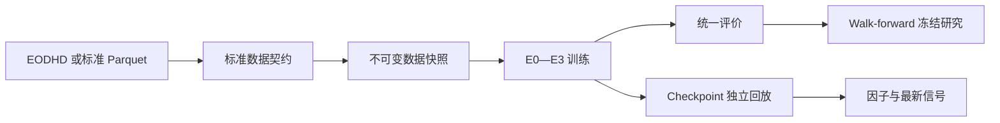
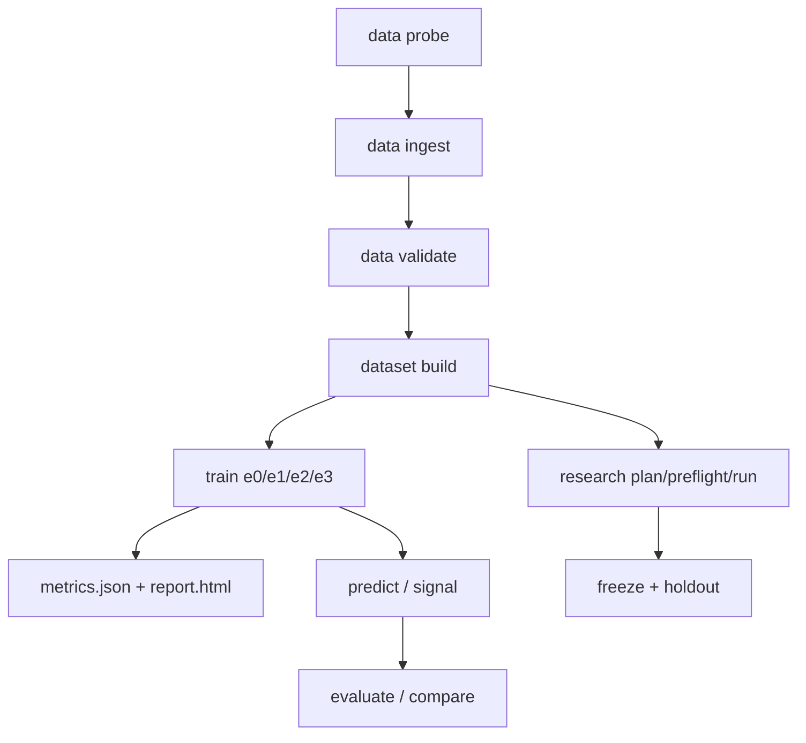

# FacDiggerNN 中文开发文档

> 面向第一次接触本项目的开发者。本文解释项目解决什么问题、代码如何组织、数据如何流动、各模块如何协作、怎样运行与扩展，以及哪些边界不能越过。

配套阅读：[实验设计文档](实验设计文档.md)解释为什么设置 E0—E3、如何做 walk-forward，以及怎样形成研究结论。

## 1. 项目是什么

FacDiggerNN 是一个面向美股日频数据的机器学习量化因子研究工具。它把每只股票截至某个交易日收盘已知的历史信息转换成一个横截面分数，用于预测从下一交易日开盘到未来第五个交易日收盘的超额收益。

这个项目不是交易系统。它不处理下单、撮合、仓位管理、资金管理和券商连接。它的输出是可审计的因子分数、实验指标和研究报告。

项目重点不是只训练一个 PatchTST 模型，而是建立一条完整、可复现、尽量防止未来信息泄漏的研究链路：



### 1.1 新用户术语表

| 术语 | 本项目中的含义 |
|---|---|
| 因子（factor） | 对每只股票、每个日期产生的预测分数 |
| Alpha | 试图解释基准以外未来收益的信号 |
| 横截面 | 同一日期上不同股票组成的集合 |
| `asof_date` | 分数生成日期；只允许使用该日收盘前已知信息 |
| target | 用于训练/评价的未来超额收益 |
| universe | 每日证券状态和是否允许进入研究的股票池 |
| eligible | 当日满足上市、类型、价格、流动性等条件 |
| point-in-time | 数据值必须是当时可知值，不能用后来修订值回填历史 |
| split | Train、Validation、Test 的时间分区 |
| fold | Walk-forward 中一组独立的 train/valid/test 边界 |
| seed | 控制随机初始化、采样等随机性的整数 |
| checkpoint | 某个训练状态的模型和优化器保存文件 |
| snapshot | 由输入哈希和配置确定的不可变训练数据目录 |
| manifest | 记录来源、配置、哈希、环境和限制的机器可读清单 |
| provenance | 数据或模型从哪里来、经过什么处理的血缘 |

### 1.2 默认研究任务

| 项目 | 当前默认值 |
|---|---|
| 市场 | 美股日频 |
| 交易所 | Nasdaq、NYSE、NYSE American |
| 证券类型 | 普通股 |
| 决策时点 | 交易日 `t` 收盘后 |
| 最早执行时点 | `t+1` 开盘 |
| 输入窗口 | 512 个市场交易日 |
| 输入通道 | 7 个价格/成交量特征 |
| 标签 | `t+1` 开盘至 `t+5` 收盘的对数收益，减同期股票池等权收益 |
| 模型 | E0 基线、E1 随机 PatchTST、E2 ETTh1 迁移、E3 金融域预训练 |
| 主要指标 | IC、Rank IC、ICIR、Q5−Q1、成本后收益、换手和稳定性 |

### 1.3 当前工程状态

M0—M8 的工程闭环已经实现并通过测试：

| 阶段 | 能力 | 状态 |
|---|---|---|
| M0 | 环境检查、PatchTST checkpoint 兼容性探针 | 已实现 |
| M1 | 标准 Parquet、点时校验、不可变数据快照 | 已实现 |
| M2 | E0 LightGBM/MLP 与统一评价 | 已实现 |
| M3 | E1 随机初始化 PatchTST、恢复训练 | 已实现 |
| M4 | E2 ETTh1 权重迁移与加载审计 | 已实现 |
| M5 | E3 Train-only masked-patch 金融预训练 | 已实现 |
| M6 | Walk-forward、统计推断、配置冻结、holdout 解封 | 已实现 |
| M7 | Checkpoint 独立回放与因子导出 | 已实现 |
| M8 | 最新信号和独立预测文件评价 | 已实现 |

但“代码支持正式实验”不等于“正式实验数据已经准备完成”：

- 本机保留了 100 股票 EODHD pilot 的标准化 bronze 数据。
- 历史动态股票池代码与配置已经完成，最近一次 probe 发现 22,745 个唯一候选，但尚未执行约 6.8 万次请求的全量行情和公司行动采集。
- 当前 EODHD 数据没有可靠的点时行业和流通市值，无法满足正式中性化。
- EODHD 当前套餐没有真实退市终值/原因；工程实现使用明确标注的保守插值，因此来源仍不是正式研究就绪状态。
- 旧实验产物和旧数据快照已经清理。开始新实验时必须重新构建快照和训练结果。

## 2. 核心设计原则

### 2.1 供应商隔离

EODHD 的字段、API 和响应格式只存在于 `src/facdigger/data/providers/eodhd/`。特征、标签、训练、评价和推理只读取标准 Parquet，不直接依赖 EODHD。

这样做有两个作用：

1. 将来可以增加其他数据源，而不用重写模型。
2. 可以先离线检查标准数据，再进行昂贵训练。

### 2.2 Point-in-time

对任意样本都必须满足：

```text
max(feature_time) <= asof_date < label_start <= label_end
```

行业、市值、股票池资格、退市处理也必须声明其可知时间。无法证明点时正确的字段不能静默当成正确数据使用。

### 2.3 不可变数据和可追溯实验

数据快照目录名是数据配置和所有输入文件哈希的 SHA-256。训练 run 记录：

- 完整解析后的配置；
- dataset ID；
- checkpoint 哈希；
- source checkpoint revision；
- Git commit 和 dirty 状态；
- Python/依赖/设备环境；
- 随机种子；
- 数据来源 manifest；
- 训练和 checkpoint 选择访问了哪些 split。

### 2.4 Outer validation 不参与训练

E0—E3 都在正式 Train 内按日期切出尾部 10% 作为 `inner_selection`。任何 `label_end` 与 inner selection 起点重叠的拟合样本会被 purge。

Outer validation 只用于冻结协议下的样本外评价，不用于：

- 早停；
- checkpoint 选择；
- 学习率调度决策；
- 训练阶段选择；
- 特征缩放器拟合。

Test 默认锁定，只有同时显式配置和命令授权时才能读取。

## 3. 项目目录

```text
FacDiggerNN/
├── configs/
│   ├── data/                 # 数据供应商采集配置
│   ├── datasets/             # 标准表到不可变快照
│   ├── experiments/          # E0—E3 实验配置
│   └── research/             # M6 walk-forward 配置
├── docs/
│   ├── 开发文档.md
│   ├── 实验设计文档.md
│   ├── IMPLEMENTATION_PLAN.md
│   └── PatchTST迁移学习实现设计文档_AI版.md
├── src/facdigger/
│   ├── cli.py                # Typer CLI 入口
│   ├── data/                 # 数据契约、快照、provider
│   ├── features/             # 七通道特征和缩放
│   ├── labels/               # 前向收益标签
│   ├── datasets/             # split、索引、窗口和采样器
│   ├── models/               # E0、PatchTST、迁移与预训练
│   ├── training/             # E0—E3 runner/engine/config
│   ├── evaluation/           # 指标、中性化、报告和比较
│   ├── research/             # walk-forward 和统计冻结
│   └── inference/            # checkpoint 回放与信号
├── tests/
│   ├── unit/
│   └── integration/
├── data/                     # 本机数据；Git 忽略
├── artifacts/                # 运行结果；Git 忽略，需要时自动创建
├── pyproject.toml
├── uv.lock
└── requirements-lock.txt
```

### 3.1 本机目录的含义

| 目录 | 内容 | 是否可直接删除 |
|---|---|---|
| `data/bronze/` | 标准化后的来源表 | 谨慎；删除后需重新采集 |
| `data/cache/` | EODHD API 响应缓存 | 可删除，但会重新消耗 API 调用 |
| `data/state/` | 本地每日调用预算 | 不建议删除 |
| `data/snapshots/` | 内容寻址的数据快照 | 可重建 |
| `data/walk_forward_snapshots/` | 每个 fold 的快照 | 可重建 |
| `artifacts/` | checkpoint、预测、指标、报告 | 可重建，但删除后无法恢复该 run |
| `.env.local` | 本机 EODHD token | 保留且绝不能提交 |
| `.venv/` | 本机 Python 环境 | 可重装，但通常保留 |

## 4. 安装与环境

### 4.1 推荐环境

- Python 3.11；
- macOS、Linux 或 Windows；
- CPU 可以完成工程冒烟；
- 正式 PatchTST 训练建议使用 CUDA GPU；
- RTX 2070 Super 需要使用 FP16，不使用 BF16 作为默认值。

### 4.2 使用 uv 安装

```bash
cd /Users/young/Documents/FacDiggerNN
uv sync --extra model --extra data --extra eodhd --extra baseline --extra dev
source .venv/bin/activate
facdigger doctor
```

依赖分组：

| extra | 用途 |
|---|---|
| `model` | PyTorch、Transformers、Hugging Face、safetensors |
| `data` | Polars、PyArrow |
| `eodhd` | requests |
| `baseline` | LightGBM |
| `dev` | pytest、pytest-cov、Ruff |

`uv.lock` 是首选锁文件；`requirements-lock.txt` 是用于普通 pip/Windows 环境的导出文件。

### 4.3 EODHD token

仓库根目录创建 `.env.local`：

```bash
EODHD_API_TOKEN=你的真实token
```

加载方式：

```bash
set -a
source .env.local
set +a
```

安全约束：

- token 不写入 YAML；
- token 不写入缓存键、URL 日志和 manifest；
- `.env.local` 已被 Git 忽略；
- 付费配置设置 `allow_demo_token: false`，避免真实任务静默退回 demo。

## 5. 从数据到结果的完整流程



### 5.1 最小免费版冒烟

```bash
facdigger data probe --config configs/data/eodhd_free.yaml
facdigger data ingest --config configs/data/eodhd_free.yaml
facdigger data validate --config configs/datasets/eodhd_free_smoke.yaml
facdigger dataset build --config configs/datasets/eodhd_free_smoke.yaml
```

免费配置只有 AAPL/TSLA 和约一年数据，`context_length=60`，只能验证管线，不能形成研究结论。

### 5.2 100 股票工程 pilot

```bash
facdigger data probe --config configs/data/eodhd_all_world_pilot.yaml
facdigger data ingest --config configs/data/eodhd_all_world_pilot.yaml
facdigger data validate --config configs/datasets/eodhd_all_world_pilot.yaml
facdigger dataset build --config configs/datasets/eodhd_all_world_pilot.yaml
```

该模式从当前 active 普通股中按当前 200 日流动性选择 100 只股票，存在存活偏差和历史前视偏差，只能用作工程、资源和端到端验证。

### 5.3 历史动态股票池

```bash
facdigger data probe --config configs/data/eodhd_historical_liquid.yaml

# 确认 API 配额、运行时间和磁盘空间后再运行：
facdigger data ingest --config configs/data/eodhd_historical_liquid.yaml
facdigger data validate --config configs/datasets/eodhd_historical_liquid.yaml
facdigger dataset build --config configs/datasets/eodhd_historical_liquid.yaml
```

该模式：

1. 同时发现 active 和 delisted 普通股；
2. 不使用当前流动性预先裁掉历史候选；
3. 获取每只候选的历史 EOD；
4. 恢复每只证券上市区间的完整市场 session 网格；
5. 根据当日 trailing ADV20、价格、上市天数和状态确定候选；
6. 每日按 ADV20 排序，只保留最多 1000 只 eligible 股票。

最近一次 probe 的规模是 22,745 个唯一候选。包含 EOD、dividends 和 splits 的全量采集约需 6.8 万次请求，不能把 `probe` 当作全量下载。

## 6. 标准数据契约

### 6.1 `bars_daily.parquet`

主键是 `(security_id, trade_date)`。

| 必需字段 | 含义 |
|---|---|
| `security_id` | 稳定证券标识；优先使用 ISIN |
| `symbol` | 当日展示 ticker |
| `trade_date` | 市场交易日 |
| `open/high/low/close` | 原始 OHLC，必须为正且满足高低价关系 |
| `volume` | 原始成交量，非负 |
| `dollar_volume` | 成交额 |
| `adj_factor` | `adjusted_close / close` |
| `source_revision` | 来源版本 |

EODHD 适配器还会保留 provider symbol、身份质量、来源交易所、证券类型和最终是否退市等审计字段。

### 6.2 `universe_daily.parquet`

主键也是 `(security_id, trade_date)`，但它是完整证券—市场 session 网格，允许没有 bar。

| 必需字段 | 含义 |
|---|---|
| `listed_days` | 从首个有效历史 session 起累计的上市天数 |
| `exchange` | 标准交易所代码 |
| `security_type` | 当前要求为 `common_stock` |
| `is_primary_listing` | 是否主上市 |
| `is_listed` | 当日是否在上市区间 |
| `is_delisted` | 是否为推断退市 session |
| `is_halted` | 上市期间缺少 bar 时的推断停牌 |
| `industry_code` | 点时行业；当前 EOD-only 来源缺失 |
| `float_market_cap` | 点时流通市值；当前 EOD-only 来源缺失 |
| `close`、`adv20_usd` | 当日价格和 trailing 流动性 |
| `eligible` | 是否进入当日研究股票池 |

`eligible=true` 时强制要求：仍上市、未退市、未停牌、主上市、普通股。

### 6.3 `corporate_actions.parquet`

包含：

- `ex_date`；
- `action_type`；
- 价格和成交量因子；
- 现金金额；
- `known_at`；
- `source_revision`。

`known_at` 不能晚于 `ex_date`。

### 6.4 `delistings.parquet`

每只证券最多一行：

- `delist_date`；
- `last_trade_date`；
- `delisting_return` 或 `terminal_value`；
- `known_at`；
- `source_revision`。

历史动态 EODHD 模式会额外写入 `is_imputed`、`imputation_method` 和 `exchange`。当前默认插值为：

| 交易所 | 插值退市收益 |
|---|---:|
| Nasdaq | -55% |
| NYSE | -30% |
| NYSE American | -30% |
| 未知 | -50% |

这些值是工程假设，不是数据供应商观测值。

## 7. 特征、标签和数据快照

### 7.1 七通道特征

| 通道 | 定义 |
|---|---|
| `r_close` | 调整后收盘价相对前收盘价的对数收益 |
| `r_gap` | 调整后开盘价相对前收盘价的对数跳空 |
| `r_intraday` | 调整后收盘相对开盘的对数收益 |
| `range` | 调整后最高价/最低价的对数振幅 |
| `dlog_volume` | `log1p(volume)` 的一阶差分 |
| `vol20` | `r_close` 的 20 日总体标准差 |
| `dollar_volume_z20` | 相对 20 日成交额中位数和 IQR 的稳健 z-score |

每个通道都有一个 `observed_<channel>` 布尔列。缺失值进入神经网络时填 0，但 observed mask 同时传入模型，不能把填充值当作真实观测。

### 7.2 缩放

缩放器只使用 `trade_date <= train_end` 的数据：

1. 按训练期 0.5% 和 99.5% 分位 winsorize；
2. 减训练期中位数；
3. 除以 `IQR / 1.349`；
4. 将参数写入 `scaler.json`。

Validation/test 不参与阈值或尺度估计。

### 7.3 标签

```text
raw_return = log(adjusted_close[t+5] / adjusted_open[t+1])
benchmark_return = 当日 eligible 股票的 raw_return 等权均值
target = raw_return - benchmark_return
```

`t+1` 和 `t+5` 使用全市场交易日历，不按个股实际 bar shift。这样停牌不会把“第五个市场交易日”错误变成“该股票第五个有交易的日期”。

如果标签窗口跨退市日，则使用退市 terminal value 或最后调整后价格乘 `(1 + delisting_return)`。

### 7.4 时间切分

数据集 split 同时使用：

- `label_end <= 当前 split 结束日期`；
- validation/test 起点经过配置的 session embargo；
- 不满足条件的边界样本直接不分配 split。

### 7.5 快照内容

`facdigger dataset build` 创建：

| 文件 | 用途 |
|---|---|
| `features.parquet` | 缩放后的七通道及 observed mask |
| `labels.parquet` | 原始收益、基准、target、标签边界和退市标记 |
| `sample_index.parquet` | 有 target 的 train/valid/test 样本 |
| `sample_metadata.parquet` | 评价所需行业、市值、eligible 等元数据 |
| `inference_index.parquet` | 不含 target 的全部可推理日期 |
| `scaler.json` | Train-only 缩放参数 |
| `audit.json` | 行数、覆盖、缺失、退市跨越等审计 |
| `manifest.json` | dataset ID、配置和输入哈希 |
| `source_manifest.json` | 数据供应商来源血缘副本 |

相同语义配置和相同输入文件会得到同一个 dataset ID，移动输入路径或输出目录不改变 ID。

## 8. 模型和训练器

### 8.1 E0：传统基线

E0 把七个通道变成多尺度 tabular 特征：

- 当前值；
- 5、20、60、120、252 日窗口；
- 每个窗口的 mean、std、min、max。

支持：

- LightGBM；
- 两层 MLP。

缺失特征使用 Train 拟合的均值/标准差处理，再补 0 并拼接 observed mask。LightGBM 在独立进程运行，以隔离 macOS 上可能冲突的原生 OpenMP runtime。

### 8.2 E1：随机 PatchTST

输入形状是 `[batch, 512, 7]`。当前正式结构：

- patch length/stride：12/12；
- `d_model=128`；
- 16 个 attention heads；
- 6 层 encoder；
- FFN 维度 512；
- PatchTST channel-independent backbone；
- patch mask 加权池化；
- 通道拼接后的两层 AlphaHead；
- 输出每个样本一个标量分数。

E1 完全随机初始化，用来分离“PatchTST 架构本身”的贡献。

### 8.3 E2：ETTh1 迁移

来源 checkpoint：

```text
ibm-research/patchtst-etth1-pretrain
revision = 1212736a0decf12b5cea5a605302421e110a3614
```

加载链：

```text
原始 checkpoint
  → 当前 Transformers PatchTST source backbone
  → FacDiggerNN 金融 Alpha backbone
```

每一步都要求：

- 参数名标准化；
- shape 精确一致；
- loaded numel ratio 至少 80%；
- 未授权 missing/unexpected/mismatch 立即失败；
- 保存权重加载报告和参数指纹。

微调分两阶段：

- FT-0：冻结 encoder，只训练 AlphaHead；
- FT-1：解冻最后 N 个 encoder block，encoder/head 使用不同学习率。

### 8.4 E3：金融域预训练

初始化链：

```text
ETTh1 encoder → 金融 masked reconstruction → AlphaHead 微调
```

金融预训练：

- 只读取正式 Train；
- Train 内尾部 10% 用于重建 checkpoint 选择；
- 随机遮挡默认 40% patch；
- Huber reconstruction loss；
- loss 只计算“被遮挡且真实 observed”的元素；
- outer validation 和 test 使用行数必须为 0。

预训练完成后将 encoder 以 100% 参数匹配载入下游 Alpha 模型，再执行与 E2 相同的 FT-0/FT-1。

### 8.5 Checkpoint 恢复

E1—E3 checkpoint 保存：

- model；
- optimizer；
- scheduler；
- GradScaler；
- epoch/global step；
- best metric；
- RNG 状态；
- sampler 状态；
- dataset/config/source hash。

只有 dataset 和完整配置哈希一致时才能恢复，防止错误续跑。

## 9. 统一评价

### 9.1 Prediction 契约

每张预测表只允许一个 model ID 和 dataset ID，且 `(model_id, security_id, asof_date)` 唯一。必需字段包括：

- raw/neutralized score；
- target；
- split；
- checkpoint hash；
- dataset ID；
- eligible；
- 行业和 log float market cap。

覆盖率低于配置门槛或出现额外样本时，评价失败。

### 9.2 指标

- 逐日 Pearson IC；
- 逐日 Spearman Rank IC；
- 年化 ICIR/Rank ICIR；
- 正 IC 比例；
- Q5−Q1 多空收益；
- 换手；
- 0/10/20/50 bps 单边成本后 Q5−Q1；
- 分年、分行业和分市值稳定性；
- 中性化前后对照。

### 9.3 中性化

每天用行业哑变量和标准化后的 `log(float_market_cap)` 回归 raw score，残差作为 neutralized score。

如果点时暴露缺失、样本不足或设计矩阵不满秩，neutralized score 保持空值并记录原因；系统不会用 raw score 冒充中性化结果。

## 10. CLI 参考

### 10.1 环境和兼容性

```bash
facdigger doctor
facdigger manifest --config configs/base.yaml --output artifacts
facdigger probe-patchtst --config configs/base.yaml --output artifacts/m0-probe
facdigger probe-patchtst --config configs/base.yaml --output artifacts/m0-probe --local-files-only
```

### 10.2 数据

```bash
facdigger data probe --config <provider.yaml>
facdigger data ingest --config <provider.yaml>
facdigger data validate --config <dataset.yaml>
facdigger dataset build --config <dataset.yaml>
```

### 10.3 训练

```bash
facdigger train e0 --config <e0.yaml> --dataset data/snapshots/<dataset_id>
facdigger train e1 --config <e1.yaml> --dataset data/snapshots/<dataset_id>
facdigger train e2 --config <e2.yaml> --dataset data/snapshots/<dataset_id>
facdigger train e3 --config <e3.yaml> --dataset data/snapshots/<dataset_id>
```

E1—E3 恢复：

```bash
facdigger train e1 \
  --config configs/experiments/e1_random.yaml \
  --dataset data/snapshots/<dataset_id> \
  --resume artifacts/e1/<run_id>/checkpoints/last.pt
```

E3 的 `--resume` 可以指向预训练或微调阶段的 `last.pt`。

### 10.4 回放、信号、独立评价

```bash
# 默认回放 source run 的原评价 split
facdigger predict --run artifacts/e3/<run_id>

# 显式回放 test
facdigger predict \
  --run artifacts/e3/<run_id> \
  --split test \
  --unlock-test

# 最新可推理横截面，不读取 target
facdigger signal --run artifacts/e3/<run_id>

# 指定日期
facdigger signal --run artifacts/e3/<run_id> --asof 2025-12-31

# 独立评价一个 prediction 文件
facdigger evaluate \
  --predictions artifacts/e3/<run_id>/predictions.parquet \
  --dataset data/snapshots/<dataset_id> \
  --output artifacts/evaluations/<evaluation_id>

# 只比较相同 dataset、split 和样本键的 runs
facdigger compare \
  --runs artifacts/e0/<run>,artifacts/e1/<run>,artifacts/e2/<run>,artifacts/e3/<run> \
  --output artifacts/comparisons/<comparison_id>
```

### 10.5 Walk-forward

```bash
facdigger research plan --config configs/research/m6_eodhd_engineering.yaml
facdigger research preflight --config configs/research/m6_eodhd_engineering.yaml
facdigger research run --config configs/research/m6_eodhd_engineering.yaml
```

恢复：

```bash
facdigger research run \
  --config configs/research/m6_eodhd_engineering.yaml \
  --resume-run artifacts/research/<research_run_id>
```

Validation 全部完成并审阅冻结报告后才允许：

```bash
facdigger research run \
  --config configs/research/m6_eodhd_engineering.yaml \
  --resume-run artifacts/research/<research_run_id> \
  --unlock-final-holdout
```

## 11. 运行产物

典型 E0—E3 run：

```text
artifacts/e3/<run_id>/
├── resolved_config.yaml
├── manifest.json
├── checkpoints/
├── predictions.parquet
├── metrics.json
├── report.html
├── weight_load_report.json
└── training_audit.json
```

不同模型会有少量差异。E3 还包含独立的 pretraining checkpoint/audit。

重要规则：

- 不要手工修改 run 内文件；
- 回放前会重新检查 manifest、dataset、checkpoint 和 sidecar 哈希；
- 同一 split 的 replay 默认要求 raw score 在固定容差内与原 run 一致；
- `factors.parquet` 不包含 target，`predictions.parquet` 包含 target 并用于研究评价。

## 12. 配置系统

所有配置由 Pydantic 严格解析，未知字段会报错，而不是静默忽略。

四类配置：

| 类型 | 作用 |
|---|---|
| `configs/data/*.yaml` | API、候选发现、日期、缓存、预算、输出 |
| `configs/datasets/*.yaml` | 标准表路径、特征、标签、split |
| `configs/experiments/*.yaml` | 模型、训练、成本、评价 split |
| `configs/research/*.yaml` | folds、seeds、模型矩阵、统计和决策门禁 |

修改配置时注意：

- 不能把 token 写进配置；
- PatchTST 通道顺序当前固定为七通道；
- `evaluation_split: test` 必须同时 `unlock_test: true`；
- E2/E3 的 source revision 必须固定；
- `selection_fraction` 默认 0.1，即使 YAML 未显式出现也会进入 resolved config；
- 改动配置会改变 run hash，改动数据文件会改变 dataset ID。

## 13. 如何扩展项目

### 13.1 增加数据供应商

1. 在 `data/providers/<name>/` 实现配置、client、mapper 和 provider；
2. 实现通用 `MarketDataProvider` 的 `probe()` 与 `ingest()`；
3. 只输出标准表，不把供应商对象传入特征层；
4. 在 provider registry 注册；
5. 添加映射、契约、失败策略和集成测试；
6. 在 source manifest 中记录选择方法、限制、请求和 readiness。

### 13.2 增加特征

1. 定义严格的点时公式；
2. 只使用 `t` 及以前数据；
3. 生成对应 observed mask；
4. 更新 `DEFAULT_CHANNELS`、数据配置和模型输入通道；
5. 检查 E2/E3 与 ETTh1 的通道/架构兼容性；
6. 添加确定性例子和泄漏测试；
7. 新特征必须形成新数据集版本，不能覆盖旧快照。

### 13.3 增加模型

1. 复用 snapshot 和统一 prediction contract；
2. 使用 Train 内 inner selection；
3. 保存完整 checkpoint 和 resolved config；
4. 通过统一 evaluator；
5. 在 compare/research matrix 中只与相同样本键结果比较；
6. 添加 train、resume、replay 集成测试。

### 13.4 增加正式中性化暴露

行业和流通市值应作为 point-in-time universe 字段加入：

- 必须有 `known_at` 或等价证据；
- 财报发布前不能使用后续更新值；
- 历史行业变更不能回填成当前行业；
- 覆盖率与缺失原因必须进入数据审计；
- 数据准备完成后重新开启 M6 两个正式门禁。

## 14. 测试和开发流程

```bash
uv lock --check
uv run ruff check .
uv run pytest
```

当前测试覆盖：

- 数据契约和 EODHD 映射；
- 特征、标签、split、窗口；
- look-ahead 和退市跨越；
- E0—E3 端到端与恢复；
- 权重迁移和参数指纹；
- 评价、中性化和比较；
- M6 fold、统计和 runner；
- checkpoint replay、signal 和独立评价。

开发建议：

1. 先写最小确定性测试；
2. 修改实现；
3. 跑相关测试；
4. 跑 Ruff 和完整测试；
5. 检查 `git diff --check`；
6. 生成真实数据前先运行 probe/preflight。

## 15. 常见问题

### 15.1 找不到 `.env`

项目使用 `.env.local`，不会自动创建。创建后需要在当前终端 `source`。

### 15.2 `research preflight` 显示 engineering

当前工程配置关闭了：

```yaml
require_neutralized_positive: false
require_source_research_ready: false
```

这表示允许验证工程链路，不表示数据满足正式研究要求。

### 15.3 中性化结果为空

当前 EOD-only 数据没有可靠点时行业和流通市值。系统按设计保持空值。不要用当前静态行业或总市值随意替代。

### 15.4 数据集目录不存在

旧 snapshots 已清理。重新运行：

```bash
facdigger dataset build --config <dataset-config>
```

### 15.5 Artifacts 不存在

旧实验结果已清理。`train`、`predict` 或 `research run` 会按需创建。

### 15.6 E2/E3 无法下载 checkpoint

首次运行需要网络。下载后可以将 `local_files_only` 改为 `true` 或使用 `--local-files-only` 运行兼容性探针。

### 15.7 恢复训练失败

常见原因：

- config 已改变；
- dataset ID 不一致；
- source checkpoint hash 不一致；
- checkpoint 不是 `last.pt`；
- run 状态不是允许恢复的状态。

不要绕过这些校验。

## 16. 当前已知限制

1. 历史动态 1000 股票全量数据尚未采集完成。
2. 退市收益是显式插值，不是真实 terminal value。
3. 点时行业和流通市值缺失，正式中性化不可用。
4. 当前动态 universe 的停牌状态由缺失 bar 推断，无法区分供应商缺数。
5. Windows RTX 2070 Super 的 CUDA/FP16 正式冒烟尚需执行。
6. 当前标签基准是 eligible 股票池等权收益，尚未加入宽基总回报指数敏感性对照。
7. 项目只研究因子，不实现交易执行和投资组合约束优化。

这些限制必须在正式实验报告中保留，不能通过调整报告措辞隐藏。
