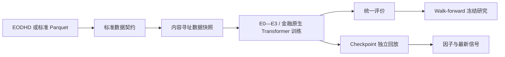
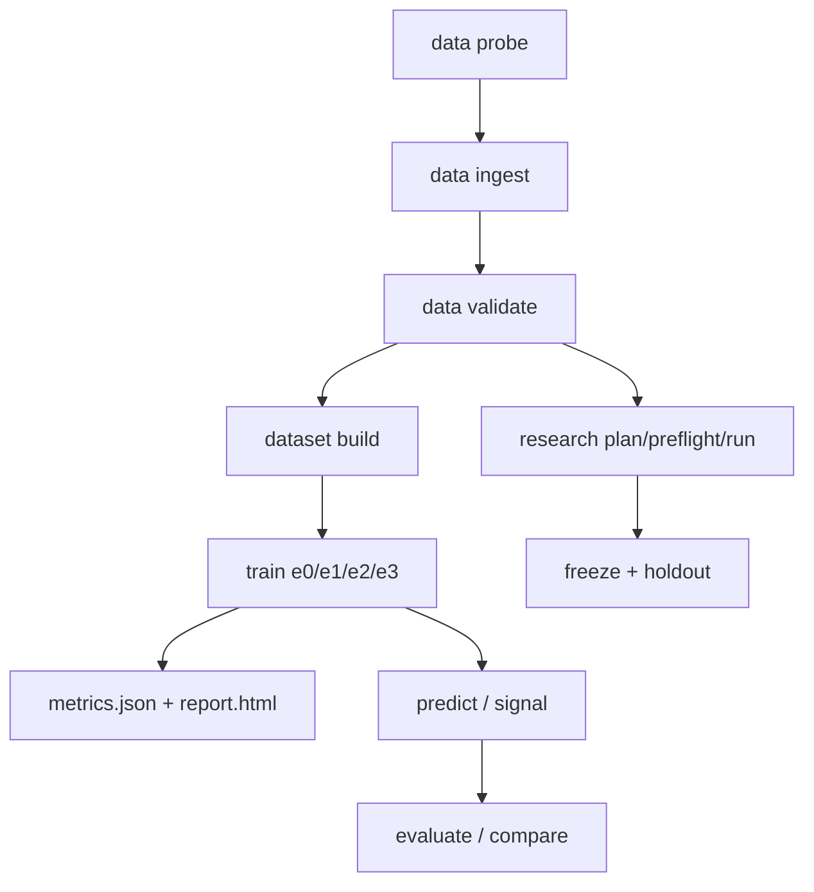

# FacDiggerNN 中文开发文档

> **现行工程说明**。面向第一次接触本项目的开发者，解释项目解决什么问题、代码如何组织、
> 数据如何流动、各模块如何协作、怎样运行与扩展，以及哪些边界不能越过。代码、严格配置和
> 测试是最终依据；历史材料不覆盖本文。

从[文档中心](README.md)可查看文档职责。配套的[实验设计文档](实验设计文档.md)解释旧
E0—E3 和当前金融原生 Transformer 精简对照怎样形成研究结论。

## 1. 项目是什么

FacDiggerNN 是一个面向美股日频数据的机器学习量化因子研究工具。它把每只股票截至某个交易日收盘已知的历史信息转换成一个横截面分数，用于预测从下一交易日开盘到未来第五个交易日收盘的超额收益。

这个项目不是交易系统。它不处理下单、撮合、仓位管理、资金管理和券商连接。它的输出是可审计的因子分数、实验指标和研究报告。

项目重点不是只训练一个 PatchTST 模型，而是建立一条完整、可复现、尽量防止未来信息泄漏的研究链路：


```mermaid
flowchart LR
    A["EODHD 或标准 Parquet"] --> B["标准数据契约"]
    B --> C["内容寻址数据快照"]
    C --> D["E0—E3 / 金融原生 Transformer 训练"]
    D --> E["统一评价"]
    E --> F["Walk-forward 冻结研究"]
    D --> G["Checkpoint 独立回放"]
    G --> H["因子与最新信号"]
```

### 1.1 新用户术语表

| 术语 | 本项目中的含义 |
|---|---|
| 因子（factor） | 对每只股票、每个日期产生的预测分数 |
| Alpha | 试图解释基准以外未来收益的信号 |
| 横截面 | 同一日期上不同股票组成的集合 |
| `asof_date` | 分数生成日期；只允许使用该日收盘前已知信息 |
| target | 用于训练/评价的未来超额收益 |
| universe | 每日证券状态和是否允许进入研究的股票池 |
| eligible | 当日满足上市、类型、价格、流动性等条件 |
| point-in-time | 数据值必须是当时可知值，不能用后来修订值回填历史 |
| split | Train、Validation、Test 的时间分区 |
| fold | Walk-forward 中一组独立的 train/valid/test 边界 |
| seed | 控制随机初始化、采样等随机性的整数 |
| checkpoint | 某个训练状态的模型和优化器保存文件 |
| snapshot | 由输入哈希和配置确定的不可变训练数据目录 |
| manifest | 记录来源、配置、哈希、环境和限制的机器可读清单 |
| provenance | 数据或模型从哪里来、经过什么处理的血缘 |

### 1.2 默认研究任务

| 项目 | 当前默认值 |
|---|---|
| 市场 | 美股日频 |
| 交易所 | Nasdaq、NYSE、NYSE American |
| 证券类型 | 普通股 |
| 决策时点 | 交易日 `t` 收盘后 |
| 最早执行时点 | `t+1` 开盘 |
| 输入窗口 | 512 个市场交易日 |
| 输入通道 | 当前主线为 14 个个股通道 + 6 个共享市场通道；旧 E0—E3 为 7 个价量通道 |
| 标签 | 当前主线为 1/5/20 日超额收益，5 日主任务；旧协议为单一 5 日标签 |
| 模型 | 当前金融原生 Transformer；保留 E0—E3 历史对照 |
| 主要指标 | IC、Rank IC、ICIR、Q5−Q1、成本后收益、换手和稳定性 |

### 1.3 当前工程状态

当前代码已经形成完整工程闭环：

| 领域 | 当前实现 |
|---|---|
| 数据 | EODHD 隔离 adapter、标准 Parquet、通用 provenance、质量门禁和内容寻址快照 |
| 训练 | E0—E3 与金融原生 Transformer；完整日排序、embedding replay、Train 内 probe/selection、恢复和 split 审计 |
| 迁移 | 锁定 ETTh1 revision、两段权重映射、参数量/shape/指纹门禁 |
| 评价 | 统一 prediction contract、Rank IC、组合参考指标、覆盖和中性化可用性 |
| 研究 | 当前 9 阶段精简矩阵；旧多 fold/seed、Holm、freeze、final refit 和 holdout 仍保留 |
| 推理 | checkpoint 独立回放、共享多模型 runtime、无标签单日/全历史 FactorBatch 和 prediction 独立评价 |

历史动态 EODHD bronze 曾在项目机器上完成采集、修复并通过来源质量门禁，但 `data/` 和
`artifacts/` 被 Git 忽略，不能根据代码仓库推断任一机器已有这些资产。新 clone 必须迁移或
重建标准表，并重新执行 `data validate` 和 `research preflight`。

“工程闭环完整”仍不等于“数据正式 research-ready”：当前来源没有真实退市终值/原因，
也没有可靠的点时行业和点时流通市值。工程配置使用显式退市插值，并关闭来源 readiness 与
中性化正向硬门禁，所以只能形成 engineering research 结果。

## 2. 核心设计原则

### 2.1 供应商隔离

EODHD 的字段、API、响应格式、缓存和预算只存在于
`src/facdigger/data/providers/eodhd/`。provider 完成专属质量门禁后，通过
`src/facdigger/data/provenance.py` 生成版本化的 `standardization` 通用证明。adapter、
snapshot、训练和 preflight 只读取标准 Parquet 与该证明，不按 provider 名称解释原始
manifest 字段。

这样做有两个作用：

1. 将来可以增加其他数据源，而不用重写模型。
2. 可以先离线检查标准数据，再进行昂贵训练。

### 2.2 Point-in-time

对任意样本都必须满足：

```text
max(feature_time) <= asof_date < label_start <= label_end
```

行业、市值、股票池资格、退市处理也必须声明其可知时间。无法证明点时正确的字段不能静默当成正确数据使用。

### 2.3 内容寻址数据和可追溯实验

数据快照目录名是数据配置和所有输入文件哈希的 SHA-256。训练 run 记录：

- 完整解析后的配置；
- dataset ID；
- checkpoint 哈希；
- source checkpoint revision；
- Git commit 和 dirty 状态；
- Python/依赖/设备环境；
- 随机种子；
- 数据来源 manifest；
- 训练和 checkpoint 选择访问了哪些 split。

快照生成后按协议不得修改，但当前实现没有文件系统或对象存储级写保护。“不可变”指内容寻址
和调用约定；如果需要对抗本机篡改，应继续为生成产物增加哈希清单和加载时校验。

### 2.4 Outer validation 不参与训练

E0—E3 都在正式 Train 内按日期切出尾部 10% 作为 `inner_selection`。任何 `label_end` 与 inner selection 起点重叠的拟合样本会被 purge。

Outer validation 只用于冻结协议下的样本外评价，不用于：

- 早停；
- checkpoint 选择；
- 学习率调度决策；
- 训练阶段选择；
- 特征缩放器拟合。

Test 默认锁定，只有同时显式配置和命令授权时才能读取。

## 3. 项目目录

```text
FacDiggerNN/
├── configs/
│   ├── data/                 # 数据供应商采集配置
│   ├── datasets/             # 标准表到内容寻址快照
│   ├── experiments/          # E0—E3 与 finance Transformer 实验配置
│   ├── inference/            # 固定 release 的全历史回测配置
│   ├── research/             # 精简 Transformer 与旧 M6 walk-forward 配置
│   └── production/           # Docker 每日因子服务配置
├── docs/
│   ├── README.md             # 文档入口和职责
│   ├── 开发文档.md
│   ├── 实验设计文档.md
│   ├── RTX2070_Windows训练指南.md
│   ├── HeyBoss因子联调交接.md
│   ├── 项目关键问题与修复复盘.md
│   └── 历史归档/            # 文件名已标记“当前可忽略”
├── src/facdigger/
│   ├── cli.py                # Typer CLI 入口
│   ├── data/                 # 数据契约、快照、provider
│   ├── features/             # 价量、横截面 rank、市场状态和缩放
│   ├── labels/               # 单/多期限前向收益标签
│   ├── datasets/             # split、索引、窗口和采样器
│   ├── models/               # E0—E3、finance Transformer 与预训练
│   ├── training/             # 训练/预训练/资源基准 runner、engine 和 config
│   ├── evaluation/           # 指标、中性化、报告和比较
│   ├── research/             # walk-forward 和统计冻结
│   ├── inference/            # 回放、共享评分、ModelRelease、历史回测与 FactorBatch
│   └── production/           # 每日状态机、Docker 调度、锁和保留策略
├── tests/
│   ├── unit/
│   └── integration/
├── data/                     # 本机数据；Git 忽略
├── artifacts/                # 运行结果；Git 忽略，需要时自动创建
├── Dockerfile                # 跨平台生产镜像
├── compose.yaml              # 单服务、持久卷和健康检查
├── pyproject.toml
├── uv.lock
└── requirements-lock.txt
```

### 3.1 本机目录的含义

| 目录 | 内容 | 是否可直接删除 |
|---|---|---|
| `data/bronze/` | 标准化后的来源表 | 谨慎；删除后需重新采集 |
| `data/cache/` | EODHD API 响应缓存 | 可删除，但会重新消耗 API 调用 |
| `data/state/` | 本地每日调用预算 | 不建议删除 |
| `data/snapshots/` | 含 label/split 的训练快照 | 可重建 |
| `data/walk_forward_snapshots/` | 每个 fold 的快照 | 可重建 |
| `data/inference_snapshots/` | 绑定 release、复用冻结 scaler 的无标签推理快照 | 可重建 |
| `data/production/` | bounded hot source、CURRENT、SQLite 状态和锁文件 | 运行中不可删除 |
| `artifacts/factor_history/` | 全历史回放 plan/state/manifest 与年度 FactorBatch | 可重建；交付后应保留审计副本 |
| `artifacts/` | checkpoint、预测、指标、报告 | 可重建，但删除后无法恢复该 run |
| `.env.local` | 本机 EODHD token | 保留且绝不能提交 |
| `.venv/` | 本机 Python 环境 | 可重装，但通常保留 |

## 4. 安装与环境

### 4.1 推荐环境

- Python 3.11；
- macOS、Linux 或 Windows；
- CPU 可以完成工程冒烟；
- 正式 PatchTST 训练建议使用 CUDA GPU；
- RTX 2070 Super 需要使用 FP16，不使用 BF16 作为默认值。

### 4.2 使用 uv 安装

```bash
cd FacDiggerNN
uv sync --frozen --all-extras
uv run facdigger doctor
```

依赖分组：

| extra | 用途 |
|---|---|
| `model` | PyTorch、Transformers、Hugging Face、safetensors |
| `data` | Polars、PyArrow |
| `eodhd` | requests |
| `baseline` | LightGBM |
| `dev` | pytest、pytest-cov、Ruff |

`uv.lock` 是首选锁文件；`requirements-lock.txt` 是用于普通 pip/Windows 环境的导出文件。

### 4.3 EODHD token

仓库根目录创建 `.env.local`：

```bash
EODHD_API_TOKEN=你的真实token
```

加载方式：

```bash
set -a
source .env.local
set +a
```

安全约束：

- token 不写入 YAML；
- token 不写入缓存键、URL 日志和 manifest；
- `.env.local` 已被 Git 忽略；
- 付费配置设置 `allow_demo_token: false`，避免真实任务静默退回 demo。

## 5. 从数据到结果的完整流程


```mermaid
flowchart TD
    P["data probe"] --> I["data ingest"]
    I --> V["data validate"]
    V --> S["dataset build"]
    S --> T["train e0/e1/e2/e3"]
    T --> M["metrics.json + report.html"]
    T --> R["predict / signal"]
    R --> X["evaluate / compare"]
    V --> W["research plan/preflight/run"]
    W --> F["freeze + holdout"]
```

这里有两条独立入口：单模型实验需要 `dataset build` 后再 `train`；M6 研究由 runner 按 fold
自行构建 walk-forward snapshots，普通 snapshot 不是其前置条件。

### 5.1 最小免费版冒烟

```bash
facdigger data probe --config configs/data/eodhd_free.yaml
facdigger data ingest --config configs/data/eodhd_free.yaml
facdigger data validate --config configs/datasets/eodhd_free_smoke.yaml
facdigger dataset build --config configs/datasets/eodhd_free_smoke.yaml
```

免费配置只有 AAPL/TSLA 和约一年数据，`context_length=60`，只能验证管线，不能形成研究结论。

### 5.2 100 股票工程 pilot

```bash
facdigger data probe --config configs/data/eodhd_all_world_pilot.yaml
facdigger data ingest --config configs/data/eodhd_all_world_pilot.yaml
facdigger data validate --config configs/datasets/eodhd_all_world_pilot.yaml
facdigger dataset build --config configs/datasets/eodhd_all_world_pilot.yaml
```

该模式从当前 active 普通股中按当前 200 日流动性选择 100 只股票，存在存活偏差和历史前视偏差，只能用作工程、资源和端到端验证。

### 5.3 历史动态股票池

```bash
facdigger data probe --config configs/data/eodhd_historical_liquid.yaml

# 确认 API 配额、运行时间和磁盘空间后再运行：
facdigger data ingest --config configs/data/eodhd_historical_liquid.yaml
facdigger data validate --config configs/datasets/eodhd_historical_liquid.yaml
facdigger dataset build --config configs/datasets/eodhd_historical_liquid.yaml
```

该模式：

1. 同时发现 active 和 delisted 普通股；
2. 不使用当前流动性预先裁掉历史候选；
3. 获取每只候选的历史 EOD；
4. 用版本化 US regular-session 日历删除闭市日异常 bars；
5. 在 ticker alias 合并前隔离价格冲突或复权价数量级断裂的身份；
6. 对公司行动做经济语义去重，并整组排除条款冲突事件；
7. 恢复每只证券上市区间的完整市场 session 网格；
8. 根据当日 trailing ADV20、价格、上市天数和状态确定候选；
9. 每日按 ADV20 排序，只保留最多 1000 只 eligible 股票。

候选数和 API 请求量会随 EODHD metadata 与配置变化，当前事实必须读取当次 probe 和 source
manifest，不能复制历史审计中的硬编码计数，也不能把 `probe` 当作全量下载。historical
模式在 provider 内强制 `quality.gate.status=passed`，然后生成
`facdigger.standard_parquet` v1 标准化证明。validate、snapshot 和 M6 preflight 只检查
该通用证明及其表哈希。旧 bronze 缺少证明，因此必须重新 ingest。

## 6. 标准数据契约

### 6.1 `bars_daily.parquet`

主键是 `(security_id, trade_date)`。

| 必需字段 | 含义 |
|---|---|
| `security_id` | 稳定证券标识；优先使用 ISIN |
| `symbol` | 当日展示 ticker |
| `trade_date` | 市场交易日 |
| `open/high/low/close` | 原始 OHLC，必须为正且满足高低价关系 |
| `volume` | 原始成交量，非负 |
| `dollar_volume` | 成交额 |
| `adj_factor` | `adjusted_close / close` |
| `source_revision` | 来源版本 |

EODHD 适配器还会保留 provider symbol、身份质量、来源交易所、证券类型和最终是否退市等审计字段。

### 6.2 `universe_daily.parquet`

主键也是 `(security_id, trade_date)`，但它是完整证券—市场 session 网格，允许没有 bar。

| 必需字段 | 含义 |
|---|---|
| `listed_days` | 从首个有效历史 session 起累计的上市天数 |
| `exchange` | 标准交易所代码 |
| `security_type` | 当前要求为 `common_stock` |
| `is_primary_listing` | 是否主上市 |
| `is_listed` | 当日是否在上市区间 |
| `is_delisted` | 是否为推断退市 session |
| `is_halted` | 上市期间缺少 bar 时的推断停牌 |
| `industry_code` | 点时行业；当前 EOD-only 来源缺失 |
| `float_market_cap` | 点时流通市值；当前 EOD-only 来源缺失 |
| `close`、`adv20_usd` | 当日价格和 trailing 流动性 |
| `eligible` | 是否进入当日研究股票池 |

`eligible=true` 时强制要求：仍上市、未退市、未停牌、主上市、普通股。

### 6.3 `corporate_actions.parquet`

包含：

- `ex_date`；
- `action_type`；
- 价格和成交量因子；
- 现金金额；
- `known_at`；
- `source_revision`。

`known_at` 不能晚于 `ex_date`。

### 6.4 `delistings.parquet`

每只证券最多一行：

- `delist_date`；
- `last_trade_date`；
- `delisting_return` 或 `terminal_value`；
- `known_at`；
- `source_revision`。

历史动态 EODHD 模式会额外写入 `is_imputed`、`imputation_method` 和 `exchange`。当前默认插值为：

| 交易所 | 插值退市收益 |
|---|---:|
| Nasdaq | -55% |
| NYSE | -30% |
| NYSE American | -30% |
| 未知 | -50% |

这些值是工程假设，不是数据供应商观测值。

## 7. 特征、标签和数据快照

### 7.1 原始七通道与新相对状态

| 通道 | 定义 |
|---|---|
| `r_close` | 调整后收盘价相对前收盘价的对数收益 |
| `r_gap` | 调整后开盘价相对前收盘价的对数跳空 |
| `r_intraday` | 调整后收盘相对开盘的对数收益 |
| `range` | 调整后最高价/最低价的对数振幅 |
| `dlog_volume` | `log1p(volume)` 的一阶差分 |
| `vol20` | `r_close` 的 20 日总体标准差 |
| `dollar_volume_z20` | 相对 20 日成交额中位数和 IQR 的稳健 z-score |

每个通道都有一个 `observed_<channel>` 布尔列。缺失值进入神经网络时填 0，但 observed mask 同时传入模型，不能把填充值当作真实观测。

`finance_transformer` feature set 还为上述每个通道增加一个按当日 eligible 横截面映射到
`[-1, 1]` 的 `rank_<channel>`，并单独保存 6 路共享市场状态。rank 不再做第二次 robust
scaling；原始个股和市场通道分别只用 Train 拟合 scaler。

### 7.2 缩放

缩放器只使用 `trade_date <= train_end` 的数据：

1. 按训练期 0.5% 和 99.5% 分位 winsorize；
2. 减训练期中位数；
3. 除以 `IQR / 1.349`；
4. 将参数写入 `scaler.json`。

Validation/test 不参与阈值或尺度估计。

### 7.3 标签

```text
raw_return = log(adjusted_close[t+5] / adjusted_open[t+1])
benchmark_return = 当日 eligible 股票的 raw_return 等权均值
target = raw_return - benchmark_return
```

`t+1` 和 `t+5` 使用全市场交易日历，不按个股实际 bar shift。这样停牌不会把“第五个市场交易日”错误变成“该股票第五个有交易的日期”。

如果标签窗口跨退市日，则使用退市 terminal value 或最后调整后价格乘 `(1 + delisting_return)`。

### 7.4 时间切分

数据集 split 同时使用：

- `label_end <= 当前 split 结束日期`；
- validation/test 起点经过配置的 session embargo；
- 不满足条件的边界样本直接不分配 split。

### 7.5 快照内容

`facdigger dataset build` 创建：

| 文件 | 用途 |
|---|---|
| `features.parquet` | 缩放后的原始通道及 observed mask；新 feature set 还含 7 个 rank 通道 |
| `market_features.parquet` | 仅新 feature set：每日期 6 路共享市场状态及 mask |
| `labels.parquet` | 原始收益、基准、target、标签边界和退市标记 |
| `sample_index.parquet` | 有 target 的 train/valid/test 样本 |
| `sample_metadata.parquet` | 评价所需行业、市值、eligible 等元数据 |
| `inference_index.parquet` | 不含 target 的全部可推理日期 |
| `pretraining_index.parquet` | 仅新 feature set：无 target/split、未来摘要不越过 Train 的 endpoint |
| `scaler.json` | Train-only 缩放参数 |
| `audit.json` | 行数、覆盖、缺失、退市跨越等审计 |
| `manifest.json` | dataset ID、配置和输入哈希 |
| `source_manifest.json` | 数据供应商来源血缘副本 |

相同语义配置和相同输入文件会得到同一个 dataset ID，移动输入路径或输出目录不改变 ID。
配置 `source_manifest` 时，该文件必须包含：

```json
{
  "standardization": {
    "name": "facdigger.standard_parquet",
    "version": 1,
    "status": "passed",
    "research_ready": false,
    "tables": {
      "bars": {"file": "bars_daily.parquet", "sha256": "..."},
      "universe": {"file": "universe_daily.parquet", "sha256": "..."}
    }
  }
}
```

provider 可在同一 manifest 保存自己的详细审计，但下游只消费上述通用字段。

## 8. 模型和训练器

### 8.1 E0：传统基线

E0 把七个通道变成多尺度 tabular 特征：

- 当前值；
- 5、20、60、120、252 日窗口；
- 每个窗口的 mean、std、min、max。

支持：

- LightGBM；
- 两层 MLP。

缺失特征使用 Train 拟合的均值/标准差处理，再补 0 并拼接 observed mask。LightGBM 在独立进程运行，以隔离 macOS 上可能冲突的原生 OpenMP runtime。

### 8.2 E1：随机 PatchTST

单次设备前向的输入形状是 `[physical_batch, 512, 7]`。当前正式结构：

- patch length/stride：12/12；
- `d_model=128`；
- 16 个 attention heads；
- 6 层 encoder；
- FFN 维度 512；
- PatchTST channel-independent backbone；
- patch mask 加权池化；
- 通道拼接后的两层 AlphaHead；
- 输出每个样本一个标量分数。

E1 完全随机初始化，作为判断 PatchTST 方法是否优于 tabular 基线的对照。但 E1 全量
训练整个 backbone，E2/E3 则使用 FT-0/FT-1 阶段冻结/解冻；即使三者都注册为
5 个监督 epochs，优化协议仍不同。因此 E2−E1 当前只能解释为“完整 ETTh1
迁移方法”与“随机 PatchTST 方法”的 method-level 差异，不能归因为纯初始化效应。

Transformers 的 PatchTST patchifier 在窗口长度不能由 patch 完整覆盖时会从
`sequence_start` 开始切片，而不是固定从第 0 个 session 开始。当 context=512、
patch length/stride=12/12 时，共有 42 个 patch，`sequence_start=8`，实际覆盖
第 8—511 个 session。监督 AlphaHead 和 E3 reconstruction 现在共用同一个
`patchify_observed_mask`，并显式传入实际 patchifier 的 `sequence_start`；这保证
observed mask 与 backbone 真正输入的 patch 一一对齐。

### 8.3 E2：ETTh1 迁移

来源 checkpoint：

```text
ibm-research/patchtst-etth1-pretrain
revision = 1212736a0decf12b5cea5a605302421e110a3614
```

加载链：

```text
原始 checkpoint
  → 当前 Transformers PatchTST source backbone
  → FacDiggerNN 金融 Alpha backbone
```

每一步都要求：

- 参数名标准化；
- shape 精确一致；
- loaded numel ratio 至少 80%；
- 未授权 missing/unexpected/mismatch 立即失败；
- 保存权重加载报告和参数指纹。

微调分两阶段：

- FT-0：冻结 encoder，只训练 AlphaHead；
- FT-1：解冻最后 N 个 encoder block，encoder/head 使用不同学习率。

旧 M6 实验配置曾面向 RTX 2070 Super 首轮完整 3-fold × 3-seed
矩阵的注册可行性预算：E1、E2 和 E3 下游微调都是 `max_epochs=5`、
`minimum_epochs=3`、`patience=2`；E2/E3 的前 2 epochs 为 FT-0。E2/E3 head
learning rate 从旧快速实验的 `1e-3` 下调为 `3e-4`，encoder 仍为 `1e-5`。
原因是排序相关性 loss 对 score 的平移和尺度不敏感，上轮 artifacts2 中较大
head 学习率伴随 score 标准差膨胀。这些参数是保守风险控制，不是已证明
充分收敛或最优的最终预算；smoke 配置保留小数据快速验证参数，不参与正式
结论。如果首轮确认可行，升级硬件后的扩预算重跑必须使用新 research ID，
不能和本轮 cell 混合。

E0—E3 的监督阶段共享横截面排序协议。完整日期内的 target 先按 average ties 变成
`[-1, 1]` 的 percentile rank；神经网络优化 `1 - corr(score, target_rank)`，相关性部分
强制使用 Float32。E0 LightGBM 使用完整日 group 的 LambdaRank，E0 MLP 直接以
完整日为 batch。E1—E3 的微调采用显存受限的两遍精确梯度：

1. `FullDateBatchSampler` 在 CPU 上组装完整日横截面，同日不分组、不丢行，也不与
   其他日期混合；
2. GPU 每次只处理 `batch_size` 行 physical microbatch。第一遍不保留计算图，
   收集当日各微批次 detached Float32 score/target 向量（通常约千行、KB 级）；
   finalize 时拼接向量并以与单图 Float32 reduction 相同的顺序计算整日 moments，
   随后清空向量；
3. 第一遍保存每个微批次的 RNG 状态，并在进入第二遍前恢复 BatchNorm running
   buffers，避免无图前向额外更新一次运行统计；
4. 第二遍逐微批次恢复 RNG、重算 score，用整日 moments 导出的精确
   `d(loss)/d(score)` 回传；
5. 在 `optimizer.step()` 前复核两遍的行数、均值、方差、协方差和范围。回放
   不一致、target rank 零方差或非有限梯度都 fail closed，不执行参数更新。
   常量 score 在 epsilon 正则化目标下仍有定义且梯度非零，不作为零方差错误拒绝。

这种方法的 GPU activation 上界由 `batch_size` 决定，CPU 侧训练 batch 只额外持有
当前一日的窗口张量；相比单遍训练，每日增加一次不建图前向。降低
`batch_size` 不会改变完整日 loss 的 moments 或把日期切成多个目标；但当前
PatchTST 使用 train-mode BatchNorm，physical microbatch 大小仍会改变当批统计和
训练轨迹，也会影响吞吐。因此正式模型比较必须固定 `batch_size`。

`dates_per_optimizer_step` 表示每次优化器更新前累积几个完整日的梯度。它与
physical microbatch 数量无关；为了处理 OOM 降低 `batch_size` 时不得联动提高该值。
E3 的 masked reconstruction 是独立无监督阶段，其
`pretraining.gradient_accumulation_steps` 仍保留原有微批次累积语义。

训练 loss 只用于优化诊断，checkpoint/early stopping 在完整 inner selection 上按逐日真实
Spearman Rank IC 均值选择。

### 8.4 E3：金融域预训练

初始化链：

```text
ETTh1 encoder → 金融 masked reconstruction → AlphaHead 微调
```

金融预训练：

- 只读取正式 Train；
- Train 内尾部 10% 用于重建 checkpoint 选择；
- 随机遮挡默认 40% patch；
- Huber reconstruction loss；
- loss 只计算“被遮挡且真实 observed”的元素；
- outer validation 和 test 使用行数必须为 0。

当前正式 E3 预训练资源协议是 `batch_size=64`、`max_epochs=3`、
`minimum_epochs=1`、`patience=2`、`learning_rate=1e-5`。上轮 artifacts2 的一个
epoch 已包含约 1.5—1.9 万个 optimizer steps，而 encoder 相对 L2 漂移约 0.43；
因此本轮先缩短 epoch 上限并将学习率降一个数量级，用于降低灾难性遗忘风险。
这是基于已观察漂移的保守首轮协议，不能表述为已证明最优；正式调参仍必须
在新 validation research ID 下完成，不得读取 holdout。
重建阶段仍使用 `pretraining.gradient_accumulation_steps`；最后不满一组的尾部 batch
按其实际组大小归一化，不会被固定除以配置值。FP16 GradScaler 跳过的 optimizer
step 会单独计数，`global_step` 只记录真正更新了参数的 step。

这里的 Huber 只属于无监督 masked reconstruction；随后 AlphaHead 微调仍使用上述统一的
横截面排序目标。

预训练完成后将 encoder 以 100% 参数匹配载入下游 Alpha 模型，再执行与 E2 相同的 FT-0/FT-1。

### 8.5 金融原生 Transformer（当前实验主线）

新路径与 E1—E3 并存但不复用旧 ETTh1/E3 模型。schema-v4 snapshot 额外包含：

- `features.parquet`：7 个原始价量 + 7 个当日横截面 rank；
- `market_features.parquet`：每日收益中位数、breadth、离散度、range、成交活跃度和市场波动；
- `sample_index.parquet`：1/5/20 日监督 target，5 日为主任务；
- `pretraining_index.parquet`：没有 target/split，只保留完整 512 日历史且未来 5 日摘要仍在
  official Train 内的 endpoint。

模型职责分为 `LocalTemporalEncoder`、`MarketContextEncoder`、
`MultiScaleStatisticsEncoder` 和 permutation-equivariant `CrossSectionalEncoder`。同一日期
先分块编码所有股票，再把 detached embedding 作为完整横截面叶节点执行 Set Transformer；
得到叶梯度后恢复 RNG 并逐块重算 local/market encoder。这一 embedding replay 保留精确完整日
计算图语义，同时把 RTX 2070S 的 activation 上界限制在 physical `batch_size`。

金融预训练随机初始化相同 local/market encoder，遍历全部 Train endpoint：

- 30% 连续 patch 遮蔽，一半跨通道共享、一半通道独立；
- 被遮蔽且真实 observed 元素的 channel-balanced Huber reconstruction；
- 原始 7 个个股通道和 6 个市场通道的未来 5 日标准化 sum/mean/std 摘要；
- 每 epoch 冻结 encoder，在固定 Train 内 probe-fit/probe-selection 日期上以完整日 5 日 Rank IC
  选择 `best_encoder.pt`，outer validation/test 使用行数必须为 0。

scratch 和 finance-pretrained 使用相同架构、监督 LR、10/6 epoch、完整样本和 selection；唯一
方法差异是 pretrained 在第一个监督 step 前严格载入同 dataset/context/channel 契约的 encoder。
正式矩阵由 `research transformer-run` 固定为 3 次预训练和 6 个监督 cell。训练 run 持续写入
`progress.jsonl`；`finance-benchmark` 用最大 fold 的 100 个真实 update 估计 9 阶段总时间，
并记录 CUDA 与进程峰值内存，但不会改变正式训练配置或产物。runner 强制要求报告同时通过
CUDA/FP16、7.2 GiB 显存、13 GiB 宿主内存和 14 天门禁，并校验报告绑定的两份配置哈希及
最大 fold dataset ID。

### 8.6 Checkpoint 恢复

完整日排序协议的 E1—E3 监督 checkpoint schema v3 保存：

- model；
- optimizer；
- scheduler；
- GradScaler；
- epoch/global step；
- best metric；
- RNG 状态；
- sampler 状态；
- dataset/config/source hash；
- objective、target transform、best selection Rank IC 和有效/跳过日期审计；
- `optimization_protocol`：完整日优化单元、两遍方法、physical microbatch 大小和
  `dates_per_optimizer_step`。

只有 dataset 和完整配置哈希一致时才能恢复，防止错误续跑。当前 objective 名称是
`cross_sectional_rank_correlation_surrogate_v2_full_date`。旧 Huber schema v1 和旧的
v1 chunked-ranking schema v2 checkpoint 不能 resume 到当前协议，也不能与新 M6 矩阵混用；
需要回放旧证据时应使用生成它的历史代码。

E3 的 reconstruction checkpoint 不使用上述监督 schema。它当前是 schema v2，额外
记录 `patch_alignment_protocol=patchifier_sequence_start_v2`。继续 reconstruction
预训练和把 financial encoder 载入 Alpha 模型两条路径都会校验该字段，并拒绝
修复前 observed mask 错位的旧 checkpoint。

金融原生监督 checkpoint 使用 schema v4、objective
`multi_horizon_full_date_rank_correlation`，并记录 exact leaf embedding replay、local/market
状态、scheduler、GradScaler、RNG、完整日 sampler 和选择审计。金融预训练的
`best_encoder.pt` 只交付两个 encoder，并绑定 dataset ID、context、通道顺序和模型结构；不能
跨 fold 误用。

## 9. 统一评价

### 9.1 Prediction 契约

每张预测表只允许一个 model ID 和 dataset ID，且 `(model_id, security_id, asof_date)` 唯一。必需字段包括：

- raw/neutralized score；
- target；
- split；
- checkpoint hash；
- dataset ID；
- eligible；
- 行业和 log float market cap。

覆盖率低于配置门槛或出现额外样本时，评价失败。

### 9.2 指标

- 逐日 Pearson IC；
- 逐日 Spearman Rank IC；
- 年化 ICIR/Rank ICIR；
- 正 IC 比例；
- Q5−Q1 多空收益；
- 换手；
- 0/10/20/50 bps 单边成本后 Q5−Q1；
- 分年、分行业和分市值稳定性；
- 中性化前后对照。

### 9.3 中性化

每天用行业哑变量和标准化后的 `log(float_market_cap)` 回归 raw score，残差作为 neutralized score。

如果点时暴露缺失、样本不足或设计矩阵不满秩，neutralized score 保持空值并记录原因；系统不会用 raw score 冒充中性化结果。

## 10. CLI 参考

### 10.1 环境和兼容性

```bash
facdigger doctor
facdigger probe-patchtst --config configs/base.yaml --output artifacts/m0-probe
facdigger probe-patchtst --config configs/base.yaml --output artifacts/m0-probe --local-files-only
```

### 10.2 数据

```bash
facdigger data probe --config <provider.yaml>
facdigger data ingest --config <provider.yaml>
facdigger data validate --config <dataset.yaml>
facdigger dataset build --config <dataset.yaml>
```

### 10.3 训练

```bash
facdigger train e0 --config <e0.yaml> --dataset data/snapshots/<dataset_id>
facdigger train e1 --config <e1.yaml> --dataset data/snapshots/<dataset_id>
facdigger train e2 --config <e2.yaml> --dataset data/snapshots/<dataset_id>
facdigger train e3 --config <e3.yaml> --dataset data/snapshots/<dataset_id>
facdigger train finance-pretrain \
  --config configs/experiments/finance_patch_pretrain.yaml \
  --dataset data/snapshots/<schema_v4_dataset_id>
facdigger train finance-transformer \
  --config configs/experiments/finance_patch_transformer_scratch.yaml \
  --dataset data/snapshots/<schema_v4_dataset_id>
```

E1—E3 恢复：

```bash
facdigger train e1 \
  --config configs/experiments/e1_random.yaml \
  --dataset data/snapshots/<dataset_id> \
  --resume artifacts/e1/<run_id>/checkpoints/last.pt
```

E3 的 `--resume` 可以指向预训练或微调阶段的 `last.pt`。
两个 finance 命令也接受各自 run 内的 `checkpoints/last.pt`，配置和 dataset ID 不一致时拒绝
恢复。正式 9 阶段矩阵应使用可自动恢复的 runner：

```bash
facdigger train finance-benchmark \
  --supervised-config configs/experiments/finance_patch_transformer_scratch.yaml \
  --pretraining-config configs/experiments/finance_patch_pretrain.yaml \
  --dataset data/snapshots/<largest_fold_dataset_id> \
  --updates 100 \
  --output artifacts/benchmarks/finance-transformer-rtx2070s.json

facdigger research transformer-plan \
  --config configs/research/finance_transformer_streamlined.yaml
facdigger research transformer-run \
  --config configs/research/finance_transformer_streamlined.yaml
```

### 10.4 回放、信号、独立评价

经审阅的完整 run 可以先冻结为不可变 ModelRelease：

```bash
facdigger release create \
  --run artifacts/e3/<run_id> \
  --output-root artifacts/releases

facdigger release verify \
  --release artifacts/releases/<release_id>
```

release 默认要求 source run 和发布工具工作树 clean；联调可显式使用 `--allow-dirty` 同时
允许训练来源和发布端的 dirty 状态。`source.git_clean` 如实为布尔值，加载时检查其与原
run manifest 一致，不再次要求必须为 true。发布命令可以从后续提交运行，但始终保留训练
run 的原始 commit，不能把
发布代码 commit 冒充训练代码身份。它复制并绑定 checkpoint、resolved config、冻结 scaler、训练 snapshot manifest、
source run manifest 和 checkpoint protocol；source run 本身还必须记录训练时 scaler 与
原始 predictions 的 SHA-256。任一文件被替换，或旧 run 缺少 scaler/predictions 绑定都会
失败。训练快照中的 provider-symbol fallback 不再阻止 release；身份可交付性只在实际
交付集合上核对。dirty 放行不能补回当时未保存的源代码变更，也不能放行未完成 run。

E1—E3 与 Finance Transformer 使用同一组 CLI，模型实现由 release 中的 `model_type` 自动
选择。从 Windows 搬回模型时，`release create --dataset <本机快照路径>` 只替换训练 snapshot
的定位方式，仍校验原 dataset ID、manifest/scaler 哈希；不得手工改写原始 manifest 的路径。
研究 `predict --dataset` 使用同一定位规则。资产内部统一安全相对路径，读取时可识别旧
Windows 反斜杠，但拒绝盘符、UNC、`..` 与目录外 symlink；新产物统一写 `/`。完整
Finance Transformer resume 从断点恢复初始化审计、权重、优化器、调度器、sampler 与 RNG，
不再先加载旧机器的预训练 encoder；应迁移完整 run/checkpoints，而不只搬一个 last.pt。

```bash
# 默认回放 source run 的原评价 split
facdigger predict --run artifacts/e3/<run_id>

# 显式回放 test
facdigger predict \
  --run artifacts/e3/<run_id> \
  --split test \
  --unlock-test

# 用 release 冻结 scaler 构建无标签推理快照
facdigger dataset build-inference \
  --config configs/datasets/eodhd_historical_liquid_inference.yaml \
  --release artifacts/releases/<release_id>

# 最新单日完整候选横截面，原子发布 FactorBatch
facdigger signal \
  --release artifacts/releases/<release_id> \
  --dataset data/inference_snapshots/<snapshot_id> \
  --output-root artifacts/factor_batches

# 同一 release 已绑定的评价 predictions，仅用于隔离联调回放
facdigger factor-batch from-predictions \
  --predictions artifacts/e3/<run_id>/predictions.parquet \
  --release artifacts/releases/<release_id> \
  --output-root artifacts/factor_batches

facdigger factor-batch verify \
  --bundle artifacts/factor_batches/<delivery_id>

# 固定同一 release，在无标签 snapshot 上生成全历史 backtest-only 分片
facdigger factor-history plan \
  --config configs/inference/e3_historical_replay.local.yaml
facdigger factor-history run \
  --config configs/inference/e3_historical_replay.local.yaml
facdigger factor-history verify \
  --export artifacts/factor_history/<history_id>

# 指定单个历史日期作生产语义诊断；不要用循环 signal 代替全历史回放
facdigger signal \
  --release artifacts/releases/<release_id> \
  --dataset data/inference_snapshots/<snapshot_id> \
  --asof 2025-12-31

# 独立评价一个 prediction 文件
facdigger evaluate \
  --predictions artifacts/e3/<run_id>/predictions.parquet \
  --dataset data/snapshots/<dataset_id> \
  --output artifacts/evaluations/<evaluation_id>

# 只比较相同 dataset、split 和样本键的 runs
facdigger compare \
  --runs artifacts/e0/<run>,artifacts/e1/<run>,artifacts/e2/<run>,artifacts/e3/<run> \
  --output artifacts/comparisons/<comparison_id>
```

### 10.5 Walk-forward

```bash
facdigger research plan --config configs/research/m6_eodhd_engineering.yaml
facdigger research preflight --config configs/research/m6_eodhd_engineering.yaml
facdigger research run --config configs/research/m6_eodhd_engineering.yaml
```

恢复：

```bash
facdigger research run \
  --config configs/research/m6_eodhd_engineering.yaml \
  --resume-run artifacts/research/<research_run_id>
```

Validation 全部完成并审阅冻结报告后才允许：

```bash
facdigger research run \
  --config configs/research/m6_eodhd_engineering.yaml \
  --resume-run artifacts/research/<research_run_id> \
  --unlock-final-holdout
```

runner 会在启动任何 test cell 前复核 validation 报告哈希及
`holdout_eligibility.eligible`。后者由完整日期/样本数契约、E3 raw 与 E3−E1 的单侧 HAC、
非重叠稳健性、cell ratio，以及正式模式下的来源/中性化门禁共同产生；Holm 校正只用于
E1−E0、E2−E1、E3−E2 三个归因问题。显式 `--unlock-final-holdout` 只是必要条件，不是绕过
`no_go` 的开关。被拒绝的解封不会改写已冻结 run 的 manifest，也不会创建 holdout 产物。
通过后，runner 会在首次读取冻结 test 键前永久登记 `holdout_has_been_read=true`，再使用
freeze 内的 final-refit protocol 新建 `train_end = valid_end` 的 snapshot，让 scaler 和
official Train 截止最后一个 validation 边界，同时保持 outer validation 为空。它会校验
来源文件哈希没有变化、新旧 snapshot 的 test 键/target 完全一致，再训练 12 个 refit cell；
test 不参与训练或 checkpoint selection。cell 状态写入
`matrix.json.final_refit`。`final_refit.json` 记录新旧 dataset ID、训练截止日、split counts、
protocol hash 和 manifest hash；中断后只重跑未完成 cell。

`research.json` 为 schema v2，当前 `freeze.json` 升为 schema v3，`matrix.json` 升为 schema
v2；旧 freeze 缺少 eligibility 或 refit 证据，不能在新协议下继续解封，应使用新的 research
ID 重跑 validation。

## 11. 运行产物

典型 E0—E3 run：

```text
artifacts/e3/<run_id>/
├── resolved_config.yaml
├── manifest.json
├── checkpoints/
├── predictions.parquet
├── metrics.json
├── report.html
├── weight_load_report.json
└── training_audit.json
```

不同模型会有少量差异。E3 还包含独立的 pretraining checkpoint/audit。

重要规则：

- 不要手工修改 run 内文件；
- 回放前会重新检查 manifest、dataset、checkpoint 和 sidecar 哈希；
- 同一 split 的 replay 默认要求 raw score 在固定容差内与原 run 一致；
- `predict` 只生成研究用 `predictions.parquet`、metrics 和 report；唯一对外因子文件由
  FactorBatch publisher 生成，且绝不包含 target。

### 11.1 ModelRelease 与 FactorBatch

ModelRelease 只在 FacDiggerNN 内部使用：

```text
artifacts/releases/<release_id>/
├── checkpoint/<checkpoint-file>
├── checkpoint_protocol.json
├── resolved_config.yaml
├── scaler.json
├── training_dataset_manifest.json
├── source_run_manifest.json
└── manifest.json
```

`release_id` 由所有文件哈希、模型/目标协议、训练数据、特征契约及真实 Git 来源状态
共同派生，不包含创建时间，因此相同输入幂等。source run manifest 还绑定原始 predictions
文件哈希；predictions 不复制进 release，但回放适配器会逐字节核对。当前 PatchTST release 只接受 schema v3、
完整日优化和当前 objective checkpoint；旧 Huber、chunked ranking 或 mask 错位训练产物
不能误发布。Finance Transformer 接受 schema v4、完整日 multi-horizon objective 和
`exact_leaf_embedding_replay` checkpoint，并额外绑定 market channels、1/5/20 horizons、
primary horizon 与 checkpoint 内完整配置。scratch / finance_pretrained 使用相同完整监督权重，
推理不重新加载初始化 encoder。

当前可冻结并发布 E1—E3 PatchTST 与 Finance Transformer；E0 仍仅支持研究回放，没有
release backend。外部模型名称通用，不等于 FacDigger 能执行任意未知模型。
旧 E3 release 的特征契约不增加空 market 字段，旧文件与内容身份不变；Finance release
才包含必需的 `market_channels`，因此无需更改已有格式或引入插件注册系统。
旧 release 的 `identity_policy` 保留读取/内容身份兼容，但不再用于扫描或删减新推理输入；
新 release 不承诺整个训练集合都有 ISIN。FactorBatch 的 identity policy 根据实际交付身份生成。

跨项目唯一协议是 FactorBatch：

```text
<delivery_id>/
├── factors.parquet
└── manifest.json
```

Parquet 列顺序固定为 `security_id, symbol, asof_date, score, eligible`。eligible 行的 score
必须有限，非 eligible 行必须为 null，主键为 `(security_id, asof_date)`，并按日期和身份
排序。manifest 使用固定 contract 和严格字段集合，记录 source/model/input/time/coverage/artifact；
当前只有一种格式，不额外维护 schema version。
`model_type` 为匹配 `[a-z][a-z0-9_]*` 的非空元数据；HeyBoss 应校验
`raw_cross_sectional_rank_score`、方向、horizon 和可用时间，不根据模型结构选择导入器。
`delivery_id` 对除 `created_at` 外的完整语义求规范 JSON 哈希，避免相同 Parquet 被替换成
不同模型或时间语义仍保持同一个交付身份。

训练 snapshot 与推理 snapshot 是两条不同路径。`dataset build-inference` 只读取标准
bars/universe、ModelRelease 的特征契约及冻结 scaler；不会构建 label、sample split 或重新
fit scaler。其 `delivery_universe` 保留完整候选横截面，并把 source eligibility 与是否具有
完整模型窗口取交集：新上市但尚不足 context length 的证券会明确输出
`eligible=false, score=null`，不会被误报成生产漏数。

`facdigger signal` 接受已支持模型的 ModelRelease 和由同一 release 构建的推理 snapshot，当前固定
一个 as-of 日期。它严格加载 checkpoint、给所有 eligible 行打分，再通过 FactorBatch
publisher 原子写入内容寻址目录。训练数据 ID 与此次推理 snapshot ID 分开记录，不再错误
要求新交易日输入等于训练 snapshot。`latest` 由完整 delivery universe 的最新候选日期决定，
不会静默回退到最近仍有可评分窗口的旧日期；若该日全部不可评分，发布全体
`eligible=false, score=null` 的显式无信号批次。

这是通用 `signal` 的诊断能力，不是清仓指令；§11.3 的每日生产可用性门禁不会发布全体
不可评分批次。消费者收到此类批次应 SKIP/保持持仓，而非把空目标权重送去执行。

评价回放也不再由 `predict` 写一份旧格式 factors；`factor-batch from-predictions` 读取
ModelRelease 已逐字节绑定的原始 predictions，选择 `score_raw`，删除 target/研究字段，
并调用同一个 `build_factor_frame` 与 publisher。它标记
`evaluation_predictions/eligible_scored_cross_section`，因此 HeyBoss 必须把它与日常
`signal_inference/complete_candidate_cross_section` 分区，绝不能用于 paper。

共享逻辑有明确边界：

| 模块 | 唯一职责 |
|---|---|
| `features/pipeline.py` | 原始价量、横截面 rank/market 特征构建，训练 fit 与冻结 transform；推理不调用 fit |
| `datasets/window.py` | 特征窗口和市场窗口；无标签 dataset 拒绝 target、label、split |
| `models/finance_scoring.py` | 训练评价、回放和推理共用的完整日 forward，不计算 loss 或读取目标 |
| `inference/source.py` | 原训练 run/config/checkpoint 文件绑定与完整性检查 |
| `data/paths.py` | 包内相对路径定位，支持跨平台分隔符并拒绝目录逃逸 |
| `inference/backends.py` | 两个具体模型族 backend，负责解析配置、严格加载权重、窗口适配和预测 |
| `inference/scoring.py` | 缓存固定 release runtime、验证计算横截面、校验标准 score 表并裁取交付范围 |
| `inference/delivery.py` | 目标集合、有效期身份映射、交付投影与计数审计；不改变模型输入或分数 |

面向 HeyBoss 的配置从 `configs/inference/heyboss_delivery.example.yaml` 复制并人工核对：

- `targets` 声明 `instrument_id` 和可选 `active_from/active_to`，决定应交付集合；
- `identities` 独立声明 `instrument_id/security_id/source_security_id/valid_from/valid_to/evidence`。
  `source_security_id=null` 表示源 ID 与交付 ID 相同；有效期必须有明确起止日，两端均包含；
- 日期内目标没有映射、映射重叠、源身份不在候选表、同日身份碰撞均失败；不能以过滤映射
  的方式缩小分母。禁止将旧 ISIN 标成另一个 ISIN；可以凭可靠映射交付双方明确约定的非 ISIN
  稳定 ID，并保留原身份审计。若直接交付历史 ISIN，消费者必须按日期解析；
- 每日及 `from-predictions` 使用 `--delivery-config`；历史 YAML 内嵌 `delivery`，不能再同时
  指定 `security_ids`；生产 YAML 在 `factor_batch.delivery` 内嵌同样结构；
- 未提供 profile 的通用研究导出不声称已匹配 HeyBoss，且不能直接交付 provider-symbol
  fallback；生产 tick 必须提供 profile。模板中的日期与 evidence 只是示范，不是生产证明。

每日先验证整个计算池的应评分行，再投影交付。实际交付保留合法 ineligible 行及 null score。
历史使用完整候选表先验证目标身份，再按 eligible-only 协议筛选，并在 plan 中记录不合格数量。
已有 predictions 没有完整候选表，因此显式清单中的 active 目标须在涉及日期的预测中存在；
不把缺失预测猜成 ineligible，需要动态资格语义时使用完整 inference snapshot 的历史通路。

映射和计数审计不增加外部协议文件：每日/预测导出写到输出根目录的相邻
`<output_root.name>_delivery_audits/<delivery_id>.json`；历史写入父 resolved config/plan。
旁路审计不是发布凭据，只有通过验证且可见的 `<delivery_id>/` 两文件目录才代表成功交付。

Finance snapshot 含 14 个个股通道及 6 个市场通道。每日重建使用 context + 20 个交易日的
历史真实 universe，不能把目标日成员重复填到历史。否则历史 rank、市场宽度和波动特征都会
随今日股票池漂移。scaler 从 release 按字节复制，保留 Windows CRLF 等原始字节，不重新 fit
或序列化。发布以后运行单日/历史通路不需要原训练 labels、训练 run 或初始化 encoder 文件。

扩展新模型时，先确认它能输出同样的日期/证券排序分数；在已有 backend 分派中新增具体实现和
必需的 release 输入检查，补充训练回放、无标签每日、历史及消费者契约测试。仅在真实输入不同
时扩展特征/窗口模块；不要复制 CLI、publisher、生产调度或整套 pipeline。

### 11.2 固定模型全历史回测

全历史工程回测复用同一条模型路径，不复制每日 runner：

```text
inference/scoring.py  固定 release runtime 与目标自由评分，内部调用模型族 backend
inference/runner.py   单日 signal 选择完整候选横截面并发布 production 语义
inference/history.py 固定 release 的历史选择、年度分片、续跑和聚合校验
factor_batch.py       两条路径共用的五列构造、语义身份和原子 publisher
```

输入必须是由同一 ModelRelease 构建、且不含 target/split 的完整历史 inference snapshot。
配置显式固定 `release_dir`、`inference_snapshot_dir` 和 `history_id`，可选日期范围及精确
`security_id` 白名单；股票身份按 ID 匹配，ticker 只作显示。`acknowledge_non_oos` 必须为
`true`，否则配置拒绝加载。

`factor-history plan` 会验证 release、checkpoint、snapshot、scaler、日期和身份范围，但不加载
模型打分。`run` 按自然年处理：一个进程只加载一次模型，每年只读取该分片需要的特征窗口，
生成一个不可变 `evaluation_predictions` FactorBatch；每个成功年份立即原子更新 state，故中断
后会先完整复核已有分片，再从下一年继续。`batch_size` 只控制推理 physical batch；内存不足时
可以在新任务开始前降低它；同一 `history_id` 已开始后禁止修改计算/交付语义和物理参数。
机器迁移不属于配置语义变更：`plan/run` 支持 `--release/--dataset/--output-root` 定位覆盖，
`verify` 支持前两项。原 resolved config 保留，不再要求旧绝对输出路径存在；计划中的
release ID、snapshot ID、manifest hash、目标范围及每个分片仍须全部一致。

Finance Transformer 的**计算横截面**始终是 snapshot 中该日全部 eligible 窗口。
`security_ids` 是**交付范围**，不能先裁成 HeyBoss 的小股票池再运行 Set Transformer；评分器会
展开为完整日、计算后再筛选。改变 physical batch size 只影响 local encoder 分块，完整日
横截面网络和共享 market 输入不变。计算集合由固定 snapshot/index 绑定；FactorBatch 的
`universe_sha256` 继续表示实际交付的行集合，不改动外部契约。

```text
artifacts/factor_history/<history_id>/
├── resolved_config.yaml
├── plan.json
├── state.json
├── manifest.json
└── factor_batches/
    ├── <year-1-delivery_id>/
    │   ├── factors.parquet
    │   └── manifest.json
    └── <year-2-delivery_id>/
        ├── factors.parquet
        └── manifest.json
```

只有全部年份通过后才产生父 `manifest.json`；`verify` 会从当前 release/snapshot 重新解析计划，
严格检查根目录、state、年份、日期、样本键和每个 FactorBatch 的语义及文件哈希。父目录是
FacDigger 内部续跑/审计格式，不是新的跨项目协议；HeyBoss 仍只接收每个两文件
`<delivery_id>/` 子目录。

这些分片不读取标签，但固定模型参数、train-only scaler 和今天可见的历史来源修订可能使用了
相对早期日期的未来数据。
因此 `source.kind=evaluation_predictions` 在这里表达“backtest-only 消费边界”，不声称数据
来自原始 predictions 文件。该设计有意复用现行 FactorBatch 契约和 HeyBoss 的 paper 拒绝
规则，不新增第三种格式。它用于打通 Catalog、Actor、组合和报告，不构成严格样本外绩效证据，
也不能用于挑选 release/seed。

### 11.3 每日生产服务（Docker）

每日生产是一条独立于研究 runner 的编排路径，代码边界为：

```text
production/config.py        严格生产配置；显式固定 release_id
production/calendar.py      America/New_York 目标日、19:00 与下一开盘截止
production/state.py         SQLite 目标状态、尝试次数、交付 ID 和服务心跳
production/quality.py       采集前覆盖基准、计算池/交付池及共享市场输入可用性
production/publication.py   发布目录与未完成 ledger 对账，核验并恢复唯一原交付
production/recovery.py      运维确认后的 blocked 恢复，仅对账/排队，不运行生产
production/lock.py          跨 macOS/Linux 的单进程文件锁
production/runner.py        单次幂等事务，不实现供应商字段映射或模型结构
production/service.py       Docker 内常驻循环、信号退出与健康检查
data/providers/eodhd/daily.py  bulk EOD 修订与调整因子定向回填
data/providers/eodhd/identity.py  日常身份变化检测及有界关联隔离，不声明身份继承
data/providers/eodhd/quarantine.py  历史质量隔离证据、合并及不可评分候选保留
data/session_store.py       provider-neutral hot store、来源完整性和 CURRENT 原子切换
production/retention.py     仅生产推理快照的日期/重试次数保留
```

容器只负责调度，不复制数据、特征或模型业务逻辑。runner 复用现有
`build_inference_snapshot`、`run_signal_inference` 和 FactorBatch publisher；CLI 只解析参数和
输出 JSON。EODHD endpoint、请求预算、缓存新鲜度及字段映射仍全部位于 provider 模块。

状态机按目标日持久化：`waiting_data → running → published`，到截止仍未完成则
`expired`；非可重试契约错误进入 `blocked`。`published/expired/blocked` 不自动重新尝试，
并不是常驻服务的终止条件。相同 D 一旦
进入状态表，release ID 不允许变化；调整 release 必须在新的目标日或清晰的人工运维流程中
进行，不能由服务自动发现“最新模型”。服务崩溃后 `running` 可重入，但内容寻址本身不能
保证“同日只交付一次”：源修订会改变 snapshot 和 delivery ID。

因此，重试前先核对专用 FactorBatch 根目录。只忽略 publisher 的 `.tmp-factor-batch-*`
暂存目录；完成目录必须通过既有契约、语义 ID、文件哈希、五列数据与覆盖校验。同日存在
多份交付（即使只有一份符合当前 release）或目录损坏，都进入 `blocked`，不挑最新文件。
唯一交付还必须匹配原 D、固定 release 的完整血缘、已持久化的 inference 质量报告及其
snapshot ID；重新验证原不可变快照、实际交付目标和日期身份、完整计算池质量记录。
缺少原快照/质量证明时不能只凭目录或 ticker 认领。

恢复只写 ledger 为 `published`，返回 `already_published`；不采集、不重新评分、不增加
attempts，不修改 FactorBatch 内容或 `created_at`。记录 `production_publication_recovered`
日志，区分原创建时间和补记时间。交付的原时间须处于 D 的 19:00（含）至 N 开盘（不含），
且不得晚于本次恢复时钟。跨过 N 开盘后仍可恢复这个已完成事实，但不会把 D 的分数当作 N
的新交付；没有完成目录则过期，绝不从临时目录迟到补发。新发布仍经过原原子提交前的截止
检查，不使用文件 mtime 或改写时间绕过截止。

本修复复用原 `quality_report.snapshot_id` 作为发布前持久化绑定，不增加 ledger schema、
外部 manifest 字段或版本。已记账 `published` 的正常快速路径不变；旧账本若缺少必需绑定，
明确阻断并由人工核查。生产目录应专用；未知或损坏的完成条目即使不能确定所属日期，也不
静默忽略。核验逐个读取小型交付文件，不加载全历史训练表。

来源提交不等于因子发布。先确认无原交付后，每次到期且尚未发布的尝试都调用 fresh revision，
包括 CURRENT 已到 D 的重试；公司行动仍走同一套定向回填。不能用 `current_end == D` 作为跳过重新采集的
条件，否则源提交后出现窗口不足会永久卡在旧缺数版本。

hot store 同时保留完整热窗口的 bars 和逐日 universe，不再只存最后一天股票池。
bootstrap 直接裁取历史 bronze 的真实成员状态；日常更新用额外 19 个 session 预热 ADV20，
重建修订区间及补齐缺口中的所有日期，并保留区间外原有成员。上市天数以每只证券最近已知
`listed_days` 为锚点延续，不能每次从热窗口起点归零。缺失历史成员或 ADV20 预热不足会失败。
旧单日 universe 存储没有足够信息恢复历史，需选择新的 `data.store_root` 并重新 bootstrap；
原 CURRENT、历史 source、训练 snapshot 和旧 FactorBatch 不被迁移代码改写。

首次初始化有两个明确入口：默认 `production bootstrap` 裁取已验证 bronze；显式 `--live`
处理没有可用 bronze 或公司重组后身份不能安全衔接的情况。后者只接受空 `store_root`，
`production.runner` 根据固定 release 与真实交易时钟计算日期，通过原有
`eodhd.daily.fetch_daily_revision` 下载全计算池历史；`data.session_store.initialize_production_store`
执行日历、身份隔离、异常复权和逐日 universe 门禁，再原子建立 CURRENT。
初始化需额外取得 `max(min_listed_sessions, 20)` 日来预热上市天数与 ADV20，不能只下载最后一天
或只下载交付十只；热窗口仍保留 `context_length + feature_buffer_sessions` 日。
初始化专用配置副本允许 24 小时原始缓存续取，不改变正常任务 `refresh=true, cache_ttl_hours=0`。
manifest 明确标记 `current_provider_identity`：当前身份只是当前推理上下文的标识，不能推断
同一 ticker 的所有历史证券身份，也不把该 source 当作 PIT 训练资产。旧 source 的身份重映射
拒绝门禁仍保留；不得直接将旧 ISIN 全表替换成新 ISIN。

生产数据使用两级更新：正常路径按日期调用 EODHD exchange bulk EOD，修订最近 10 个
session；首次部署若历史 bronze 落后，会从其末尾重叠窗口补齐至 D。若新旧重叠区发现
`adjusted_close/close` 因子变化，普通 10 日覆盖不足以安全改写更早窗口，系统会对涉及的
provider symbol 调用个股 EOD endpoint 回填整个 hot window，再重新通过日历、身份和极端
复权收益门禁。所有 daily EOD 请求必须来自 fresh network response，不能从旧缓存发布。
回补请求只从失败合并异常中提取 symbol/date，退出异常作用域后才下载和再次合并，避免
traceback 同时保留两份全历史大表；隔离候选的观察辅助表仅保留身份/日期列。
各阶段完成后释放已无用途的旧表，中间热窗口裁切与 universe 构建错开；别名审计只为
标量检查发现的冲突组生成详细列表，检查范围、阈值和最终数据契约不变。
bulk 与定向回填在 provider 内先检查未去重的原始别名，再合并一致重叠；原始质量证据进入
`daily_update.raw_quality`（初始化位于 `bootstrap.raw_quality`）。生产 store 继续检查合并后
的跨窗口连续性。审计中的示例日期明确为 ISO 字符串，不依赖 writer 隐式 stringify。

隔离状态随 source manifest 的 `quarantines` 持续继承。短窗口正常不代表历史异常已解决；
旧 source 首次迁移从经文件校验的 parent/bootstrap 审计恢复，缺少证据时明确失败，不改旧
revision。隔离原因区分 alias 重叠冲突、极端复权收益、回补缺段和 endpoint 分歧；极端跌幅
本身并不证明 ISIN 冲突。记录保留原始原因、日期及有限示例，10 倍/5%/10% 原阈值不变。

定向回补核验同身份的已知 aliases；明确退休且不属于原请求/已观测窗口的旧 alias 在完整
请求中返回空，可记录为 `empty_related_aliases`，不凭空要求其仍交易。应有历史为空或非法
则不能视为成功。bulk 与 targeted 相同 listing/date 的 OHLCV 和调整因子先明确比对，
不通过 concat 后任意去重选值；比较仅容纳数值浮点误差，成交量舍入差异也会明确隔离并留证。
成功身份整段替换；仍需使用的旧日期不能在回补中丢失中段，失败身份的旧/新 bars 都不进入
模型或市场输入，不写入成功回补清单。整体隔离比例和完整市场日期检查继续生效。

隔离证券保留有实际观察依据的候选成员，`eligible=false`、价格/ADV 为空，原因是
`source_quality_quarantined`；不补造行情、不从交付清单删除。解除需完整模型/预热窗口及
相关 alias 复核，不能只读干净的当前别名。日常短窗口不会主动为全部隔离证券重复下载完整
历史；必要时通过显式、经确认的完整采集/新 store 初始化复核，不能手改隔离列表放行。

**身份变化不是普通价格缺失。** 同 ticker 新旧身份不同（包括 ISIN 消失）时，在元数据刷新
之前识别全部变化，以 `identity_change_pending` 持久记录原身份、新观测身份、symbol、
首次观测时间及 D。普通元数据刷新不再写入 `security_id/identity_quality`。
相关历史 bars 整段退出本次模型和市场输入；关联 alias/身份碰撞只扩大隔离范围，不代表
允许合并这些证券。原候选保留为 `identity_change_quarantined`，未接受的新 ID 只作为证据，
不变成额外候选或扩大隔离比例分母。已接受的旧 source 文件不修改。

短窗口、完整价格回补、元数据回退、ticker 再变化均不能自动解除身份隔离；证据缺失/损坏
明确失败。恢复评分需要另行核实身份沿革和历史连续性，本路径不实现自动历史承接。
标准推理审计将其描述为 `unresolved_security_identity`；非交付股票在固定计算基准及市场
门禁内可降级继续，实际交付目标命中时，无论缺分容忍度多少都拒绝交付。每日质量检查与
直接 signal inference 复用同一交付身份检查，不能用仍有效的旧 mapping 掩盖新身份问题。

hot store 不是训练数据，也不追求保存全历史：它只保留
`release.context_length + feature_buffer_sessions` 个 session 的 bars 和逐日 universe，以及
当前/上一 source revision。`listed_days` 从上一历史状态延续，不会因窗口裁剪每天重置。
这里的 revision ID 只是内部原子状态标识，使用不透明 UUID，不对 hot store 进行全表
语义哈希；Parquet 文件哈希只负责后续读取时的完整性检查。
训练 bronze、`data/snapshots/` 和 `data/walk_forward_snapshots/` 从未作为输出目标；
生产配置还显式拒绝把 source store、state database 或 inference root 放到两个
训练 snapshot 根目录下。

目标日 snapshot 按模型契约构造个股窗口及需要的历史 rank/市场特征，使用 release 冻结
scaler；其 delivery universe 保留 D 的完整计算候选，不能提前删除 fallback 身份。
生产 `inference.minimum_candidate_rows/minimum_eligible_rows` 检查计算池规模；原配置的
这两个字段需要从 `factor_batch` 移到 `inference`。`factor_batch.delivery` 必须嵌入确认后的
目标/身份清单，实际交付按该清单检查精确覆盖，不再要求交付的小股票池也达到计算池的 100 行。
FactorBatch commit 前再次读取时钟；若已到下一 regular session 09:30 ET，隐藏
临时目录会清理且不发布。

#### 局部缺数与分层门禁

`quality` 的默认值是计算池缺失上限 5%、交付不可评分上限 20%、交付可评分至少 3 只。
这些是运行可用性阈值，不是降低 FactorBatch 的完整性要求，也不代表模型效果已验证。
交付下限应与消费者的 Top N/组合需求一致；FacDigger 不读取账户或推断当前持仓。

1. 首次采集前，从源中 D 之前最近一天的 eligible 成员提取具有足够历史 session 的计算基准，
   同时保留历史逐日市场成员计数。基准写入已有 SQLite ledger，同 D 不允许替换；上一日
   异常或计算池缩水时延用其基准，避免连续缺失被“昨天已经少了”掩盖。
2. 来源层仍验证 schema、身份、日期、非法 OHLC 和极端复权收益。缺单只 D bar 不伪造，
   逐日 universe 保留该证券且不可评分；整市场 session 缺失为可重试的未就绪。采集审计增加
   `rejected_rows_by_symbol`。源存储不再承载模型/组合最低数量，这些规则由生产质量模块统一判断。
3. 计算池既检查 `inference.minimum_*`，也以固定基准计入缺 D bar、流动性历史不足和模型历史
   不足、来源质量隔离及未确认身份。缺失参考成员数与总可评分数下降取较大值；新加入股票不能掩盖参考股票的缺失。
   正常流动性退出与数据缺失分开记录，但大幅数量下降仍触发门禁。
4. snapshot/index 只把有真实 D bar 且满足既有窗口要求的股票标为 eligible；历史内部小洞仍
   按训练时的 mask 规则处理。加载快照还校验索引对应的当日观测，拒绝复用“缺 D bar 但索引
   eligible”的旧错误产物。exact-D 全不可评分时可生成真实的诊断快照，生产门禁不会发布它。
5. Finance Transformer 额外检查完整市场窗口日期、D 的全部市场通道、窗口观察比例和
   逐日 eligible 收益贡献成员比例；不能只用个股数量下限保护共享市场输入。
6. 按显式 delivery profile 解析身份并检查完整候选行，再独立判断交付可评分比例/数量。
   模型仍计算整个可评分池后投影交付子集，不用 HeyBoss 的小集合重算横截面分数。
   NaN、缺少应有模型输出、身份歧义或文件损坏仍是错误，不能临时把 eligible 改 false 放行。

本地可用性报告存于 `production_runs.quality_report`，CLI 输出名为 `latest.quality`：
`status=ready/degraded/insufficient`、`stage=source/inference`，以及 `computation`、`delivery`、
`unscorable`、`market`、`violations`。无新检查结果时保留上次报告，因此应连同目标日、尝试次数、
运行状态和 error 阅读，不能仅看旧 quality.status。snapshot 的 `audit.json` 还保存最新日期的
`delivery_universe.latest_unscorable`。这些是生产者运维信息，不放入严格的 FactorBatch 两文件目录。

`production_readiness` 结构化日志在等待、降级发布、截止、阻断或恢复时输出，按 D 的状态/
错误类型/门禁变化去重，重启不会把相同告警每 30 分钟再发一次；不记录原始 API 响应或 token。
每次 attempt 另有 `production_attempt_started/finished` 日志，记录 UTC、阶段耗时、截止、
状态和错误正文；成功 source 提交记录 `production_source_quality`，不受告警去重影响。
运行重试保留上一失败，expired 保留原截止与最后失败，成功发布才清除旧错误；API 错误正文
在 provider 边界脱敏。进程硬退出可能只有开始事件，应结合账本识别未完成尝试。
等待按绝对 UTC 到期时刻重新判断，休眠/时钟前跳后不再继续累计旧等待时间；跨截止仍过期。
这不代替运维保持主机唤醒，也不意味着 Docker 心跳正常就能准时交付。
这是 Docker 日志告警，没有额外实现短信、邮件或跨系统推送。HeyBoss 已在其事件、Gateway
和审批恢复中实现缺分持仓保护，相关离线回归与 826 历史预测交付验收已完成；真实每日生产
已在 2026-09-20 用 826 release 跑通首个当前 D 批次和只读文件校验，见
[826 生产运行交接](826每日生产运行交接.md)。真实接纳、消费者持仓保护的生产验证与连续
五日仍待联合验收，不能把本轮上游成功等同于 paper 交易已运行。

Docker 镜像以 Python 3.11、锁定 `uv.lock` 和最小 data/eodhd/model extras 构建，安装 tzdata
以保证 America/New_York DST 正确。Compose 只挂载 `configs:ro`、`data` 和 `artifacts`，token
由容器环境注入。常驻进程每个交易日 19:00 ET 首次尝试，30 分钟重试；心跳健康检查与业务
发布状态分离，因此非交易时段不会被误判为服务异常。正常入口：

```bash
facdigger production plan --config configs/production/eodhd_daily.local.yaml
facdigger production bootstrap --config configs/production/eodhd_daily.local.yaml
docker compose up -d --build
facdigger production status --config configs/production/eodhd_daily.local.yaml
```

修复阻断原因并完成验证后，可在**停止常驻生产者**的维护窗口使用 `production resume`。
它也获取相同的 `ProductionLock`；服务还在运行时命令应失败，不绕过锁。示例占位值须
替换为 `production status` 中已检查的目标日和 `latest.updated_at`，原因不得包含秘密：

```bash
facdigger production resume --config configs/production/eodhd_daily.local.yaml \
  --target YYYY-MM-DD --expected-updated-at '<latest.updated_at>' \
  --reason '已验证的修复及受验提交'
```

恢复先调用原 FD-04 对账：唯一、完整、按时的原交付只恢复原 delivery ID，允许在截止后
认领，但绝不重算；损坏/歧义继续阻断。没有原交付时，只能在指定 D 的原开放窗口中把
已检查且未变化的 blocked 行转为 waiting_data，下一次由唯一常驻生产者 fresh 采集。
先验证固定 release 和 CURRENT 文件完整性，耗时预检结束后再次检查截止。`published`、
`expired`、普通 `waiting_data/running`、变更 release、旧状态凭据和过期 D 均不能重置。
无 `--force`、自定义截止或手工修改当前时间的 CLI 选项。

`production_resume_events` 与排队变更在同一 SQLite 事务保存恢复原因、原错误、原尝试次数、
原 updated_at 和恢复时间。原覆盖基准、质量报告和尝试次数保留；重复同一次恢复请求不
重复记账或延后重试，已执行过新尝试则必须重新检查状态。这是运维恢复审计，不是新增
逐 attempt 事件库。命令本身不访问 provider、不建立快照、不评分或发布新批次。

`production tick` 是诊断命令，不应和 `serve` 或另一个宿主调度器并行。常驻服务先记录 ledger
结果，再清理为最近 10 个日期目录、每日期最近 2 个完成的推理快照，source 保留 CURRENT 及
上一修订。等待/阻断/截止路径也执行保留策略，避免反复重新采集和建快照导致磁盘持续增长；
清理失败不会把已发布 FactorBatch 伪装成失败重做。FactorBatch 没有清理代码，按契约永久保留。

## 12. 配置系统

所有配置由 Pydantic 严格解析，未知字段会报错，而不是静默忽略。

六类配置：

| 类型 | 作用 |
|---|---|
| `configs/data/*.yaml` | API、候选发现、日期、缓存、预算、输出 |
| `configs/datasets/*.yaml` | 训练快照，或标准表到 inference snapshot 的路径 |
| `configs/experiments/*.yaml` | 模型、训练、成本、评价 split |
| `configs/inference/*.yaml` | 固定 release 的 target-free 全历史回测范围与资源参数，适用全部已支持模型 |
| `configs/research/*.yaml` | folds、seeds、模型矩阵、统计和决策门禁 |
| `configs/production/*.yaml` | Docker 每日时钟、fixed release、保留与完整性门禁 |

配置名中的 smoke、pilot 和 engineering 是协议边界，不是性能档位：

- `eodhd_free*` 只验证小数据管线；
- `eodhd_all_world_pilot*` 使用当前 active 100 股票，明确带存活偏差；
- `eodhd_historical_liquid*` 是历史动态 top-1000 主数据路径；
- `eodhd_historical_liquid_inference.yaml` 不含 feature/label/split 参数，它们由 release
  固定或在推理路径中明确禁止；
- `e3_historical_replay.example.yaml` 只生成 backtest-only 年度 FactorBatch，不是 OOS
  实验或 paper 配置；本地副本应使用 `*.local.yaml`；
- `*_smoke.yaml` 和 `*_paid_pilot.yaml` 不能形成正式模型结论；
- `finance_transformer_streamlined.yaml` 是当前 3-fold、seed 42、scratch/pretrained 的
  9 阶段主线；
- `m6_eodhd_engineering.yaml` 使用 historical-liquid 数据，但仍因来源和中性化缺口属于
  engineering 模式；其 `research_id` 是 `m6_eodhd_engineering_full_date_v2`，当前不默认运行。

修改配置时注意：

- 不能把 token 写进配置；
- 旧 E1—E3 通道顺序固定为七通道；finance Transformer 固定为 14 路 local + 6 路 market；
- `evaluation_split: test` 必须同时 `unlock_test: true`；
- E2/E3 的 source revision 必须固定；
- E1/E2 的 `training.batch_size` 和 E3 的 `finetuning.batch_size` 只限制 GPU physical
  microbatch，不改变完整日目标；
- 监督阶段用 `dates_per_optimizer_step`，E3 reconstruction 才使用
  `pretraining.gradient_accumulation_steps`；
- `selection_fraction` 默认 0.1，即使 YAML 未显式出现也会进入 resolved config；
- 改动配置会改变 run hash，改动数据文件会改变 dataset ID。

## 13. 如何扩展项目

### 13.1 增加数据供应商

1. 在 `data/providers/<name>/` 实现配置、client、mapper 和 provider；
2. 实现通用 `MarketDataProvider` 的 `probe()` 与 `ingest()`；
3. 只输出标准表，不把供应商对象传入特征层；
4. 在 provider registry 注册；
5. 添加映射、契约、失败策略和集成测试；
6. 在 source manifest 中记录选择方法、限制、请求和 readiness。

### 13.2 增加特征

1. 定义严格的点时公式；
2. 只使用 `t` 及以前数据；
3. 生成对应 observed mask；
4. 更新 `DEFAULT_CHANNELS`、数据配置和模型输入通道；
5. 检查 E2/E3 与 ETTh1 的通道/架构兼容性；
6. 添加确定性例子和泄漏测试；
7. 新特征必须形成新数据集版本，不能覆盖旧快照。

### 13.3 增加模型

1. 复用 snapshot 和统一 prediction contract；
2. 使用 Train 内 inner selection；
3. 保存完整 checkpoint 和 resolved config；
4. 通过统一 evaluator；
5. 在 compare/research matrix 中只与相同样本键结果比较；
6. 添加 train、resume、replay 集成测试。

### 13.4 增加正式中性化暴露

行业和流通市值应作为 point-in-time universe 字段加入：

- 必须有 `known_at` 或等价证据；
- 财报发布前不能使用后续更新值；
- 历史行业变更不能回填成当前行业；
- 覆盖率与缺失原因必须进入数据审计；
- 数据准备完成后重新开启 M6 两个正式门禁。

## 14. 测试和开发流程

人类贡献流程、风险分级、本地命令和 CI 约束统一维护在
[`CONTRIBUTING.md`](../CONTRIBUTING.md)，安全与秘密要求见
[`SECURITY.md`](../SECURITY.md)。GitHub Actions 在 Python 3.10–3.12 上以冻结 lockfile
安装全部 extras，并检查 lockfile 一致性、运行 Ruff 和完整 pytest；CI 不访问 live API、
模型网络或正式 holdout。

```bash
uv sync --frozen --all-extras
uv lock --check
uv run ruff check .
uv run pytest
```

当前测试覆盖：

- 数据契约和 EODHD 映射；
- 特征、标签、split、窗口；
- look-ahead 和退市跨越；
- E0—E3 端到端与恢复；
- 权重迁移和参数指纹；
- 评价、中性化和比较；
- M6 fold、统计和 runner；
- checkpoint replay、单日 signal、固定 release 年度历史回放、FactorBatch 完整性和独立评价。

生成真实数据前仍必须单独运行 probe/preflight，并确认额度、磁盘和运行时间；CI 通过不代表
网络、CUDA、付费数据或正式研究已经验证。

## 15. 常见问题

### 15.1 找不到 `.env`

项目使用 `.env.local`，不会自动创建。创建后需要在当前终端 `source`。

### 15.2 `research preflight` 显示 engineering

当前工程配置关闭了：

```yaml
require_neutralized_positive: false
require_source_research_ready: false
```

这表示允许验证工程链路，不表示数据满足正式研究要求。

### 15.3 中性化结果为空

当前 EOD-only 数据没有可靠点时行业和流通市值。系统按设计保持空值。不要用当前静态行业或总市值随意替代。

### 15.4 数据集目录不存在

`data/` 不随 Git 分发，或者本机尚未为当前配置构建 snapshot。单模型路径重新运行：

```bash
facdigger dataset build --config <dataset-config>
```

M6 不使用这个普通 snapshot；先确认标准表存在，再运行 `research preflight/run`，由 runner
构建各 fold 快照。

### 15.5 Artifacts 不存在

`artifacts/` 不随 Git 分发。`train` 或 `research run` 会创建新 run；`predict` 和 `signal`
需要已有、与当前协议兼容的完整 run，不能从空目录生成 checkpoint。

### 15.6 E2/E3 无法下载 checkpoint

首次运行需要网络。下载后可以将 `local_files_only` 改为 `true` 或使用 `--local-files-only` 运行兼容性探针。

### 15.7 恢复训练失败

常见原因：

- config 已改变；
- dataset ID 不一致；
- source checkpoint hash 不一致；
- checkpoint 不是 `last.pt`；
- checkpoint 仍是 Huber 或 v1 小块排序协议，不是 schema v3 / objective v2；
- run 状态不是允许恢复的状态。

不要绕过这些校验。

## 16. 当前已知限制

1. 历史动态 bronze 是不随 Git 分发的本地资产；每台机器都必须验证其 manifest 和表哈希。
2. 退市收益是显式插值，不是真实 terminal value。
3. 点时行业和流通市值缺失，正式中性化不可用。
4. 当前动态 universe 的停牌状态由缺失 bar 推断，无法区分真实停牌与供应商缺数。
5. 目标 RTX 2070 Super / 16 GB 机器已有内存优化与旧协议 pilot，但当前排序、显著性和
   final-refit 协议仍需重新完成完整 M6 资源验收。当前配置的 `batch_size: 64`
   和 FP16 尚未在该 CUDA 目标机完成真实峰值、吞吐或整轮训练验收。
6. 当前标签基准是 eligible 股票池等权收益，尚未加入宽基总回报指数敏感性对照。
7. 项目只研究因子，不实现交易执行和投资组合约束优化。

这些限制必须在正式实验报告中保留，不能通过调整报告措辞隐藏。


## 2026-09-16：两侧统一交易日历

本次联合实施已按用户确认统一为 `exchange_calendars==4.13.2` / XNYS。
唯一入口为 `src/facdigger/data/market_calendar.py`；原供应商目录的手写日历已删除。
模块懒加载数据依赖，返回标准库 date 与有时区 UTC datetime；MarketSession 包含实际开收盘，
支持提前收盘。regular_sessions 为闭区间，previous/next 严格跨日，shift(offset=0) 要求交易日。
既有 regular_session_frame 仅做 Polars 转换。没有 Provider 抽象、插件注册或共享运行时包。

来源标识复用外部交付既有 calendar_version，固定为 `exchange_calendars:4.13.2:XNYS`。
发布前验证安装版本与所有 asof_date；不能仅换标签而不校验日期。production_window 继续负责
纽约 19:00 首次尝试、30 分钟重试与下一交易日实际开盘截止；提前收盘不改变 19:00 策略。
HeyBoss 独立计算最近已收盘 D，并以 N 开盘前本地成功验收、N 常规时段执行为消费门禁。

两仓 `tests/fixtures/us_equities_sessions.json` 内容一致；覆盖 2001/2012 特殊休市、2021-12-31、
2025-01-09、2026 夏冬令时、Good Friday 和 11-27/12-24 半日市。HeyBoss 的
`scripts/check_calendar_consistency.py` 使用双方各自解释器比较 2000—2027 完整日期集合、UTC
开收盘与前后交易日。升级来源必须重跑此联合检查；普通单仓测试不依赖另一个仓库。
