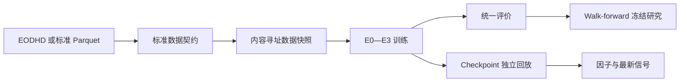
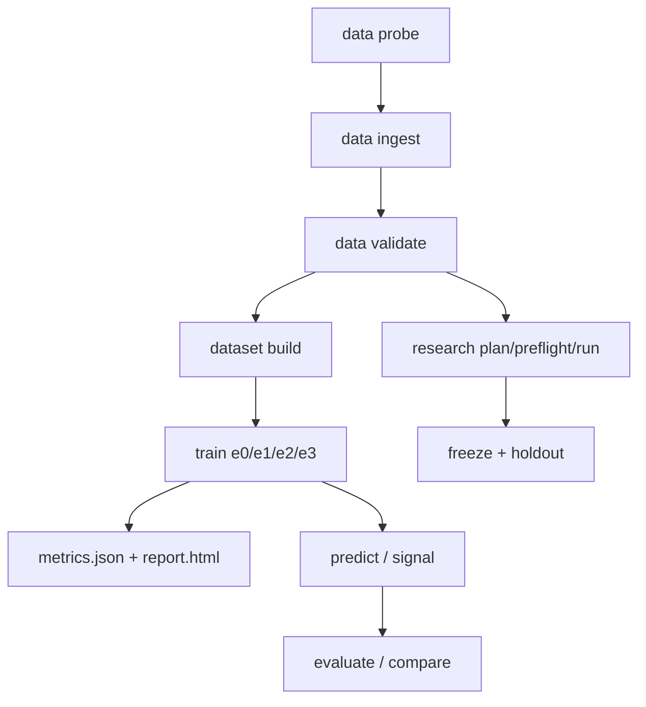

# FacDiggerNN 中文开发文档

> **现行工程说明**。面向第一次接触本项目的开发者，解释项目解决什么问题、代码如何组织、
> 数据如何流动、各模块如何协作、怎样运行与扩展，以及哪些边界不能越过。代码、严格配置和
> 测试是最终依据；历史材料不覆盖本文。

从[文档中心](README.md)可查看文档职责。配套的[实验设计文档](实验设计文档.md)解释为什么
设置 E0—E3、如何做 walk-forward，以及怎样形成研究结论。

## 1. 项目是什么

FacDiggerNN 是一个面向美股日频数据的机器学习量化因子研究工具。它把每只股票截至某个交易日收盘已知的历史信息转换成一个横截面分数，用于预测从下一交易日开盘到未来第五个交易日收盘的超额收益。

这个项目不是交易系统。它不处理下单、撮合、仓位管理、资金管理和券商连接。它的输出是可审计的因子分数、实验指标和研究报告。

项目重点不是只训练一个 PatchTST 模型，而是建立一条完整、可复现、尽量防止未来信息泄漏的研究链路：


```mermaid
flowchart LR
    A["EODHD 或标准 Parquet"] --> B["标准数据契约"]
    B --> C["内容寻址数据快照"]
    C --> D["E0—E3 训练"]
    D --> E["统一评价"]
    E --> F["Walk-forward 冻结研究"]
    D --> G["Checkpoint 独立回放"]
    G --> H["因子与最新信号"]
```

### 1.1 新用户术语表

| 术语 | 本项目中的含义 |
|---|---|
| 因子（factor） | 对每只股票、每个日期产生的预测分数 |
| Alpha | 试图解释基准以外未来收益的信号 |
| 横截面 | 同一日期上不同股票组成的集合 |
| `asof_date` | 分数生成日期；只允许使用该日收盘前已知信息 |
| target | 用于训练/评价的未来超额收益 |
| universe | 每日证券状态和是否允许进入研究的股票池 |
| eligible | 当日满足上市、类型、价格、流动性等条件 |
| point-in-time | 数据值必须是当时可知值，不能用后来修订值回填历史 |
| split | Train、Validation、Test 的时间分区 |
| fold | Walk-forward 中一组独立的 train/valid/test 边界 |
| seed | 控制随机初始化、采样等随机性的整数 |
| checkpoint | 某个训练状态的模型和优化器保存文件 |
| snapshot | 由输入哈希和配置确定的不可变训练数据目录 |
| manifest | 记录来源、配置、哈希、环境和限制的机器可读清单 |
| provenance | 数据或模型从哪里来、经过什么处理的血缘 |

### 1.2 默认研究任务

| 项目 | 当前默认值 |
|---|---|
| 市场 | 美股日频 |
| 交易所 | Nasdaq、NYSE、NYSE American |
| 证券类型 | 普通股 |
| 决策时点 | 交易日 `t` 收盘后 |
| 最早执行时点 | `t+1` 开盘 |
| 输入窗口 | 512 个市场交易日 |
| 输入通道 | 7 个价格/成交量特征 |
| 标签 | `t+1` 开盘至 `t+5` 收盘的对数收益，减同期股票池等权收益 |
| 模型 | E0 基线、E1 随机 PatchTST、E2 ETTh1 迁移、E3 金融域预训练 |
| 主要指标 | IC、Rank IC、ICIR、Q5−Q1、成本后收益、换手和稳定性 |

### 1.3 当前工程状态

当前代码已经形成完整工程闭环：

| 领域 | 当前实现 |
|---|---|
| 数据 | EODHD 隔离 adapter、标准 Parquet、通用 provenance、质量门禁和内容寻址快照 |
| 训练 | E0—E3、完整日横截面排序目标、显存受限两遍精确梯度、Train 内 selection、恢复和 split 访问审计 |
| 迁移 | 锁定 ETTh1 revision、两段权重映射、参数量/shape/指纹门禁 |
| 评价 | 统一 prediction contract、Rank IC、组合参考指标、覆盖和中性化可用性 |
| 研究 | 多 fold/seed、HAC/非重叠检验、Holm 校正、freeze、final refit 和 holdout |
| 推理 | checkpoint 独立回放、无标签 factor/signal 和已有 prediction 独立评价 |

历史动态 EODHD bronze 曾在项目机器上完成采集、修复并通过来源质量门禁，但 `data/` 和
`artifacts/` 被 Git 忽略，不能根据代码仓库推断任一机器已有这些资产。新 clone 必须迁移或
重建标准表，并重新执行 `data validate` 和 `research preflight`。

“工程闭环完整”仍不等于“数据正式 research-ready”：当前来源没有真实退市终值/原因，
也没有可靠的点时行业和点时流通市值。工程配置使用显式退市插值，并关闭来源 readiness 与
中性化正向硬门禁，所以只能形成 engineering research 结果。

## 2. 核心设计原则

### 2.1 供应商隔离

EODHD 的字段、API、响应格式、缓存和预算只存在于
`src/facdigger/data/providers/eodhd/`。provider 完成专属质量门禁后，通过
`src/facdigger/data/provenance.py` 生成版本化的 `standardization` 通用证明。adapter、
snapshot、训练和 preflight 只读取标准 Parquet 与该证明，不按 provider 名称解释原始
manifest 字段。

这样做有两个作用：

1. 将来可以增加其他数据源，而不用重写模型。
2. 可以先离线检查标准数据，再进行昂贵训练。

### 2.2 Point-in-time

对任意样本都必须满足：

```text
max(feature_time) <= asof_date < label_start <= label_end
```

行业、市值、股票池资格、退市处理也必须声明其可知时间。无法证明点时正确的字段不能静默当成正确数据使用。

### 2.3 内容寻址数据和可追溯实验

数据快照目录名是数据配置和所有输入文件哈希的 SHA-256。训练 run 记录：

- 完整解析后的配置；
- dataset ID；
- checkpoint 哈希；
- source checkpoint revision；
- Git commit 和 dirty 状态；
- Python/依赖/设备环境；
- 随机种子；
- 数据来源 manifest；
- 训练和 checkpoint 选择访问了哪些 split。

快照生成后按协议不得修改，但当前实现没有文件系统或对象存储级写保护。“不可变”指内容寻址
和调用约定；如果需要对抗本机篡改，应继续为生成产物增加哈希清单和加载时校验。

### 2.4 Outer validation 不参与训练

E0—E3 都在正式 Train 内按日期切出尾部 10% 作为 `inner_selection`。任何 `label_end` 与 inner selection 起点重叠的拟合样本会被 purge。

Outer validation 只用于冻结协议下的样本外评价，不用于：

- 早停；
- checkpoint 选择；
- 学习率调度决策；
- 训练阶段选择；
- 特征缩放器拟合。

Test 默认锁定，只有同时显式配置和命令授权时才能读取。

## 3. 项目目录

```text
FacDiggerNN/
├── configs/
│   ├── data/                 # 数据供应商采集配置
│   ├── datasets/             # 标准表到内容寻址快照
│   ├── experiments/          # E0—E3 实验配置
│   └── research/             # M6 walk-forward 配置
├── docs/
│   ├── README.md             # 文档入口和职责
│   ├── 开发文档.md
│   ├── 实验设计文档.md
│   ├── RTX2070_Windows训练指南.md
│   ├── 项目关键问题与修复复盘.md
│   └── 历史归档/            # 文件名已标记“当前可忽略”
├── src/facdigger/
│   ├── cli.py                # Typer CLI 入口
│   ├── data/                 # 数据契约、快照、provider
│   ├── features/             # 七通道特征和缩放
│   ├── labels/               # 前向收益标签
│   ├── datasets/             # split、索引、窗口和采样器
│   ├── models/               # E0、PatchTST、迁移与预训练
│   ├── training/             # E0—E3 runner/engine/config
│   ├── evaluation/           # 指标、中性化、报告和比较
│   ├── research/             # walk-forward 和统计冻结
│   └── inference/            # checkpoint 回放与信号
├── tests/
│   ├── unit/
│   └── integration/
├── data/                     # 本机数据；Git 忽略
├── artifacts/                # 运行结果；Git 忽略，需要时自动创建
├── pyproject.toml
├── uv.lock
└── requirements-lock.txt
```

### 3.1 本机目录的含义

| 目录 | 内容 | 是否可直接删除 |
|---|---|---|
| `data/bronze/` | 标准化后的来源表 | 谨慎；删除后需重新采集 |
| `data/cache/` | EODHD API 响应缓存 | 可删除，但会重新消耗 API 调用 |
| `data/state/` | 本地每日调用预算 | 不建议删除 |
| `data/snapshots/` | 内容寻址的数据快照 | 可重建 |
| `data/walk_forward_snapshots/` | 每个 fold 的快照 | 可重建 |
| `artifacts/` | checkpoint、预测、指标、报告 | 可重建，但删除后无法恢复该 run |
| `.env.local` | 本机 EODHD token | 保留且绝不能提交 |
| `.venv/` | 本机 Python 环境 | 可重装，但通常保留 |

## 4. 安装与环境

### 4.1 推荐环境

- Python 3.11；
- macOS、Linux 或 Windows；
- CPU 可以完成工程冒烟；
- 正式 PatchTST 训练建议使用 CUDA GPU；
- RTX 2070 Super 需要使用 FP16，不使用 BF16 作为默认值。

### 4.2 使用 uv 安装

```bash
cd FacDiggerNN
uv sync --frozen --all-extras
uv run facdigger doctor
```

依赖分组：

| extra | 用途 |
|---|---|
| `model` | PyTorch、Transformers、Hugging Face、safetensors |
| `data` | Polars、PyArrow |
| `eodhd` | requests |
| `baseline` | LightGBM |
| `dev` | pytest、pytest-cov、Ruff |

`uv.lock` 是首选锁文件；`requirements-lock.txt` 是用于普通 pip/Windows 环境的导出文件。

### 4.3 EODHD token

仓库根目录创建 `.env.local`：

```bash
EODHD_API_TOKEN=你的真实token
```

加载方式：

```bash
set -a
source .env.local
set +a
```

安全约束：

- token 不写入 YAML；
- token 不写入缓存键、URL 日志和 manifest；
- `.env.local` 已被 Git 忽略；
- 付费配置设置 `allow_demo_token: false`，避免真实任务静默退回 demo。

## 5. 从数据到结果的完整流程


```mermaid
flowchart TD
    P["data probe"] --> I["data ingest"]
    I --> V["data validate"]
    V --> S["dataset build"]
    S --> T["train e0/e1/e2/e3"]
    T --> M["metrics.json + report.html"]
    T --> R["predict / signal"]
    R --> X["evaluate / compare"]
    V --> W["research plan/preflight/run"]
    W --> F["freeze + holdout"]
```

这里有两条独立入口：单模型实验需要 `dataset build` 后再 `train`；M6 研究由 runner 按 fold
自行构建 walk-forward snapshots，普通 snapshot 不是其前置条件。

### 5.1 最小免费版冒烟

```bash
facdigger data probe --config configs/data/eodhd_free.yaml
facdigger data ingest --config configs/data/eodhd_free.yaml
facdigger data validate --config configs/datasets/eodhd_free_smoke.yaml
facdigger dataset build --config configs/datasets/eodhd_free_smoke.yaml
```

免费配置只有 AAPL/TSLA 和约一年数据，`context_length=60`，只能验证管线，不能形成研究结论。

### 5.2 100 股票工程 pilot

```bash
facdigger data probe --config configs/data/eodhd_all_world_pilot.yaml
facdigger data ingest --config configs/data/eodhd_all_world_pilot.yaml
facdigger data validate --config configs/datasets/eodhd_all_world_pilot.yaml
facdigger dataset build --config configs/datasets/eodhd_all_world_pilot.yaml
```

该模式从当前 active 普通股中按当前 200 日流动性选择 100 只股票，存在存活偏差和历史前视偏差，只能用作工程、资源和端到端验证。

### 5.3 历史动态股票池

```bash
facdigger data probe --config configs/data/eodhd_historical_liquid.yaml

# 确认 API 配额、运行时间和磁盘空间后再运行：
facdigger data ingest --config configs/data/eodhd_historical_liquid.yaml
facdigger data validate --config configs/datasets/eodhd_historical_liquid.yaml
facdigger dataset build --config configs/datasets/eodhd_historical_liquid.yaml
```

该模式：

1. 同时发现 active 和 delisted 普通股；
2. 不使用当前流动性预先裁掉历史候选；
3. 获取每只候选的历史 EOD；
4. 用版本化 US regular-session 日历删除闭市日异常 bars；
5. 在 ticker alias 合并前隔离价格冲突或复权价数量级断裂的身份；
6. 对公司行动做经济语义去重，并整组排除条款冲突事件；
7. 恢复每只证券上市区间的完整市场 session 网格；
8. 根据当日 trailing ADV20、价格、上市天数和状态确定候选；
9. 每日按 ADV20 排序，只保留最多 1000 只 eligible 股票。

候选数和 API 请求量会随 EODHD metadata 与配置变化，当前事实必须读取当次 probe 和 source
manifest，不能复制历史审计中的硬编码计数，也不能把 `probe` 当作全量下载。historical
模式在 provider 内强制 `quality.gate.status=passed`，然后生成
`facdigger.standard_parquet` v1 标准化证明。validate、snapshot 和 M6 preflight 只检查
该通用证明及其表哈希。旧 bronze 缺少证明，因此必须重新 ingest。

## 6. 标准数据契约

### 6.1 `bars_daily.parquet`

主键是 `(security_id, trade_date)`。

| 必需字段 | 含义 |
|---|---|
| `security_id` | 稳定证券标识；优先使用 ISIN |
| `symbol` | 当日展示 ticker |
| `trade_date` | 市场交易日 |
| `open/high/low/close` | 原始 OHLC，必须为正且满足高低价关系 |
| `volume` | 原始成交量，非负 |
| `dollar_volume` | 成交额 |
| `adj_factor` | `adjusted_close / close` |
| `source_revision` | 来源版本 |

EODHD 适配器还会保留 provider symbol、身份质量、来源交易所、证券类型和最终是否退市等审计字段。

### 6.2 `universe_daily.parquet`

主键也是 `(security_id, trade_date)`，但它是完整证券—市场 session 网格，允许没有 bar。

| 必需字段 | 含义 |
|---|---|
| `listed_days` | 从首个有效历史 session 起累计的上市天数 |
| `exchange` | 标准交易所代码 |
| `security_type` | 当前要求为 `common_stock` |
| `is_primary_listing` | 是否主上市 |
| `is_listed` | 当日是否在上市区间 |
| `is_delisted` | 是否为推断退市 session |
| `is_halted` | 上市期间缺少 bar 时的推断停牌 |
| `industry_code` | 点时行业；当前 EOD-only 来源缺失 |
| `float_market_cap` | 点时流通市值；当前 EOD-only 来源缺失 |
| `close`、`adv20_usd` | 当日价格和 trailing 流动性 |
| `eligible` | 是否进入当日研究股票池 |

`eligible=true` 时强制要求：仍上市、未退市、未停牌、主上市、普通股。

### 6.3 `corporate_actions.parquet`

包含：

- `ex_date`；
- `action_type`；
- 价格和成交量因子；
- 现金金额；
- `known_at`；
- `source_revision`。

`known_at` 不能晚于 `ex_date`。

### 6.4 `delistings.parquet`

每只证券最多一行：

- `delist_date`；
- `last_trade_date`；
- `delisting_return` 或 `terminal_value`；
- `known_at`；
- `source_revision`。

历史动态 EODHD 模式会额外写入 `is_imputed`、`imputation_method` 和 `exchange`。当前默认插值为：

| 交易所 | 插值退市收益 |
|---|---:|
| Nasdaq | -55% |
| NYSE | -30% |
| NYSE American | -30% |
| 未知 | -50% |

这些值是工程假设，不是数据供应商观测值。

## 7. 特征、标签和数据快照

### 7.1 七通道特征

| 通道 | 定义 |
|---|---|
| `r_close` | 调整后收盘价相对前收盘价的对数收益 |
| `r_gap` | 调整后开盘价相对前收盘价的对数跳空 |
| `r_intraday` | 调整后收盘相对开盘的对数收益 |
| `range` | 调整后最高价/最低价的对数振幅 |
| `dlog_volume` | `log1p(volume)` 的一阶差分 |
| `vol20` | `r_close` 的 20 日总体标准差 |
| `dollar_volume_z20` | 相对 20 日成交额中位数和 IQR 的稳健 z-score |

每个通道都有一个 `observed_<channel>` 布尔列。缺失值进入神经网络时填 0，但 observed mask 同时传入模型，不能把填充值当作真实观测。

### 7.2 缩放

缩放器只使用 `trade_date <= train_end` 的数据：

1. 按训练期 0.5% 和 99.5% 分位 winsorize；
2. 减训练期中位数；
3. 除以 `IQR / 1.349`；
4. 将参数写入 `scaler.json`。

Validation/test 不参与阈值或尺度估计。

### 7.3 标签

```text
raw_return = log(adjusted_close[t+5] / adjusted_open[t+1])
benchmark_return = 当日 eligible 股票的 raw_return 等权均值
target = raw_return - benchmark_return
```

`t+1` 和 `t+5` 使用全市场交易日历，不按个股实际 bar shift。这样停牌不会把“第五个市场交易日”错误变成“该股票第五个有交易的日期”。

如果标签窗口跨退市日，则使用退市 terminal value 或最后调整后价格乘 `(1 + delisting_return)`。

### 7.4 时间切分

数据集 split 同时使用：

- `label_end <= 当前 split 结束日期`；
- validation/test 起点经过配置的 session embargo；
- 不满足条件的边界样本直接不分配 split。

### 7.5 快照内容

`facdigger dataset build` 创建：

| 文件 | 用途 |
|---|---|
| `features.parquet` | 缩放后的七通道及 observed mask |
| `labels.parquet` | 原始收益、基准、target、标签边界和退市标记 |
| `sample_index.parquet` | 有 target 的 train/valid/test 样本 |
| `sample_metadata.parquet` | 评价所需行业、市值、eligible 等元数据 |
| `inference_index.parquet` | 不含 target 的全部可推理日期 |
| `scaler.json` | Train-only 缩放参数 |
| `audit.json` | 行数、覆盖、缺失、退市跨越等审计 |
| `manifest.json` | dataset ID、配置和输入哈希 |
| `source_manifest.json` | 数据供应商来源血缘副本 |

相同语义配置和相同输入文件会得到同一个 dataset ID，移动输入路径或输出目录不改变 ID。
配置 `source_manifest` 时，该文件必须包含：

```json
{
  "standardization": {
    "name": "facdigger.standard_parquet",
    "version": 1,
    "status": "passed",
    "research_ready": false,
    "tables": {
      "bars": {"file": "bars_daily.parquet", "sha256": "..."},
      "universe": {"file": "universe_daily.parquet", "sha256": "..."}
    }
  }
}
```

provider 可在同一 manifest 保存自己的详细审计，但下游只消费上述通用字段。

## 8. 模型和训练器

### 8.1 E0：传统基线

E0 把七个通道变成多尺度 tabular 特征：

- 当前值；
- 5、20、60、120、252 日窗口；
- 每个窗口的 mean、std、min、max。

支持：

- LightGBM；
- 两层 MLP。

缺失特征使用 Train 拟合的均值/标准差处理，再补 0 并拼接 observed mask。LightGBM 在独立进程运行，以隔离 macOS 上可能冲突的原生 OpenMP runtime。

### 8.2 E1：随机 PatchTST

单次设备前向的输入形状是 `[physical_batch, 512, 7]`。当前正式结构：

- patch length/stride：12/12；
- `d_model=128`；
- 16 个 attention heads；
- 6 层 encoder；
- FFN 维度 512；
- PatchTST channel-independent backbone；
- patch mask 加权池化；
- 通道拼接后的两层 AlphaHead；
- 输出每个样本一个标量分数。

E1 完全随机初始化，作为判断 PatchTST 方法是否优于 tabular 基线的对照。但 E1 全量
训练整个 backbone，E2/E3 则使用 FT-0/FT-1 阶段冻结/解冻；即使三者都注册为
5 个监督 epochs，优化协议仍不同。因此 E2−E1 当前只能解释为“完整 ETTh1
迁移方法”与“随机 PatchTST 方法”的 method-level 差异，不能归因为纯初始化效应。

Transformers 的 PatchTST patchifier 在窗口长度不能由 patch 完整覆盖时会从
`sequence_start` 开始切片，而不是固定从第 0 个 session 开始。当 context=512、
patch length/stride=12/12 时，共有 42 个 patch，`sequence_start=8`，实际覆盖
第 8—511 个 session。监督 AlphaHead 和 E3 reconstruction 现在共用同一个
`patchify_observed_mask`，并显式传入实际 patchifier 的 `sequence_start`；这保证
observed mask 与 backbone 真正输入的 patch 一一对齐。

### 8.3 E2：ETTh1 迁移

来源 checkpoint：

```text
ibm-research/patchtst-etth1-pretrain
revision = 1212736a0decf12b5cea5a605302421e110a3614
```

加载链：

```text
原始 checkpoint
  → 当前 Transformers PatchTST source backbone
  → FacDiggerNN 金融 Alpha backbone
```

每一步都要求：

- 参数名标准化；
- shape 精确一致；
- loaded numel ratio 至少 80%；
- 未授权 missing/unexpected/mismatch 立即失败；
- 保存权重加载报告和参数指纹。

微调分两阶段：

- FT-0：冻结 encoder，只训练 AlphaHead；
- FT-1：解冻最后 N 个 encoder block，encoder/head 使用不同学习率。

当前 main 实验配置是面向 RTX 2070 Super 首轮完整 3-fold × 3-seed
矩阵的注册可行性预算：E1、E2 和 E3 下游微调都是 `max_epochs=5`、
`minimum_epochs=3`、`patience=2`；E2/E3 的前 2 epochs 为 FT-0。E2/E3 head
learning rate 从旧快速实验的 `1e-3` 下调为 `3e-4`，encoder 仍为 `1e-5`。
原因是排序相关性 loss 对 score 的平移和尺度不敏感，上轮 artifacts2 中较大
head 学习率伴随 score 标准差膨胀。这些参数是保守风险控制，不是已证明
充分收敛或最优的最终预算；smoke 配置保留小数据快速验证参数，不参与正式
结论。如果首轮确认可行，升级硬件后的扩预算重跑必须使用新 research ID，
不能和本轮 cell 混合。

E0—E3 的监督阶段共享横截面排序协议。完整日期内的 target 先按 average ties 变成
`[-1, 1]` 的 percentile rank；神经网络优化 `1 - corr(score, target_rank)`，相关性部分
强制使用 Float32。E0 LightGBM 使用完整日 group 的 LambdaRank，E0 MLP 直接以
完整日为 batch。E1—E3 的微调采用显存受限的两遍精确梯度：

1. `FullDateBatchSampler` 在 CPU 上组装完整日横截面，同日不分组、不丢行，也不与
   其他日期混合；
2. GPU 每次只处理 `batch_size` 行 physical microbatch。第一遍不保留计算图，
   收集当日各微批次 detached Float32 score/target 向量（通常约千行、KB 级）；
   finalize 时拼接向量并以与单图 Float32 reduction 相同的顺序计算整日 moments，
   随后清空向量；
3. 第一遍保存每个微批次的 RNG 状态，并在进入第二遍前恢复 BatchNorm running
   buffers，避免无图前向额外更新一次运行统计；
4. 第二遍逐微批次恢复 RNG、重算 score，用整日 moments 导出的精确
   `d(loss)/d(score)` 回传；
5. 在 `optimizer.step()` 前复核两遍的行数、均值、方差、协方差和范围。回放
   不一致、target rank 零方差或非有限梯度都 fail closed，不执行参数更新。
   常量 score 在 epsilon 正则化目标下仍有定义且梯度非零，不作为零方差错误拒绝。

这种方法的 GPU activation 上界由 `batch_size` 决定，CPU 侧训练 batch 只额外持有
当前一日的窗口张量；相比单遍训练，每日增加一次不建图前向。降低
`batch_size` 不会改变完整日 loss 的 moments 或把日期切成多个目标；但当前
PatchTST 使用 train-mode BatchNorm，physical microbatch 大小仍会改变当批统计和
训练轨迹，也会影响吞吐。因此正式模型比较必须固定 `batch_size`。

`dates_per_optimizer_step` 表示每次优化器更新前累积几个完整日的梯度。它与
physical microbatch 数量无关；为了处理 OOM 降低 `batch_size` 时不得联动提高该值。
E3 的 masked reconstruction 是独立无监督阶段，其
`pretraining.gradient_accumulation_steps` 仍保留原有微批次累积语义。

训练 loss 只用于优化诊断，checkpoint/early stopping 在完整 inner selection 上按逐日真实
Spearman Rank IC 均值选择。

### 8.4 E3：金融域预训练

初始化链：

```text
ETTh1 encoder → 金融 masked reconstruction → AlphaHead 微调
```

金融预训练：

- 只读取正式 Train；
- Train 内尾部 10% 用于重建 checkpoint 选择；
- 随机遮挡默认 40% patch；
- Huber reconstruction loss；
- loss 只计算“被遮挡且真实 observed”的元素；
- outer validation 和 test 使用行数必须为 0。

当前正式 E3 预训练资源协议是 `batch_size=64`、`max_epochs=3`、
`minimum_epochs=1`、`patience=2`、`learning_rate=1e-5`。上轮 artifacts2 的一个
epoch 已包含约 1.5—1.9 万个 optimizer steps，而 encoder 相对 L2 漂移约 0.43；
因此本轮先缩短 epoch 上限并将学习率降一个数量级，用于降低灾难性遗忘风险。
这是基于已观察漂移的保守首轮协议，不能表述为已证明最优；正式调参仍必须
在新 validation research ID 下完成，不得读取 holdout。
重建阶段仍使用 `pretraining.gradient_accumulation_steps`；最后不满一组的尾部 batch
按其实际组大小归一化，不会被固定除以配置值。FP16 GradScaler 跳过的 optimizer
step 会单独计数，`global_step` 只记录真正更新了参数的 step。

这里的 Huber 只属于无监督 masked reconstruction；随后 AlphaHead 微调仍使用上述统一的
横截面排序目标。

预训练完成后将 encoder 以 100% 参数匹配载入下游 Alpha 模型，再执行与 E2 相同的 FT-0/FT-1。

### 8.5 Checkpoint 恢复

完整日排序协议的 E1—E3 监督 checkpoint schema v3 保存：

- model；
- optimizer；
- scheduler；
- GradScaler；
- epoch/global step；
- best metric；
- RNG 状态；
- sampler 状态；
- dataset/config/source hash；
- objective、target transform、best selection Rank IC 和有效/跳过日期审计；
- `optimization_protocol`：完整日优化单元、两遍方法、physical microbatch 大小和
  `dates_per_optimizer_step`。

只有 dataset 和完整配置哈希一致时才能恢复，防止错误续跑。当前 objective 名称是
`cross_sectional_rank_correlation_surrogate_v2_full_date`。旧 Huber schema v1 和旧的
v1 chunked-ranking schema v2 checkpoint 不能 resume 到当前协议，也不能与新 M6 矩阵混用；
需要回放旧证据时应使用生成它的历史代码。

E3 的 reconstruction checkpoint 不使用上述监督 schema。它当前是 schema v2，额外
记录 `patch_alignment_protocol=patchifier_sequence_start_v2`。继续 reconstruction
预训练和把 financial encoder 载入 Alpha 模型两条路径都会校验该字段，并拒绝
修复前 observed mask 错位的旧 checkpoint。

## 9. 统一评价

### 9.1 Prediction 契约

每张预测表只允许一个 model ID 和 dataset ID，且 `(model_id, security_id, asof_date)` 唯一。必需字段包括：

- raw/neutralized score；
- target；
- split；
- checkpoint hash；
- dataset ID；
- eligible；
- 行业和 log float market cap。

覆盖率低于配置门槛或出现额外样本时，评价失败。

### 9.2 指标

- 逐日 Pearson IC；
- 逐日 Spearman Rank IC；
- 年化 ICIR/Rank ICIR；
- 正 IC 比例；
- Q5−Q1 多空收益；
- 换手；
- 0/10/20/50 bps 单边成本后 Q5−Q1；
- 分年、分行业和分市值稳定性；
- 中性化前后对照。

### 9.3 中性化

每天用行业哑变量和标准化后的 `log(float_market_cap)` 回归 raw score，残差作为 neutralized score。

如果点时暴露缺失、样本不足或设计矩阵不满秩，neutralized score 保持空值并记录原因；系统不会用 raw score 冒充中性化结果。

## 10. CLI 参考

### 10.1 环境和兼容性

```bash
facdigger doctor
facdigger probe-patchtst --config configs/base.yaml --output artifacts/m0-probe
facdigger probe-patchtst --config configs/base.yaml --output artifacts/m0-probe --local-files-only
```

### 10.2 数据

```bash
facdigger data probe --config <provider.yaml>
facdigger data ingest --config <provider.yaml>
facdigger data validate --config <dataset.yaml>
facdigger dataset build --config <dataset.yaml>
```

### 10.3 训练

```bash
facdigger train e0 --config <e0.yaml> --dataset data/snapshots/<dataset_id>
facdigger train e1 --config <e1.yaml> --dataset data/snapshots/<dataset_id>
facdigger train e2 --config <e2.yaml> --dataset data/snapshots/<dataset_id>
facdigger train e3 --config <e3.yaml> --dataset data/snapshots/<dataset_id>
```

E1—E3 恢复：

```bash
facdigger train e1 \
  --config configs/experiments/e1_random.yaml \
  --dataset data/snapshots/<dataset_id> \
  --resume artifacts/e1/<run_id>/checkpoints/last.pt
```

E3 的 `--resume` 可以指向预训练或微调阶段的 `last.pt`。

### 10.4 回放、信号、独立评价

```bash
# 默认回放 source run 的原评价 split
facdigger predict --run artifacts/e3/<run_id>

# 显式回放 test
facdigger predict \
  --run artifacts/e3/<run_id> \
  --split test \
  --unlock-test

# 最新可推理横截面，不读取 target
facdigger signal --run artifacts/e3/<run_id>

# 指定日期
facdigger signal --run artifacts/e3/<run_id> --asof 2025-12-31

# 独立评价一个 prediction 文件
facdigger evaluate \
  --predictions artifacts/e3/<run_id>/predictions.parquet \
  --dataset data/snapshots/<dataset_id> \
  --output artifacts/evaluations/<evaluation_id>

# 只比较相同 dataset、split 和样本键的 runs
facdigger compare \
  --runs artifacts/e0/<run>,artifacts/e1/<run>,artifacts/e2/<run>,artifacts/e3/<run> \
  --output artifacts/comparisons/<comparison_id>
```

### 10.5 Walk-forward

```bash
facdigger research plan --config configs/research/m6_eodhd_engineering.yaml
facdigger research preflight --config configs/research/m6_eodhd_engineering.yaml
facdigger research run --config configs/research/m6_eodhd_engineering.yaml
```

恢复：

```bash
facdigger research run \
  --config configs/research/m6_eodhd_engineering.yaml \
  --resume-run artifacts/research/<research_run_id>
```

Validation 全部完成并审阅冻结报告后才允许：

```bash
facdigger research run \
  --config configs/research/m6_eodhd_engineering.yaml \
  --resume-run artifacts/research/<research_run_id> \
  --unlock-final-holdout
```

runner 会在启动任何 test cell 前复核 validation 报告哈希及
`holdout_eligibility.eligible`。后者由完整日期/样本数契约、E3 raw 与 E3−E1 的单侧 HAC、
非重叠稳健性、cell ratio，以及正式模式下的来源/中性化门禁共同产生；Holm 校正只用于
E1−E0、E2−E1、E3−E2 三个归因问题。显式 `--unlock-final-holdout` 只是必要条件，不是绕过
`no_go` 的开关。被拒绝的解封不会改写已冻结 run 的 manifest，也不会创建 holdout 产物。
通过后，runner 会在首次读取冻结 test 键前永久登记 `holdout_has_been_read=true`，再使用
freeze 内的 final-refit protocol 新建 `train_end = valid_end` 的 snapshot，让 scaler 和
official Train 截止最后一个 validation 边界，同时保持 outer validation 为空。它会校验
来源文件哈希没有变化、新旧 snapshot 的 test 键/target 完全一致，再训练 12 个 refit cell；
test 不参与训练或 checkpoint selection。cell 状态写入
`matrix.json.final_refit`。`final_refit.json` 记录新旧 dataset ID、训练截止日、split counts、
protocol hash 和 manifest hash；中断后只重跑未完成 cell。

`research.json` 为 schema v2，当前 `freeze.json` 升为 schema v3，`matrix.json` 升为 schema
v2；旧 freeze 缺少 eligibility 或 refit 证据，不能在新协议下继续解封，应使用新的 research
ID 重跑 validation。

## 11. 运行产物

典型 E0—E3 run：

```text
artifacts/e3/<run_id>/
├── resolved_config.yaml
├── manifest.json
├── checkpoints/
├── predictions.parquet
├── metrics.json
├── report.html
├── weight_load_report.json
└── training_audit.json
```

不同模型会有少量差异。E3 还包含独立的 pretraining checkpoint/audit。

重要规则：

- 不要手工修改 run 内文件；
- 回放前会重新检查 manifest、dataset、checkpoint 和 sidecar 哈希；
- 同一 split 的 replay 默认要求 raw score 在固定容差内与原 run 一致；
- `factors.parquet` 不包含 target，`predictions.parquet` 包含 target 并用于研究评价。

## 12. 配置系统

所有配置由 Pydantic 严格解析，未知字段会报错，而不是静默忽略。

四类配置：

| 类型 | 作用 |
|---|---|
| `configs/data/*.yaml` | API、候选发现、日期、缓存、预算、输出 |
| `configs/datasets/*.yaml` | 标准表路径、特征、标签、split |
| `configs/experiments/*.yaml` | 模型、训练、成本、评价 split |
| `configs/research/*.yaml` | folds、seeds、模型矩阵、统计和决策门禁 |

配置名中的 smoke、pilot 和 engineering 是协议边界，不是性能档位：

- `eodhd_free*` 只验证小数据管线；
- `eodhd_all_world_pilot*` 使用当前 active 100 股票，明确带存活偏差；
- `eodhd_historical_liquid*` 是历史动态 top-1000 主数据路径；
- `*_smoke.yaml` 和 `*_paid_pilot.yaml` 不能形成正式模型结论；
- `m6_eodhd_engineering.yaml` 使用 historical-liquid 数据，但仍因来源和中性化缺口属于
  engineering 模式；当前 `research_id` 是 `m6_eodhd_engineering_full_date_v2`。

修改配置时注意：

- 不能把 token 写进配置；
- PatchTST 通道顺序当前固定为七通道；
- `evaluation_split: test` 必须同时 `unlock_test: true`；
- E2/E3 的 source revision 必须固定；
- E1/E2 的 `training.batch_size` 和 E3 的 `finetuning.batch_size` 只限制 GPU physical
  microbatch，不改变完整日目标；
- 监督阶段用 `dates_per_optimizer_step`，E3 reconstruction 才使用
  `pretraining.gradient_accumulation_steps`；
- `selection_fraction` 默认 0.1，即使 YAML 未显式出现也会进入 resolved config；
- 改动配置会改变 run hash，改动数据文件会改变 dataset ID。

## 13. 如何扩展项目

### 13.1 增加数据供应商

1. 在 `data/providers/<name>/` 实现配置、client、mapper 和 provider；
2. 实现通用 `MarketDataProvider` 的 `probe()` 与 `ingest()`；
3. 只输出标准表，不把供应商对象传入特征层；
4. 在 provider registry 注册；
5. 添加映射、契约、失败策略和集成测试；
6. 在 source manifest 中记录选择方法、限制、请求和 readiness。

### 13.2 增加特征

1. 定义严格的点时公式；
2. 只使用 `t` 及以前数据；
3. 生成对应 observed mask；
4. 更新 `DEFAULT_CHANNELS`、数据配置和模型输入通道；
5. 检查 E2/E3 与 ETTh1 的通道/架构兼容性；
6. 添加确定性例子和泄漏测试；
7. 新特征必须形成新数据集版本，不能覆盖旧快照。

### 13.3 增加模型

1. 复用 snapshot 和统一 prediction contract；
2. 使用 Train 内 inner selection；
3. 保存完整 checkpoint 和 resolved config；
4. 通过统一 evaluator；
5. 在 compare/research matrix 中只与相同样本键结果比较；
6. 添加 train、resume、replay 集成测试。

### 13.4 增加正式中性化暴露

行业和流通市值应作为 point-in-time universe 字段加入：

- 必须有 `known_at` 或等价证据；
- 财报发布前不能使用后续更新值；
- 历史行业变更不能回填成当前行业；
- 覆盖率与缺失原因必须进入数据审计；
- 数据准备完成后重新开启 M6 两个正式门禁。

## 14. 测试和开发流程

人类贡献流程、风险分级、本地命令和 CI 约束统一维护在
[`CONTRIBUTING.md`](../CONTRIBUTING.md)，安全与秘密要求见
[`SECURITY.md`](../SECURITY.md)。GitHub Actions 在 Python 3.10–3.12 上以冻结 lockfile
安装全部 extras，并检查 lockfile 一致性、运行 Ruff 和完整 pytest；CI 不访问 live API、
模型网络或正式 holdout。

```bash
uv sync --frozen --all-extras
uv lock --check
uv run ruff check .
uv run pytest
```

当前测试覆盖：

- 数据契约和 EODHD 映射；
- 特征、标签、split、窗口；
- look-ahead 和退市跨越；
- E0—E3 端到端与恢复；
- 权重迁移和参数指纹；
- 评价、中性化和比较；
- M6 fold、统计和 runner；
- checkpoint replay、signal 和独立评价。

生成真实数据前仍必须单独运行 probe/preflight，并确认额度、磁盘和运行时间；CI 通过不代表
网络、CUDA、付费数据或正式研究已经验证。

## 15. 常见问题

### 15.1 找不到 `.env`

项目使用 `.env.local`，不会自动创建。创建后需要在当前终端 `source`。

### 15.2 `research preflight` 显示 engineering

当前工程配置关闭了：

```yaml
require_neutralized_positive: false
require_source_research_ready: false
```

这表示允许验证工程链路，不表示数据满足正式研究要求。

### 15.3 中性化结果为空

当前 EOD-only 数据没有可靠点时行业和流通市值。系统按设计保持空值。不要用当前静态行业或总市值随意替代。

### 15.4 数据集目录不存在

`data/` 不随 Git 分发，或者本机尚未为当前配置构建 snapshot。单模型路径重新运行：

```bash
facdigger dataset build --config <dataset-config>
```

M6 不使用这个普通 snapshot；先确认标准表存在，再运行 `research preflight/run`，由 runner
构建各 fold 快照。

### 15.5 Artifacts 不存在

`artifacts/` 不随 Git 分发。`train` 或 `research run` 会创建新 run；`predict` 和 `signal`
需要已有、与当前协议兼容的完整 run，不能从空目录生成 checkpoint。

### 15.6 E2/E3 无法下载 checkpoint

首次运行需要网络。下载后可以将 `local_files_only` 改为 `true` 或使用 `--local-files-only` 运行兼容性探针。

### 15.7 恢复训练失败

常见原因：

- config 已改变；
- dataset ID 不一致；
- source checkpoint hash 不一致；
- checkpoint 不是 `last.pt`；
- checkpoint 仍是 Huber 或 v1 小块排序协议，不是 schema v3 / objective v2；
- run 状态不是允许恢复的状态。

不要绕过这些校验。

## 16. 当前已知限制

1. 历史动态 bronze 是不随 Git 分发的本地资产；每台机器都必须验证其 manifest 和表哈希。
2. 退市收益是显式插值，不是真实 terminal value。
3. 点时行业和流通市值缺失，正式中性化不可用。
4. 当前动态 universe 的停牌状态由缺失 bar 推断，无法区分真实停牌与供应商缺数。
5. 目标 RTX 2070 Super / 16 GB 机器已有内存优化与旧协议 pilot，但当前排序、显著性和
   final-refit 协议仍需重新完成完整 M6 资源验收。当前配置的 `batch_size: 64`
   和 FP16 尚未在该 CUDA 目标机完成真实峰值、吞吐或整轮训练验收。
6. 当前标签基准是 eligible 股票池等权收益，尚未加入宽基总回报指数敏感性对照。
7. 项目只研究因子，不实现交易执行和投资组合约束优化。

这些限制必须在正式实验报告中保留，不能通过调整报告措辞隐藏。
