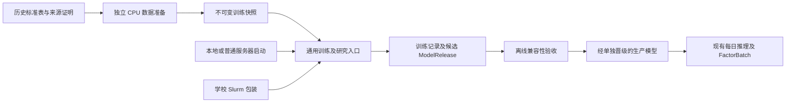

**FacDiggerNN 训练可靠性与独立部署方案**

设计日期：2026-09-25。代码基线：`70390e3b3aa9cdcc9330fd6e0ef275655ba87834`。

2026-09-25 实施状态：R1–R3 的通用恢复、独立快照输入和资源接口已实现，D1 学校配置与包装已交付；CPU 合成故障和全量回归见文末。真实数据性能、锁定环境 GPU、Slurm 信号链和 Lustre 跨节点锁仍待学校验收。学校资源实测、账户限制和操作单独见[学校 GPU 训练环境适配方案](学校GPU训练环境适配方案.md)与[ICF 操作说明](../configs/deployment/icf/README.md)。本方案适用于本地、普通服务器和批处理集群。

**1. 交付边界：共享代码，独立环境，模型产物交接**

建议分开部署训练和每日生产，保留一个源码仓库、一个 `facdigger` 包和一套模型/数据/评价契约。训练可靠性是项目通用能力；分区、账户、GPU 类型、挂载路径和重排队操作属于部署配置。两项改造分别提交、分别验收。



| 部署单元 | 所需内容 | 与其他单元的边界 |
|---|---|---|
| 数据准备 | 标准 bronze、来源证明、dataset 配置；通常 `data` extra 足够，采集才另加 `eodhd` | 输出完整不可变 snapshot；大规模特征构建独立于 GPU 作业 |
| 离线训练/研究 | 完整包、`data` + `model` extras、实验配置、完整 snapshot；LightGBM 才加 `baseline` | 不需要生产 ledger、CURRENT、交付目录或 EODHD token |
| 每日生产/推理 | 现有固定环境、生产配置、行情状态、已验收 ModelRelease | 按原有时序生成因子，不依赖学校在线或训练作业成功 |

`training/` 同时依赖 `models/`、`datasets/`、数据契约和评价，不能只复制一个源码子目录。当前 wheel 包含整个 `src/facdigger`，保留完整包并不等于启动所有功能。第一阶段用固定提交的完整 Git clone 加独立 venv，配置和锁文件随源码交付；无需新建训练服务、复制模型实现或维护第二套依赖锁。以后采用 wheel/容器时仍需提供配置、锁定依赖和可核验的 Git 来源，不能为满足 release 校验伪造干净状态。

使用已有 snapshot 的单模型训练可以离线运行。`transformer-run` 现在接受 runtime 的 `fold_snapshots`：提供全部三个 fold 的完整快照及外置校验清单后，无需 bronze 即可启动矩阵；逐 fold 校验协议、内容寻址 ID、manifest、全文件清单和来源证明。不提供映射时仍调用原构建器，缓存命中前仍需访问 bronze。

**2. 实施前根因与改造落点**

以下由基线代码确认，均属于通用训练问题；本次实现针对这些根因，而非另写学校训练循环。

| 当前行为 | 中断后的影响 | 主要修改位置 |
|---|---|---|
| 两个 finance 训练器主要在 epoch 末写 `last.pt`，sampler 只保存 epoch | 长 epoch 内可能丢失数小时；现有恢复从下一 epoch 开始 | [监督引擎](../src/facdigger/training/finance_transformer_engine.py)、[预训练引擎](../src/facdigger/training/finance_pretrain_engine.py)、[采样器](../src/facdigger/datasets/sampler.py) |
| 训练 manifest 直接覆盖，仅 `except Exception` 登记失败 | 硬杀可能留下 `running` 或不完整 JSON；SIGTERM/SIGKILL 不保证经过该分支 | [监督编排](../src/facdigger/training/finance_transformer.py)、[预训练编排](../src/facdigger/training/finance_pretrain.py) |
| `_recoverable_checkpoint()` 按修改时间寻找声明了 recoverable checkpoint 的 `failed` run | `running` + 有效断点被忽略；可能猜错目标或新建重复 run | [研究 runner](../src/facdigger/research/transformer_runner.py) |
| matrix 在子训练返回后才记录子 run；last/best 分别提交 | 中断窗口内可能遗失已完成子任务，或最佳权重与恢复元数据不一致 | 两个编排器、两个引擎、研究 runner |
| 训练配置哈希包含 `output_root`、`pretrained_checkpoint`；矩阵记录绝对路径 | 改路径可能导致恢复校验失败，直接重写历史配置会破坏证据 | 编排器、研究 runner 的显式路径解析 |
| benchmark 固定 7.2 GiB 显存、13 GiB RAM 和 14 天矩阵预算 | 无法表达不同服务器或单作业时限 | [资源 benchmark](../src/facdigger/training/finance_benchmark.py)、runner 准入校验 |

首轮增强对象是 `finance-transformer`、`finance-pretrain` 和 `research transformer-run`。E0–E3 保持现有接口和语义，并纳入回归；不在本轮顺便把所有训练器重写为新框架。

**3. 协议、运行控制、站点配置必须分开**

| 类别 | 内容及归属 | 恢复规则 |
|---|---|---|
| 实验协议 | 现有 `configs/experiments/`、`configs/research/`：数据切分、模型、目标、seed、epoch、early stopping、batch/microbatch、精度等 | 原有严格配置和哈希规则保留；改变算法或数值协议应新开实验 |
| 通用运行控制 | 可选 runtime：周期保存间隔、本次进程时间预算、退出余量、信号处理开关及输入重定位；CLI 单独定位 run | 不混入实验配置哈希；每次启动单独留档，允许不同作业采用不同时间预算 |
| 通用资源预算 | benchmark 的显存/RAM/计算总时长预算；作业片段耗时另做演练 | 与实测硬件、数据和实验配置绑定；不以放宽资源预算改变训练协议 |
| 站点部署 | `sbatch` 资源、账户/QoS、线程上限、存储/缓存路径、作业日志、重排队策略 | 仅启动包装读取；核心训练代码不依赖 Slurm 命令、学校用户名或路径 |

两个 finance 训练 CLI 和 `research transformer-run` 已增加可选 `--runtime`、`--run-dir`。专职运行控制位于 [runtime.py](../src/facdigger/training/runtime.py)，run 生命周期位于 [run_state.py](../src/facdigger/training/run_state.py)。CLI 只负责参数和退出结果，Slurm 信息由包装层转换成通用值传入；不传新参数的原命令继续有效。

已实现的严格运行配置如下；未知字段、非有限时间、余量不小于预算均被拒绝。可复制[通用示例](../configs/runtime/reliable.example.yaml)：

| 字段 | 无配置时的行为 | 启用后的含义 |
|---|---|---|
| `checkpoint_interval_seconds` | `null`，保留现有 epoch 保存频率 | 到达间隔后，在下一完整 update 边界持久化 |
| `max_walltime_seconds` | `null`，不主动限时 | 本次进程运行预算；研究 runner 传给子阶段的是剩余预算，不为每个阶段重新计时 |
| `shutdown_margin_seconds` | 仅设置时间预算时生效 | 为安全边界、保存和退出预留时间；必须小于本次预算 |
| `handle_signals` | `false`，不安装新的全局 handler | 训练命令显式启用，handler 仅设置停止请求，退出时恢复原 handler |
| `dataset_overrides` | 空，不改变现有路径解析 | 将已绑定 dataset ID 定位到另一个根目录，校验内容身份后使用 |
| `fold_snapshots` | 空，矩阵按原路径读取 bronze 构建快照 | fold ID → `{path, checksums}`，必须恰好覆盖配置的三个 fold |

`--run-dir` 显式创建或继续同一 run；已 complete 时校验产物后幂等返回。沿用原 `--resume` / `--resume-run`，补充研究阶段启动前的身份登记，不按修改时间寻找“最新 run”。runtime 文件中的相对路径以该文件目录解析，旧实验配置路径仍遵守原有规则。

现有 `device`、`precision`、`num_workers` 和输出路径也已参与完整配置哈希，本轮不追溯剥离这些字段。学校可以在启动前检查 GPU 必须存在，但不能把原 `auto` 配置偷偷改成 `cuda` 后继续声称是同一协议。新 run 如需固定 `device: cuda`，应在首次 benchmark 和训练前同时冻结相应实验配置。

没有 Slurm、没有 CUDA、或平台缺少 POSIX 信号时，普通 CPU/本地命令仍可导入运行。显式请求不支持的信号机制时明确报错或选用时间预算模式；不让所有训练命令隐式依赖 Linux `fcntl`、`scontrol`、cgroup 或 `SIGUSR1`。

**4. 断点必须表达真正的训练进度**

监督训练的安全边界是一个完整梯度累积组处理结束：所有完整交易日的 embedding replay 已结束，optimizer/GradScaler/scheduler 的本次处理完成，梯度已清理。不能在半个日期、半个 microbatch 或未提交的梯度累积中保存游标。

新恢复状态至少包含：

- 当前 epoch、阶段、下一个待处理日期/批次的游标，采样顺序/seed，已消费样本或日期数；
- model、optimizer、scheduler、GradScaler，以及 Python/NumPy/Torch CPU/CUDA RNG；
- 成功更新的 `global_step`，AMP 跳过次数，当前 epoch 已累积的损失、梯度和 replay 审计；
- best 权重及选择指标、best epoch、stale epochs、完整 history；
- dataset ID、既有协议哈希、模型初始化依据，以及是否完成训练、selection 和最终评价。

AMP overflow 跳过 optimizer update 后也已消费该批数据、更新 scaler；恢复游标和成功更新计数要分别保存，不能只按 `global_step` 推断位置。sampler 的游标按**已处理并提交**的数据推进，不按 DataLoader 已预取的数量推进。恢复时直接定位剩余采样序列，不通过重新跑 forward/backward 来跳过历史批次。

DataLoader iterator 的创建、worker 的随机状态和预取都可能影响 RNG。当前精确恢复要求 `num_workers=0`，启用周期保存、限时或信号时拒绝多 worker；未启用新控制的原 epoch 路径仍可使用原 worker 配置。恢复重建 iterator 时避免二次消耗模型 RNG。保留原有完整日期、微批次大小、梯度累积和学习率总步数，不因单次作业变短而缩短 epoch 或重新 warmup。

预训练分别记录 `local → market → probe` 的阶段和游标；从 market 恢复不重复 local 更新。probe 和监督 selection 采用“阶段入口 checkpoint + 确定性重跑本阶段”：保存入口 RNG，阶段结束前不提交 best/early stopping/history。阶段内可响应停止，但下一次重跑本阶段。若耗时大于可用作业片段，需增大已验收时限或后续实现更细恢复，不能无限重跑；学校包装有无进展上限。

最终评价、预测和报告也属于可恢复流程。训练结束持久化 `phase=epoch_complete, finished=true`（即原设计中的 finalizing 语义），再生成完整产物，最后写 `complete`。评价期间中断会重做最终评价，不额外训练 epoch，也不把部分 predictions 当作已完成结果。early stopping 状态一并保存。耗时统计排除在数值等价断言之外；中断前的部分 wall-clock 不作为完整计费记录，部署计费另存。

**5. 原子状态、最佳权重和格式兼容**

checkpoint 和 manifest 均在目标目录写临时文件，写完再原子替换；目录须位于同一文件系统。检查点先落盘，后更新引用它的 manifest。训练日志仅用于观察，残留 `.tmp` 或截断日志不成为恢复依据。文件 flush/fsync 及目录持久化按平台能力实现、按实际文件系统验收；进程中断安全不等于共享存储故障或断电时零损失。

以自足的 `last.pt` 作为恢复权威，包含一致的最新训练状态和最佳模型状态。先提交该断点，再导出 `best.pt` / `best_encoder.pt`；导出中断可从权威断点重建。最佳权重只在改善时复制，复制/序列化不消耗训练 RNG。增加的 CPU 内存、磁盘和写入耗时仍须在目标机器测量；现有 update benchmark 尚未覆盖 checkpoint 保存开销。

训练用 resume 格式与推理用最佳模型格式分离。当前 release 校验器要求金融 Transformer 的 `schema_version=4` 和 `finance_patch_transformer_checkpoint` 等既有契约；见 [releases.py](../src/facdigger/inference/releases.py)。不要为了训练游标直接升级所有推理权重的 schema，也不要放宽发布校验。

| 产物 | 兼容要求 |
|---|---|
| 旧 epoch 边界 `last.pt` | 新 reader 在校验旧 contract、dataset、protocol 和完整必要状态后，从下一 epoch 恢复；验证既有 best 权重与元数据可对应 |
| 新 epoch 内训练断点 | 监督使用 `finance_patch_transformer_training_resume`，预训练使用 `finance_patch_pretrain_progress`；旧 reader 拒绝，避免把 epoch 内游标误作 epoch 完成 |
| `best.pt` / `best_encoder.pt` | 导出保持现有可消费布局与语义；`best.pt` 继续用于 release，不能把部分训练 resume 文件冒充候选模型 |
| 既有 ModelRelease、FactorBatch、生产状态 | 保持 schema、文件集合、验证规则和加载方式；无需迁移或重新生成 |

向后兼容指“新代码可读取经验证的旧产物”，不承诺旧训练程序能读取新 epoch 内断点。部署回滚保留旧环境、旧提交和升级前断点副本；不能将新断点交给旧程序碰运气。缺失 best、数据不匹配、已知损坏或不可解释的旧状态应明确失败，不填默认值伪造恢复成功。

**6. run 身份、停止与研究重入**

在进入长操作前原子记录研究 run、fold、stage 及其唯一子 run 路径。无论手动重试、进程崩溃还是调度器重新启动，都使用同一身份。研究 runner 持有矩阵写锁，子训练持有本 run 写锁；训练实现不自行调用 `sbatch` 或重排队。

首次启动就记录源码提交、真实 dirty 状态、依赖环境和冻结协议；每次恢复追加本次运行控制与设备记录。正常续跑固定相同代码和锁定环境，跨实现升级应单独验证后再执行，不能只凭配置哈希相同就假设训练逻辑未变。

锁须提供单写者语义，并在目标本地文件系统和 Lustre 上验收。Linux 可用系统支持的文件锁，其他平台采用有明确等价语义的实现；不能在模块 import 时强制导入仅 Linux 可用的库。不能仅凭 `running`、PID 数字或旧心跳就断言进程已死并删除锁，尤其是在跨主机路径上。

| 重入时发现 | 必须采取的行为 |
|---|---|
| 目标子 run 已 complete，matrix 尚未登记 | 验证身份、配置、数据和完整产物后登记，复用结果 |
| paused / failed / 遗留 running，且存在有效断点 | 获得锁并验证绑定后，从该 run 的已提交进度恢复 |
| 遗留 running，但没有断点 | 明确报告尚无可恢复更新；允许显式从头重试同一已登记任务，不悄悄新建另一实验 |
| 损坏断点或绑定不符 | 明确失败；不退回另一个目录里的“最近断点” |
| 仍有活跃写者 | 拒绝第二个训练写入者 |

旧矩阵没有子 run 绑定时，只能显式指定经校验的子 run；如设计自动认领，必须唯一匹配全部身份和协议，有多个候选立即报错。删除按 mtime 猜测 run 的旧路径，不并行保留两套恢复逻辑。

主动限时/信号停止记录 `status=paused`、原因及恢复入口，不经过完成后评价的正常返回分支。已实现 CLI 退出码：`0` 完整完成，`75` 已持久化的可恢复暂停，`1` 为捕获的运行失败（参数错误仍由 CLI 返回其错误码）。普通代码错误、OOM、无效数据和人为取消不默认触发续跑。

signal handler 仅设置标志，由训练循环在安全边界保存；暂停、异常和完成均释放锁、恢复原 handler。POSIX `SIGKILL` 无法处理，SIGTERM 也不保证有足够时间保存，周期断点负责兜底。首次运行应尽早创建可恢复初始状态，避免第一个超长 epoch 前完全没有断点。

单调时钟从训练编排入口开始计时，覆盖加载、训练、selection/probe、最终评价和落盘；矩阵各子阶段共用同一计时器。停止检查在完整 update、阶段边界、selection/probe 批次和最终预测日期边界执行。数据加载、一个完整 update、序列化及部分评价汇总仍不可在中途安全提交，须测量其最长耗时。安全余量需要覆盖这些操作；“每 600 秒检查保存”不等于最多损失 600 秒。

**7. 路径和资源适配的通用规则**

第一阶段采用稳定输出根目录。run、checkpoint、encoder、冻结配置和 benchmark 报告在多次启动中保持地址稳定，只将大体积只读输入重定位到另一目录。学校选 Lustre，普通服务器选自己的持久目录；核心代码不指定存储介质。

输入重定位必须显式映射、保留原始 manifest/config/hash，并验证 dataset ID、manifest 哈希与传输文件清单。单模型已有 `--dataset` 可指定输入位置，矩阵还需将该定位能力传递给每个 fold。快照搬运清单用于发现传输损坏，不改内容寻址快照；只验证 manifest 文件本身不足以验证全部 Parquet 未损坏。

当前 `output_root` 和 `pretrained_checkpoint` 属于完整配置哈希，首轮不承诺任意移动整个进行中的研究输出后自动恢复。若后续确有此需求，再增加显式输出/encoder 定位覆盖和身份校验，不能重写历史哈希。向现有生产端交接使用自足 ModelRelease；发布时已有显式 dataset 重定位入口应继续保留。

benchmark 增加可选、平台无关的资源预算输入；无新输入时保留现行 RTX 2070S/16 GB 主机预算与 14 天门禁、默认报告路径和旧报告校验行为。显式使用新预算时保存实际预算和硬件证据，并在 runner 中校验匹配，不允许旧报告被当成已验证的新硬件预算。

保留最大 fold、至少 100 次监督 update、至少 100 次 local 预训练 update、既定 market 测量、配置/数据绑定和九阶段总量。补测 selection/probe、数据加载、checkpoint 保存、恢复与最终评价；现有报告明确 `probe_time_not_measured=true`，不能据此证明整个作业能在时限内结束。

显存预算使用当前进程可见 CUDA 设备容量；RAM 使用明确部署预算与可读取的进程/cgroup 限制。未分配信息应记录为未知，不能默认整台共享主机内存均可用。CPU/非 CUDA 本地训练继续可用，正式 CUDA FP16 矩阵原有准入要求继续有效；不为了本地 smoke test 放宽正式研究准入。

“矩阵总计算量可接受”和“单次作业能完成至少一个可恢复片段”分别验收。设备/GPU profile 变化需重新测量；跨 GPU 不承诺逐 bit 相同，使用预先冻结的数值容差。精度、microbatch、上下文和模型改动另开实验，不作为部署自动调参。

**8. 生产隔离与兼容性验收**

学校训练在独立 clone、venv、配置和资产根目录中实施。生产机器继续固定自己的代码、依赖和 release；训练目录不得指向生产 CURRENT、SQLite ledger、行情 store 或 FactorBatch 根目录。学校成功产出候选模型不触发自动晋级。

验收要在生产当前固定版本的隔离副本中加载新候选 release、进行离线推理，而不只在新训练代码中自测。原模型继续用于每日流程，候选模型通过来源、哈希、特征/scaler、无标签最新推理、完整横截面评分、ISIN/交付集合、覆盖率和幂等性检查后，再单独执行模型晋级。已有历史交付不重写。

| 验收场景 | 通过标准与现有测试入口 |
|---|---|
| 不提供 runtime / 学校变量 | 老 CLI、旧配置和默认输出行为成立；无 Slurm 的 Linux/WSL、项目已有本地 CPU 路径正常 |
| 连续训练 vs update 内中断恢复 | 顺序、有效更新数、scheduler、RNG、scaler、best/early stopping、history 和最终分数一致；补充 AMP 跳过与 DataLoader RNG 场景 |
| 两类 finance 训练 | 扩展 [监督集成测试](../tests/integration/test_finance_transformer_training.py)、[预训练集成测试](../tests/integration/test_finance_pretraining.py)，覆盖 local/market/probe/selection/finalizing |
| 实际进程终止 | 合成数据子进程注入 SIGTERM、SIGKILL，验证同 run 恢复；第一次断点前停止也有明确结果 |
| 多文件提交窗口 | 在 checkpoint、best、manifest、matrix 提交间注入故障；无错误晋级、无丢失已完成子 run |
| run 锁和研究重入 | 重复启动只能一个写者；扩展 [矩阵测试](../tests/unit/research/test_transformer_comparison.py) |
| 路径和资源 | 同 snapshot 两个输入根目录可恢复；内容改变拒绝；旧/新预算严格区分；无 cgroup 环境不影响普通命令 |
| 旧 checkpoint/legacy 模型 | 保留 E1/E2/E3 的 pipeline、resume 测试，以及旧 finance epoch-only 恢复样例 |
| release/推理/每日生产 | [release 单测](../tests/unit/inference/test_releases.py)、[金融交付集成](../tests/integration/test_finance_factor_delivery.py)、[生产恢复](../tests/integration/test_production_recovery.py)、[复权处理](../tests/integration/test_production_adjustment.py)及 inference/production 单测全通过 |
| 目标 CUDA 环境 | 锁定依赖下真实 FP16 前后向、embedding replay、一次暂停恢复；CPU 通过不替代此项 |

连续/恢复对照比较训练语义和数值结果，排除 wall-clock 耗时、作业 ID 等运行元数据；GPU 数值使用既定容差。暂停期间不消耗 epoch、patience 或学习率预算。

涉及共享训练和 checkpoint 的实现阶段运行 `uv lock --check`、`uv run ruff check .`、相关故障回归和完整 `uv run pytest`，遵守 [CONTRIBUTING.md](../CONTRIBUTING.md)。关键修复完成后再写[问题复盘](项目关键问题与修复复盘.md)，记录实际证据；不提前将设计记成修复完成。

**9. 可分开评审的执行顺序**

| 单元 | 具体交付 | 退出条件 |
|---|---|---|
| R1：通用身份与原子状态 | 原子 manifest、单写者锁、预登记子 run、running/孤立 complete 恢复、旧 checkpoint 校验 | 故障与重复启动测试通过；未配置 runtime 的路径回归通过 |
| R2：通用 epoch 内恢复与限时 | 安全边界状态、best 一致性、阶段游标、暂停返回、时间预算、可选信号 | 连续/中断对照及硬杀测试通过；最终导出兼容旧推理代码 |
| R3：通用输入与资源接口 | 显式输入重定位、可选资源预算；需要时支持预构建 fold snapshots | 原有哈希和默认准入语义保留；新接口绑定严格且有回归 |
| D1：学校部署配置 | 学校 runtime 示例、环境检查、Slurm 入口、Lustre/scratch 布置与操作文档 | 只调用已验收通用接口；不在训练核心新增学校条件分支 |
| D2：学校演练 | 锁定环境 GPU 检查、最大 fold benchmark、短作业续跑、单 fold 对照 | 有实测资源、恢复与模型兼容证据后再启动完整矩阵 |

R1–R3 可用合成数据在普通机器实施和大部分验收，D1 的环境准备可以并行；正式长作业依赖 R2 完成。先顺序执行九阶段并跨作业续跑；按 fold/stage 拆多个并行任务放到后续优化，必须保留依赖关系和单写者汇总，不能让多个作业同时改一个 matrix。

R1、R2、R3 接口与 D1 已落地；D2 仍待真实 GPU/数据演练。实验配置、依赖锁、生产调度及发布契约保持原样。旧生产固定版本的隔离回放仍是候选模型晋级前的独立门禁。

**10. 已实现接口的使用**

以下假设当前目录为固定提交的仓库，`/srv/facdigger` 替换为自己的持久资产根目录；这些示例不会因写入文档而自动运行。

```bash
uv sync --frozen --extra data --extra model
.venv/bin/facdigger train finance-transformer \
  --config configs/experiments/finance_patch_transformer_scratch.yaml \
  --dataset /srv/facdigger/inputs/snapshot \
  --run-dir /srv/facdigger/runs/scratch-01 \
  --runtime configs/runtime/reliable.example.yaml
```

续跑重复同一命令和 `--run-dir`，可换本次 runtime 时间预算，不修改冻结的实验配置。预训练换成 `finance-pretrain` 及其配置即可。`--resume .../checkpoints/last.pt` 仍可用于显式断点恢复；不要用 `best.pt` 代替训练进度。已完成 run 的 `--run-dir` 重入校验后返回，显式 `--resume` 完成的单模型 run 仍报错。

需要本次训练最多运行一小时，可在独立 runtime 文件设置 `max_walltime_seconds: 3600`、`shutdown_margin_seconds: 120`；POSIX 上可另设 `handle_signals: true`，Windows 等缺少 SIGUSR1 的环境使用时间预算。无 runtime 时不安装新信号、不主动限时，保持 epoch 保存频率。

快照搬运前创建外置清单并随数据传输，不能在损坏的目标副本上重建清单来“通过”验证：

```bash
.venv/bin/facdigger train snapshot-checksums \
  --dataset /srv/facdigger/inputs/snapshot \
  --output /srv/facdigger/inputs/snapshot.checksums.json
```

重定位 runtime 示例，`DATASET_ID` 替换为原 manifest ID；CLI 的 `--dataset` 传一个实际可访问的快照目录。进行中 run 仍校验原绑定的 ID/manifest 哈希。

```yaml
checkpoint_interval_seconds: 600
dataset_overrides:
  DATASET_ID:
    path: /another-disk/snapshot
    checksums: /srv/facdigger/inputs/snapshot.checksums.json
```

只携带三个快照启动矩阵时，在 runtime 设置 `fold_snapshots`，键与研究配置一致，每项均含 `path`、`checksums`。新建矩阵用这份映射替代构建；已有 `folds.json` 的矩阵若改变输入位置，还要设置各 dataset ID 的 `dataset_overrides`。学校包装自动生成这份覆盖。

```bash
.venv/bin/facdigger research transformer-run \
  --config /srv/facdigger/configs/research.yaml \
  --run-dir /srv/facdigger/runs/comparison-01 \
  --runtime /srv/facdigger/configs/runtime.yaml \
  --resource-budget /srv/facdigger/configs/budget.yaml
```

`--resource-budget` 同时供 `train finance-benchmark` 和 runner 使用；省略时保留旧报告路径与旧预算规则。显式预算报告绑定原有实验配置/数据、当前 torch/CUDA、设备名称/可见容量/能力；换设备规格或预算需重新 benchmark。跨节点同规格可继续，但不承诺逐 bit 一致。报告包含 `job_time_admission=requires_loading_probe_selection_checkpoint_measurement`，只证明原 update 内存及矩阵计算量门禁，不证明单作业全生命周期时限；加载、probe、selection、保存/恢复、最终评价仍须短作业实测。

**11. 本次验证与剩余验收**

已安装原锁定 all-extras 环境，在本机 CPU 执行连续/恢复状态对照、SIGTERM/SIGKILL 子进程、旧 epoch 断点、best 导出中断重建、AMP 跳步模拟、写盘中断、run 锁、矩阵认领、预构建 fold 校验和学校包装 fake Slurm 回归。连续/恢复比较 model、optimizer、scheduler、scaler、RNG、history 与 best 状态；模拟 AMP 跳步不等于实际 CUDA overflow 验收。

最终完整 pytest **442 项通过**；Ruff、离线锁检查、wheel 构建、文档链接/示例及脚本语法检查通过，见[修复复盘第 58 项](项目关键问题与修复复盘.md)。未运行真实行情采集、模型下载、正式训练或 holdout 解锁；未部署或切换生产。原生 Windows 文件锁、多 worker 精确恢复、真实 CUDA FP16、Lustre 跨节点锁和实际 Slurm 抢占链不在本次 CPU 验证结论内。
